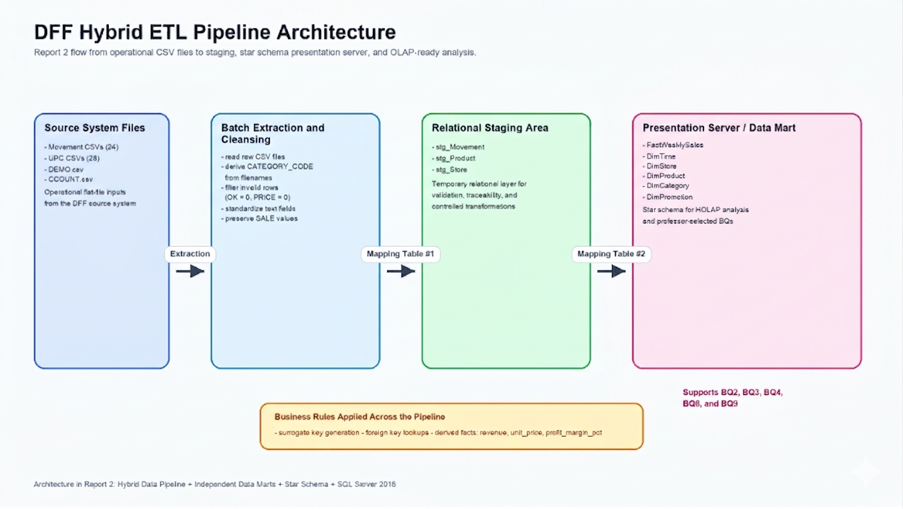
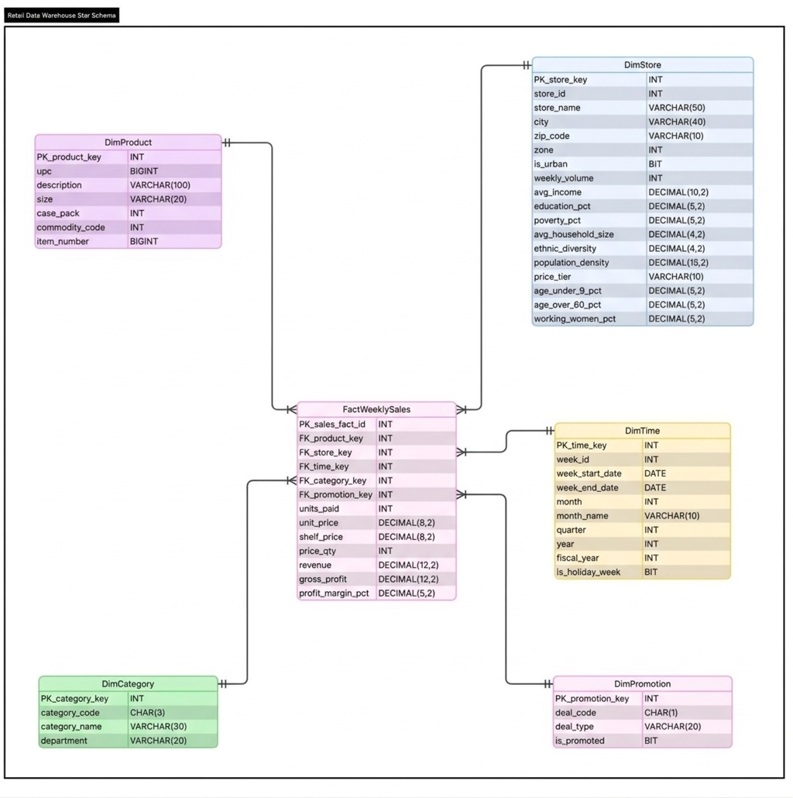

<div align="center">

# 🏪 Dominick's Finer Foods — Data Warehouse & BI Platform

**A Production-Grade Data Warehousing & Business Intelligence Project**

[](https://www.microsoft.com/sql-server)
[](https://docs.microsoft.com/en-us/sql/integration-services)
[](https://docs.microsoft.com/en-us/analysis-services)
[](https://docs.microsoft.com/en-us/sql/reporting-services)
[](https://aws.amazon.com/redshift/)
[](https://powerbi.microsoft.com/)

---

**ISTM 637 — Data Warehousing · Texas A&M University · Spring 2026**

*Nisarg Sonar · Bhavik Dalal · Yifei Wang*

</div>

---

## 🎯 Project at a Glance

|  |  |
|---|---|
| **Dataset** | Dominick's Finer Foods — Kilts Center, UChicago Booth |
| **Scale** | 134.9M scanner records · 29 categories · 107 stores · 400 weeks (1989 – 1997) |
| **DW Engine** | SQL Server 2016 on `infodata16.mbs.tamu.edu` |
| **Fact Table** | `FactWeeklySales` — **14.9M rows** (4 categories loaded) |
| **Schema** | Kimball star schema · 5 dimensions · 1 fact table |
| **BI Tools** | SSRS · SSAS · AWS Redshift · Power BI |
| **Business Questions** | 10 formulated → 5 selected → 5 fully answered with BI reports |

---

## 🏗️ Architecture

### Hybrid ETL Pipeline

Raw CSV flat files are ingested through a three-stage SSIS pipeline — **Extract → Transform → Load** — with full data quality remediation, surrogate key assignment, and referential integrity enforcement.

<div align="center">
  
  <br/>
  <sub><b>Figure 1.</b> End-to-end ETL architecture — 9 source files → staging → star schema</sub>
</div>

<br/>

### Star Schema (Kimball Methodology)

The data mart uses a pure **star schema** — no snowflaking — centered on `FactWeeklySales` at the grain of **one row per UPC × Store × Week**.

<div align="center">
  
  <br/>
  <sub><b>Figure 2.</b> Dimensional model — FactWeeklySales with 5 conformed dimensions</sub>
</div>

<br/>

| Table | Type | Rows | Key Columns |
|:------|:-----|-----:|:------------|
| `FactWeeklySales` | Fact | 14,921,365 | units_sold, revenue, gross_profit, profit_margin_pct |
| `DimProduct` | Dimension | 3,127 | upc, description, category_key |
| `DimStore` | Dimension | 107 | avg_income, poverty_pct, price_tier, is_urban |
| `DimTime` | Dimension | ~400 | week_start_date, month, quarter, year |
| `DimCategory` | Dimension | 28 | category_code, category_name, department |
| `DimPromotion` | Dimension | 4 | deal_type, is_promoted |

---

## 📊 Business Intelligence Reports

Five business questions answered across **four enterprise BI platforms**:

### 1️⃣ SSRS — Weekly Soft Drink Sales Trend (BQ2)
> *What are the total weekly unit sales of Soft Drinks across all stores?*

Paginated SSRS report with a time-series line chart and tabular data. Deployed to the SSRS Report Server for on-demand access.

### 2️⃣ SSAS — Promotion vs Non-Promotion Analysis (BQ3)
> *How do promoted weeks compare to non-promoted weeks in sales volume?*

SSAS multidimensional cube with MOLAP storage. Pivot analysis by `deal_type` with drill-down by year and quarter.

### 3️⃣ AWS Redshift — Promotion Lift by Type (BQ4)
> *Which promotion type generates the highest incremental lift in Canned Soup?*

Data exported to S3, loaded into a Redshift cluster, and analyzed using Redshift Query Editor v.2 with CTE-based lift calculations.

### 4️⃣ Power BI — Store Revenue Quartiles & Demographics (BQ8)
> *How do top-performing Toothpaste stores differ demographically from bottom-tier stores?*

Interactive dashboard with DAX-computed revenue quartiles, demographic comparison matrix, and geographic map visualization.

### 5️⃣ SSRS — Top 10 Weekly Cracker Products (BQ9)
> *Which Cracker products lead unit sales each week, and how are they trending?*

Parameterized SSRS report with week selector dropdown, product ranking table, and week-over-week change indicators.

---

## 📂 Repository Structure

```
dff-data-warehouse-project/
│
├── 📄 README.md                           ← You are here
├── 🖼️  assets/                             ← Architecture diagrams for README
│
├── 📁 report_1/                           ← Phase 1: Requirements & EDA
│   ├── CONSULTING_REPORT_1_Team_1.docx    ← Final Report 1
│   ├── business_questions.md              ← 10 BQs with OLAP classification
│   ├── data_exploration_summary.md        ← Dataset profiling & DQ findings
│   └── charts/                            ← EDA visualizations
│
├── 📁 report_2/                           ← Phase 2: Logical & Physical Design
│   ├── CONSULTING_REPORT_2_Team_1.docx    ← Final Report 2
│   ├── Report_2_Final.md                  ← Design narrative
│   ├── data_warehouse_schema.md           ← Schema documentation
│   └── *.png / *.jpeg                     ← ERD iterations & pipeline diagrams
│
├── 📁 report_3/                           ← Phase 3: ETL Design & Implementation
│   ├── Integrated_Report_3.docx           ← Final Report 3
│   ├── MappingTables.xlsx                 ← Source → Staging → DW mappings
│   ├── sql/                               ← SQL scripts (01 – 08)
│   └── image/                             ← SSIS/SSMS implementation screenshots
│
├── 📁 report_4/                           ← Phase 4: Final Integration & BI
│   ├── CONSULTING_REPORT_4_Team_1.docx    ← ✅ Final Integrated Report
│   ├── MappingTables.xlsx                 ← Updated mapping tables
│   ├── dax_revenue_quartile.txt           ← DAX measure for BQ8
│   ├── row_count_verification.sql         ← Data validation queries
│   ├── sql/                               ← Complete SQL scripts (9 files)
│   │   ├── 01_create_databases.sql
│   │   ├── 02_create_staging_tables.sql
│   │   ├── 03_create_dw_tables.sql
│   │   ├── 04_transform_staging.sql
│   │   ├── 05_load_dimensions.sql
│   │   ├── 06_load_facts.sql
│   │   ├── 07_drop_temp_tables.sql
│   │   ├── 08_verify_bq_queries.sql
│   │   └── 09_diagnose_and_fix_fk.sql
│   └── screenshots/                       ← 80+ SSMS/SSIS/BI implementation evidence
│
└── 📄 MappingTables.xlsx                  ← Master mapping tables
```

---

## 🛠️ Technology Stack

| Layer | Technology | Purpose |
|:------|:-----------|:--------|
| **Storage** | SQL Server 2016 | RDBMS for staging area & data mart |
| **ETL** | SSIS (Integration Services) | 3-package pipeline: Extract → Transform → Load |
| **OLAP** | SSAS (Analysis Services) | Multidimensional cube with MOLAP storage |
| **Reporting** | SSRS (Reporting Services) | Paginated, parameterized operational reports |
| **Cloud Analytics** | AWS Redshift | Scalable analytical SQL queries via S3 → Redshift |
| **Dashboards** | Power BI Desktop | Interactive dashboards with DAX & geospatial mapping |
| **Diagramming** | LucidChart | Architecture & ERD diagrams |

---

## 🔑 Key Technical Highlights

- **Data Quality Remediation** — Handled NULLs in MOVE/PRICE, missing UPC references, inconsistent promo flags, and implicit category codes derived from filenames
- **Surrogate Key Architecture** — All dimensions use INT surrogate keys; natural keys retained as attributes for traceability
- **Referential Integrity** — Foreign key constraints enforced across all fact-dimension relationships
- **Scalable Schema** — Designed for all 29 categories; 4 loaded for project scope (SDR, CSO, TPA, CRA)
- **Aggregate Tables** — Pre-computed summaries planned for query acceleration
- **DAX Calculated Measures** — Revenue quartile tiering via `RANKX` + `SWITCH` in Power BI

---

## 📚 References

> Montgomery (1997) · Kimball & Ross (2013) · Hoch et al. (1994, 1995) · Chintagunta (2002) · Chevalier et al. (2003) · Mehta & Ma (2012) · Kilts Center (2013)

Full APA references available in Section 6 of the [final report](report_4/CONSULTING_REPORT_4_Team_1.docx).

---

<div align="center">

**Built with ❤️ at Texas A&M University**

*"From 134.9M scanner records to strategic retail intelligence."*

<br/>

[](https://github.com/dalalbhavik01/dff-data-warehouse-project)

</div>
