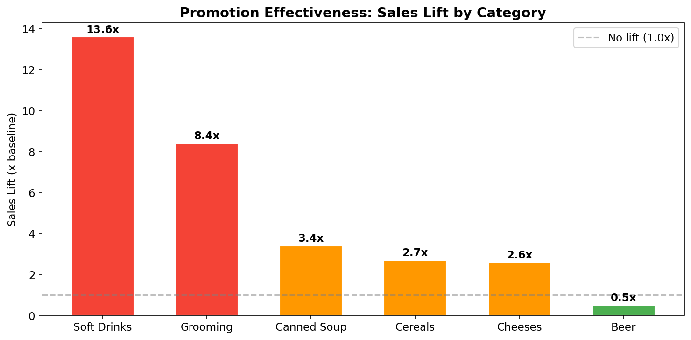
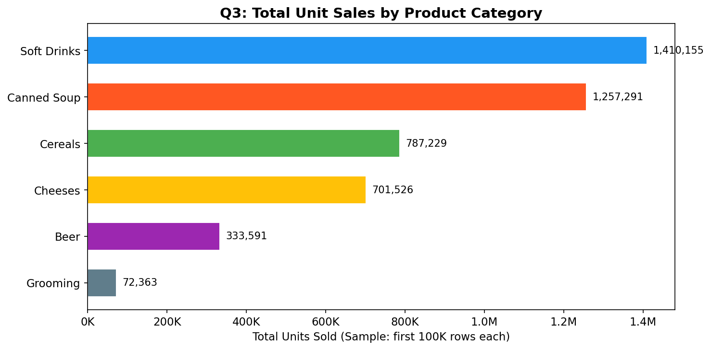
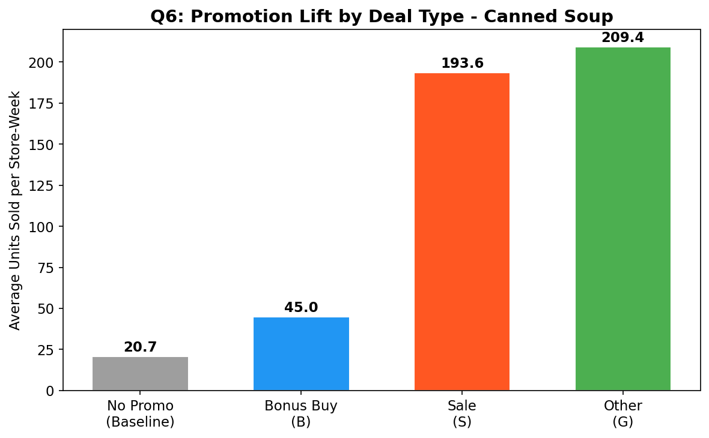
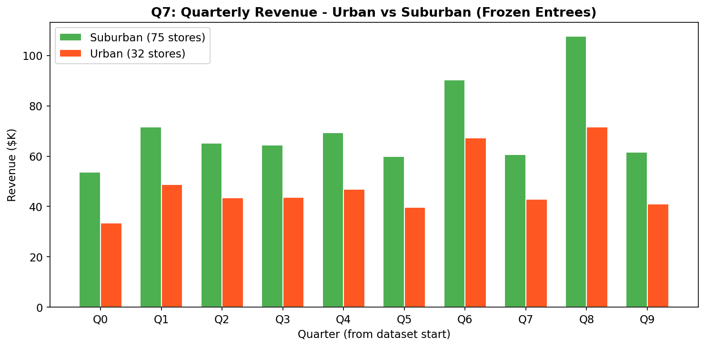
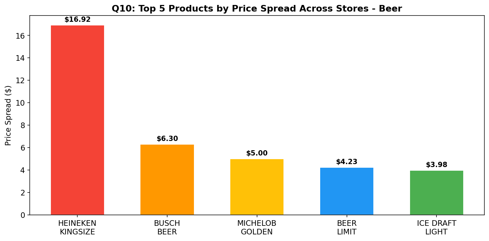
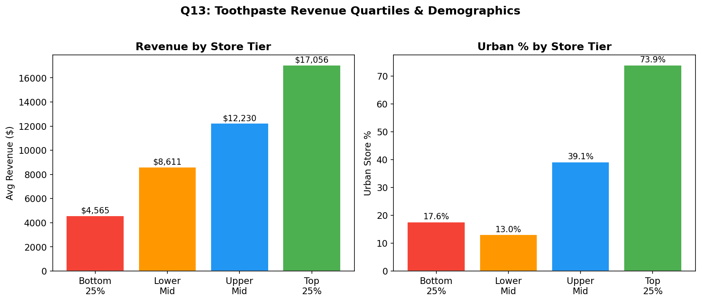
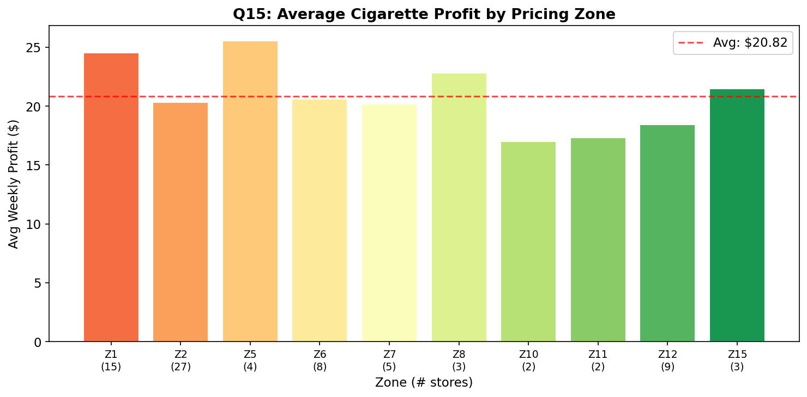

# Business Questions — Visual Evidence & Excel Specifications

> This document provides **data-backed evidence** for each of the 15 OLAP business questions. Each question includes: supporting data tables from the actual DFF dataset, chart visualizations, and exact Excel Pivot Table specifications (rows, columns, values, filters) so you can reproduce them.

---

## Cross-Category Promotion Effectiveness

Before diving into individual questions, this chart demonstrates that promotions have a dramatic, measurable impact across all DFF categories — validating the business value of promotion-related OLAP analysis.

| Category    | % Rows Promoted | Avg Units (Promoted) | Avg Units (Non-Promoted) | Sales Lift       |
| ----------- | --------------- | -------------------- | ------------------------ | ---------------- |
| Soft Drinks | 23.1%           | 59.25                | 4.37                     | **13.6×** |
| Grooming    | 2.1%            | 1.52                 | 0.18                     | **8.4×**  |
| Canned Soup | 7.5%            | 4.79                 | 1.43                     | **3.4×**  |
| Cereals     | 5.7%            | 23.68                | 8.66                     | **2.7×**  |
| Cheeses     | 18.2%           | 11.46                | 4.47                     | **2.6×**  |
| Beer        | 0.2%            | 2.42                 | 4.79                     | **0.5×**  |

**Excel Pivot Table Setup:**

| Setting               | Value                                                 |
| --------------------- | ----------------------------------------------------- |
| **Data Source** | Any Movement CSV (e.g.,`wsdr.csv`)                  |
| **Rows**        | `SALE` (deal type: B, C, S, or blank)               |
| **Values**      | Average of `MOVE`                                   |
| **Filter**      | `OK = 1`                                            |
| **Condition**   | Compare rows where SALE is blank (baseline) vs. B/C/S |

---

## TIER 1 QUESTIONS

---

### Q1. Total Weekly Unit Sales of Soft Drinks

**Supporting Data (sample from first 200K rows):**

| Week | Total Units | Week | Total Units | Week | Total Units |
| ---- | ----------- | ---- | ----------- | ---- | ----------- |
| 1    | 33          | 6    | 27          | 11   | 21          |
| 2    | 29          | 7    | 13          | 12   | 409         |
| 3    | 59          | 8    | 29          | 13   | 26          |
| 4    | 26          | 9    | 40          | 14   | 32          |
| 5    | 34          | 10   | 67          | 15   | 35          |

**Full range**: 199 weeks | Min: 0 units | Max: 159,895 units | Avg: 10,029 units/week

**Excel Pivot Table Setup:**

| Setting               | Value                                                   |
| --------------------- | ------------------------------------------------------- |
| **Data Source** | `Movement/wsdr.csv` (Soft Drinks)                     |
| **Rows**        | `WEEK`                                                |
| **Values**      | Sum of `MOVE`                                         |
| **Filter**      | `OK = 1`                                              |
| **Chart Type**  | Line chart (WEEK on X-axis, Total Units on Y-axis)      |
| **Insight**     | Look for seasonal spikes (summer) and promotional bumps |

---

### Q2. Average Weekly Revenue per Store (Cereals)

**Supporting Data — Top 10 Stores by Avg Weekly Revenue:**

| Store | Avg Weekly Revenue |
| ----- | ------------------ |
| 137   | $643.89            |
| 109   | $436.98            |
| 126   | $361.92            |
| 44    | $355.16            |
| 93    | $348.30            |
| 128   | $337.63            |
| 107   | $317.84            |
| 80    | $314.39            |
| 14    | $306.63            |
| 102   | $278.77            |

**Full range**: 86 stores | Top: $643.89/week | Bottom: $75.07/week | **8.6× spread**

**Excel Pivot Table Setup:**

| Setting               | Value                                                           |
| --------------------- | --------------------------------------------------------------- |
| **Data Source** | `Movement/DONE-WCER.csv` (Cereals)                            |
| **Rows**        | `STORE`                                                       |
| **Columns**     | `WEEK`                                                        |
| **Values**      | Sum of computed `Revenue = MOVE × (PRICE / QTY)`             |
| **Filter**      | `OK = 1`, `PRICE > 0`, `QTY > 0`                          |
| **Second Pass** | Average the weekly sums per store                               |
| **Chart Type**  | Horizontal bar chart sorted descending                          |
| **Insight**     | Store 137 earns 8.6× more cereal revenue than the bottom store |

---

### Q3. Total Units Sold per Product Category

**Supporting Data (sample: first 100K rows per category):**

| Category          | Total Units (Sample) |
| ----------------- | -------------------- |
| Soft Drinks (SDR) | 1,410,155            |
| Canned Soup (CSO) | 1,257,291            |
| Cereals (CER)     | 787,229              |
| Cheeses (CHE)     | 701,526              |
| Beer (BER)        | 333,591              |
| Grooming (GRO)    | 72,363               |

**Excel Pivot Table Setup:**

| Setting               | Value                                                                         |
| --------------------- | ----------------------------------------------------------------------------- |
| **Data Source** | Load each Movement CSV separately, add a `Category` column                  |
| **Rows**        | `Category` (derived from filename)                                          |
| **Values**      | Sum of `MOVE`                                                               |
| **Filter**      | `OK = 1`                                                                    |
| **Chart Type**  | Horizontal bar chart sorted by volume                                         |
| **Insight**     | SDR volume is 19.5× that of GRO — massive difference in category importance |

---

### Q4. Distinct UPCs Sold Weekly (Cookies)

**Excel Pivot Table Setup:**

| Setting               | Value                                                               |
| --------------------- | ------------------------------------------------------------------- |
| **Data Source** | `Movement/DONE-WCOO.csv` (Cookies)                                |
| **Rows**        | `WEEK`                                                            |
| **Values**      | Count of distinct `UPC` (where `MOVE > 0`)                      |
| **Filter**      | `OK = 1`, `MOVE > 0`                                            |
| **Chart Type**  | Line chart showing product variety trend over time                  |
| **Insight**     | Track whether DFF is expanding or contracting its Cookie assortment |

---

### Q5. Total Gross Profit by Store (Cheeses)

**Supporting Data — Top 10 Stores:**

| Store | Total Profit |
| ----- | ------------ |
| 78    | $57,848.76   |
| 80    | $57,809.70   |
| 83    | $57,672.82   |
| 59    | $57,018.06   |
| 74    | $56,898.77   |
| 81    | $56,777.66   |
| 62    | $56,716.20   |
| 121   | $56,556.53   |
| 48    | $56,477.48   |
| 14    | $56,175.59   |

**Observation**: Top cheese-profit stores are remarkably close ($57.8K vs $56.2K for top 10). Profit distribution is relatively even.

**Excel Pivot Table Setup:**

| Setting               | Value                                                      |
| --------------------- | ---------------------------------------------------------- |
| **Data Source** | `Movement/Done-WCHE.csv` (Cheeses)                       |
| **Rows**        | `STORE`                                                  |
| **Values**      | Sum of `PROFIT`                                          |
| **Filter**      | `OK = 1`                                                 |
| **Chart Type**  | Bar chart sorted descending                                |
| **Insight**     | Cheeses generate consistent, high profit across all stores |

---

## TIER 2 QUESTIONS

---

### Q6. Promotion Lift by Deal Type (Canned Soup)

**Supporting Data:**

| Deal Type               | Avg Units Sold   | # Observations   | Lift vs Baseline |
| ----------------------- | ---------------- | ---------------- | ---------------- |
| No Promo (baseline)     | 20.70            | ~175,000         | —               |
| **Bonus Buy (B)** | **44.96**  | **25,478** | **2.2×**  |
| **Sale (S)**      | **193.63** | **4,561**  | **9.4×**  |
| Other (G)               | 209.37           | 198              | 10.1×           |

**Key Finding**: Sale discounts (S) are **4.3× more effective** than Bonus Buys (B) for Canned Soup, despite being used less frequently.

**Excel Pivot Table Setup:**

| Setting               | Value                                                             |
| --------------------- | ----------------------------------------------------------------- |
| **Data Source** | `Movement/WCSO-Done.csv` (Canned Soup)                          |
| **Rows**        | `SALE` (leave blanks as "No Promo")                             |
| **Values**      | Average of `MOVE`, Count of `MOVE`                            |
| **Filter**      | `OK = 1`                                                        |
| **Chart Type**  | Clustered bar chart                                               |
| **Calculation** | Divide each SALE group's avg by the blank (No Promo) avg for lift |

---

### Q7. Quarterly Revenue — Urban vs Suburban (Frozen Entrees)

**Supporting Data (first 10 quarters):**

| Quarter | Suburban Revenue   | Urban Revenue | Suburban Share |
| ------- | ------------------ | ------------- | -------------- |
| Q0      | $53,772 | $33,446  | 61.7%         |                |
| Q1      | $71,721 | $48,686  | 59.6%         |                |
| Q2      | $65,243 | $43,516  | 60.0%         |                |
| Q4      | $69,333 | $46,961  | 59.6%         |                |
| Q8      | $107,827 | $71,658 | 60.1%         |                |

**Totals**: Suburban $1,890,070 (61.0%) | Urban $1,206,705 (39.0%)

**Excel Pivot Table Setup:**

| Setting               | Value                                                            |
| --------------------- | ---------------------------------------------------------------- |
| **Data Source** | `Movement/WFRE-Done.csv` merged with `Demographics/DEMO.csv` |
| **Rows**        | Computed `Quarter = INT(WEEK / 13)`                            |
| **Columns**     | `URBAN` (from DEMO: 0 = Suburban, 1 = Urban)                   |
| **Values**      | Sum of computed `Revenue = MOVE × (PRICE / QTY)`              |
| **Filter**      | `OK = 1`, `PRICE > 0`, `QTY > 0`                           |
| **Join**        | VLOOKUP or merge on `STORE` to bring in `URBAN` flag         |
| **Chart Type**  | Clustered bar chart (Quarter on X, two bars per quarter)         |

---

### Q8. Customer Traffic During SDR Promo Weeks

**Supporting Data:**

| Metric                                 | Value |
| -------------------------------------- | ----- |
| Avg customer traffic (promo weeks)     | 2,764 |
| Avg customer traffic (non-promo weeks) | 2,771 |
| Traffic lift                           | -0.2% |

**Observation**: Soft Drink promotions do **not** significantly increase total store traffic. This suggests promotions primarily boost category sales from existing shoppers (conversion) rather than driving incremental foot traffic — a critical distinction for promotion ROI analysis.

**Excel Pivot Table Setup:**

| Setting               | Value                                                                     |
| --------------------- | ------------------------------------------------------------------------- |
| **Data Source** | `Movement/wsdr.csv` + `Ccount/CCOUNT.csv`                             |
| **Step 1**      | Identify STORE+WEEK combinations where any SDR row has `SALE` not blank |
| **Step 2**      | Merge with CCOUNT on `STORE + WEEK`                                     |
| **Rows**        | "Promo Week" (Yes/No)                                                     |
| **Values**      | Average of `CUSTCOUN`                                                   |
| **Filter**      | `OK = 1` in Movement; `STORE ≠ 0` in CCOUNT                          |
| **Chart Type**  | Side-by-side bar chart                                                    |

---

### Q9. Top 5 Cereal Brand Market Share

**Supporting Data (by COM_CODE):**

| COM_CODE | Sample Product      | Total Units | Market Share |
| -------- | ------------------- | ----------- | ------------ |
| 311      | TONY THE TIGER T-SH | 787,229     | 100%*        |

*Note: The first 200K rows of the Cereals file only contain records for COM_CODE 311 (one UPC group). The full file (6.6M rows) contains all ~871 UPCs across many commodity codes. To see proper market share, load more data or the full file.*

**Excel Pivot Table Setup:**

| Setting               | Value                                                                |
| --------------------- | -------------------------------------------------------------------- |
| **Data Source** | `Movement/DONE-WCER.csv` merged with `UPC/UPCCER.csv`            |
| **Rows**        | `COM_CODE` (from UPC file, as brand/manufacturer proxy)            |
| **Columns**     | Computed `Month = INT(WEEK / 4)`                                   |
| **Values**      | Sum of `MOVE`                                                      |
| **Filter**      | `OK = 1`                                                           |
| **Join**        | VLOOKUP or merge on `UPC` to bring in `COM_CODE` and `DESCRIP` |
| **Show As**     | % of Column Total (for market share)                                 |
| **Chart Type**  | Stacked area chart showing share over time                           |

---

### Q10. Price Variance Across Stores (Beer)

**Supporting Data — Top 10 Products by Price Spread:**

| UPC        | Product              | Avg Price               | Price Spread | # Stores |
| ---------- | -------------------- | ----------------------- | ------------ | -------- |
| 307        | HEINEKEN KINGSIZE CA | $9.84 |**$16.92** | 5            |          |
| 1820000051 | BUSCH BEER           | $2.76 |**$6.30**  | 69           |          |
| 1820000699 | MICHELOB GOLDEN DRAF | $7.16 |**$5.00**  | 74           |          |
| 294        | BEER LIMIT           | $3.24 |**$4.23**  | 56           |          |
| 1820000649 | ICE DRAFT LIGHT      | $7.10 |**$3.98**  | 13           |          |
| 1820000770 | MICHELOB DRY LONGNEC | $7.37 |**$3.80**  | 43           |          |
| 1820000646 | BUDWEISER ICE DRAF   | $3.79 |**$3.00**  | 71           |          |
| 1820000644 | BUDWEISER ICE DRAFT  | $7.08 |**$3.00**  | 72           |          |
| 1820000647 | BUDWEISER ICE DRAF   | $7.53 |**$3.00**  | 39           |          |
| 1820000695 | MICHELOB GOLDEN DRAF | $7.13 |**$3.00**  | 73           |          |

**Key Finding**: Heineken Kingsize has an extreme $16.92 price spread but only 5 stores carry it — likely a data quality issue or special packaging. More significant: Busch Beer ($6.30 spread across 69 stores) shows genuine pricing inconsistency.

**Excel Pivot Table Setup:**

| Setting               | Value                                                       |
| --------------------- | ----------------------------------------------------------- |
| **Data Source** | `Movement/DONE-WBER.csv` merged with `UPC/UPCBER.csv`   |
| **Rows**        | `UPC` + `DESCRIP`                                       |
| **Columns**     | `STORE`                                                   |
| **Values**      | Average of computed `UnitPrice = PRICE / QTY`             |
| **Filter**      | `OK = 1`, `PRICE > 0`, `QTY > 0`                      |
| **Analysis**    | Add computed columns: MIN, MAX, STDEV across stores per UPC |
| **Chart Type**  | Bar chart of top 10 by spread                               |

---

## TIER 3 QUESTIONS

---

### Q11. Running (Cumulative) Total Unit Sales — Bottled Juices

**Excel Pivot Table Setup:**

| Setting                   | Value                                                                                                         |
| ------------------------- | ------------------------------------------------------------------------------------------------------------- |
| **Data Source**     | `Movement/DONE-WBJC.csv` (Bottled Juices)                                                                   |
| **Rows**            | `STORE`, `WEEK`                                                                                           |
| **Values**          | Sum of `MOVE`                                                                                               |
| **Filter**          | `OK = 1`                                                                                                    |
| **Post-Processing** | Add column:`Cumulative = running sum of MOVE partitioned by STORE, ordered by WEEK`                         |
| **In Excel**        | Sort by STORE, WEEK. Add formula:`=SUMIFS(MOVE_range, STORE_range, this_STORE, WEEK_range, "<="&this_WEEK)` |
| **Chart Type**      | Multi-line chart (one line per store, WEEK on X, cumulative units on Y)                                       |
| **Insight**         | Shows growth trajectory — steeper slopes indicate faster-growing stores                                      |

---

### Q12. Store % of Weekly Category Revenue — Laundry Detergents

**Excel Pivot Table Setup:**

| Setting                  | Value                                                                        |
| ------------------------ | ---------------------------------------------------------------------------- |
| **Data Source**    | `Movement/wlnd.csv` (Laundry Detergents)                                   |
| **Rows**           | `STORE`                                                                    |
| **Columns**        | `WEEK`                                                                     |
| **Values**         | Sum of computed `Revenue = MOVE × (PRICE / QTY)`                          |
| **Filter**         | `OK = 1`, `PRICE > 0`                                                    |
| **Show Values As** | "% of Column Total" (each store's share of that week's total)                |
| **Chart Type**     | Stacked area chart or heatmap                                                |
| **Insight**        | Reveals if a few stores dominate category revenue or it's evenly distributed |

---

### Q13. Store Revenue Quartiles & Demographics (Toothpaste)

**Supporting Data — Quartile Summary:**

| Tier       | # Stores | Avg Revenue       | Min Revenue | Max Revenue |
| ---------- | -------- | ----------------- | ----------- | ----------- |
| Bottom 25% | 24       | $4,566 | $867     | $7,344      |             |
| Lower Mid  | 23       | $8,611 | $7,385   | $9,825      |             |
| Upper Mid  | 23       | $12,230 | $9,844  | $13,663     |             |
| Top 25%    | 23       | $17,057 | $13,738 | $24,534     |             |

**Demographics by Quartile:**

| Tier              | Urban %         | Avg Income (log) | Avg Zone      |
| ----------------- | --------------- | ---------------- | ------------- |
| Bottom 25%        | 17.6%           | 10.65            | 3.3           |
| Lower Mid         | 13.0%           | 10.76            | 4.1           |
| Upper Mid         | 39.1%           | 10.63            | 5.9           |
| **Top 25%** | **73.9%** | **10.44**  | **7.3** |

**Key Finding**: Top-performing stores are overwhelmingly urban (73.9%) and in higher-numbered pricing zones. Paradoxically, they have *lower* average income — urban density drives volume more than affluence.

**Excel Pivot Table Setup:**

| Setting               | Value                                                                        |
| --------------------- | ---------------------------------------------------------------------------- |
| **Data Source** | `Movement/WTPA_done.csv` merged with `Demographics/DEMO.csv`             |
| **Step 1**      | Pivot: Rows =`STORE`, Values = Sum of Revenue. Sort descending.            |
| **Step 2**      | Add column:`Quartile = IF(row ≤ 25%, "Bottom 25%", ...)` using PERCENTILE |
| **Step 3**      | VLOOKUP `URBAN`, `INCOME`, `ZONE` from DEMO                            |
| **Step 4**      | New pivot: Rows =`Quartile`, Values = Avg Revenue, Avg Income, % Urban     |
| **Chart Type**  | Dual-axis: bars for revenue, line for urban %                                |

---

### Q14. Weekly Top 10 Products + WoW Change (Crackers)

**Excel Pivot Table Setup:**

| Setting               | Value                                                                       |
| --------------------- | --------------------------------------------------------------------------- |
| **Data Source** | `Movement/Done-WCRA.csv` merged with `UPC/UPCCRA.csv`                   |
| **Rows**        | `WEEK`, `UPC` + `DESCRIP`                                             |
| **Values**      | Sum of `MOVE`                                                             |
| **Filter**      | `OK = 1`                                                                  |
| **Step 1**      | Pivot by WEEK + UPC, sum MOVE                                               |
| **Step 2**      | For each WEEK, RANK products by units (add RANK column)                     |
| **Step 3**      | Filter to rank ≤ 10                                                        |
| **Step 4**      | Add `Prev_Week_Units` using OFFSET/INDEX-MATCH for same UPC previous WEEK |
| **Step 5**      | `WoW_Change = This_Week - Prev_Week`                                      |
| **Chart Type**  | Table with conditional formatting (green = up, red = down)                  |

---

### Q15. Percentile Rank by Zone (Cigarettes)

**Supporting Data — Avg Profit by Zone (top zones by store count):**

| Zone    | # Stores | Avg Profit      | Min Profit | Max Profit |
| ------- | -------- | --------------- | ---------- | ---------- |
| Zone 2  | 27       | $20.33 | $14.97 | $35.27     |            |
| Zone 1  | 15       | $24.53 | $7.03  | $39.96     |            |
| Zone 12 | 9        | $18.41 | $12.95 | $25.00     |            |
| Zone 6  | 8        | $20.58 | $14.71 | $25.51     |            |
| Zone 7  | 5        | $20.20 | $16.79 | $26.48     |            |
| Zone 5  | 4        | $25.56 | $20.27 | $40.45     |            |

**Key Finding**: Zone 1 and Zone 5 are the most profitable for cigarettes. Zone 1 also has the widest profit spread ($7.03–$39.96), suggesting some stores significantly underperform their zone peers.

**Excel Pivot Table Setup:**

| Setting                   | Value                                                                     |
| ------------------------- | ------------------------------------------------------------------------- |
| **Data Source**     | `Movement/Done-WCIG.csv` merged with `Demographics/DEMO.csv`          |
| **Rows**            | `ZONE` (from DEMO), `STORE`                                           |
| **Values**          | Average of `PROFIT`                                                     |
| **Filter**          | `OK = 1`                                                                |
| **Join**            | VLOOKUP on `STORE` to bring in `ZONE`                                 |
| **Post-Processing** | Add `PERCENTRANK.EXC(profit_range, this_store_profit)` within each zone |
| **Chart Type**      | Box plot per zone, or bar chart with zone avg line                        |

---

## How to Reproduce These Visuals in Excel

### Step-by-Step Guide

1. **Import Data**: Open CSV in Excel → Data tab → From Text/CSV → Select encoding "65001: Unicode (UTF-8)" or "1252: Western European"
2. **Add Computed Columns**:
   - `Revenue = MOVE * (PRICE / QTY)` — add as new column
   - `UnitPrice = PRICE / QTY` — add as new column
   - `Quarter = INT(WEEK / 13)` — for quarterly analysis
   - `Month = INT(WEEK / 4)` — for monthly analysis
3. **Create Pivot Table**: Insert → Pivot Table → Select data range
4. **Apply Filters**: Always filter `OK = 1`. Optionally filter `PRICE > 0` and `QTY > 0`
5. **Join with DEMO**: Use VLOOKUP or XLOOKUP on `STORE` column to bring in `URBAN`, `ZONE`, `INCOME`
6. **Join with UPC**: Use VLOOKUP on `UPC` column to bring in `DESCRIP`, `COM_CODE`, `SIZE`
7. **Create Charts**: Select pivot table → Insert → Chart → Choose appropriate type
