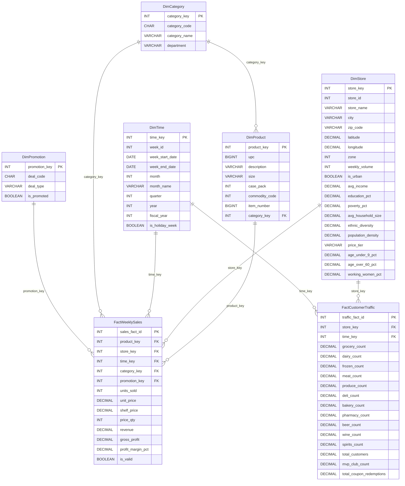
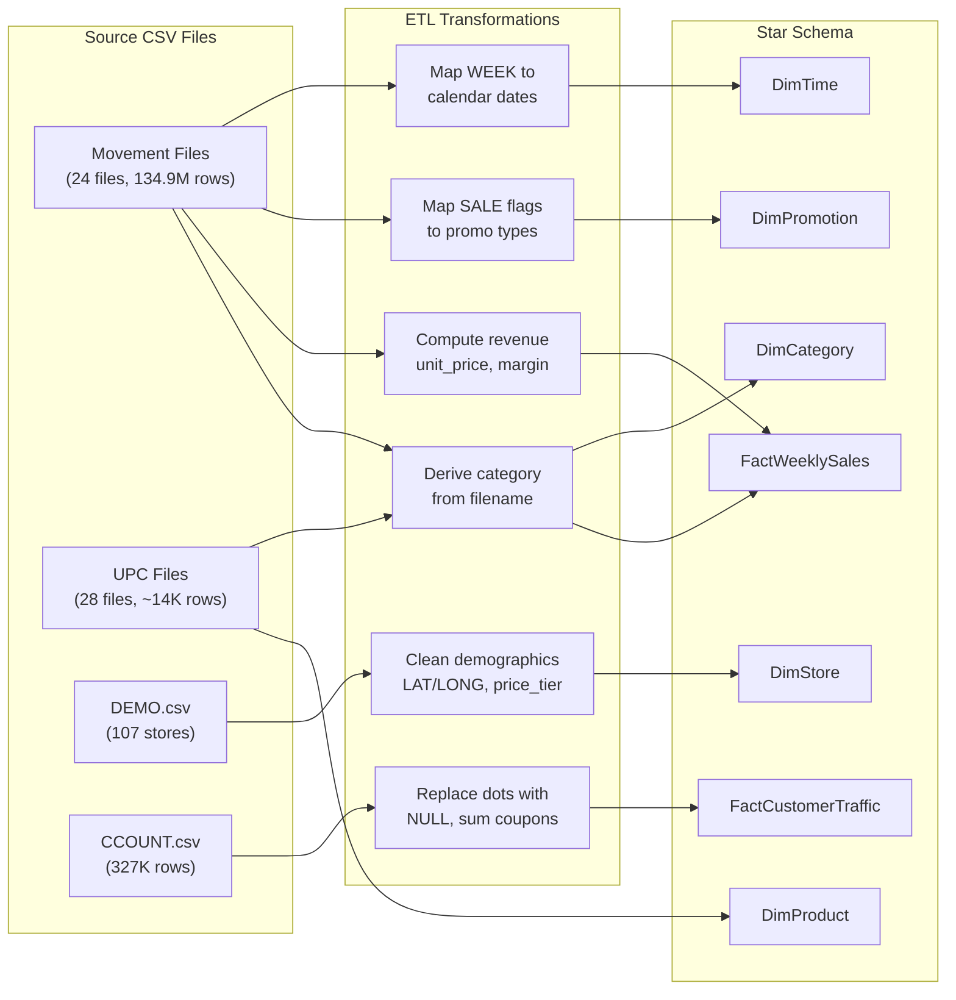

# Entity Relationship Diagram — DFF Data Warehouse

> Star Schema ERD for the Dominick's Fine Foods Data Warehouse. Two fact tables surrounded by five dimension tables.

---

## Star Schema ERD

---

## Relationship Summary

| Relationship | Cardinality | Join Key | Description |
|-------------|-------------|----------|-------------|
| DimProduct → FactWeeklySales | 1:N | `product_key` | Each product appears in many weekly sales rows |
| DimStore → FactWeeklySales | 1:N | `store_key` | Each store has sales data across many weeks/products |
| DimTime → FactWeeklySales | 1:N | `time_key` | Each week contains sales for many store-product combos |
| DimCategory → FactWeeklySales | 1:N | `category_key` | Each category contains many product-store-week sales |
| DimPromotion → FactWeeklySales | 1:N | `promotion_key` | Each promo type (B/C/S/None) applies to many sales rows |
| DimCategory → DimProduct | 1:N | `category_key` | Each category contains many products |
| DimStore → FactCustomerTraffic | 1:N | `store_key` | Each store has weekly traffic counts |
| DimTime → FactCustomerTraffic | 1:N | `time_key` | Each week has traffic data for many stores |

---

## Source-to-Target Data Flow

