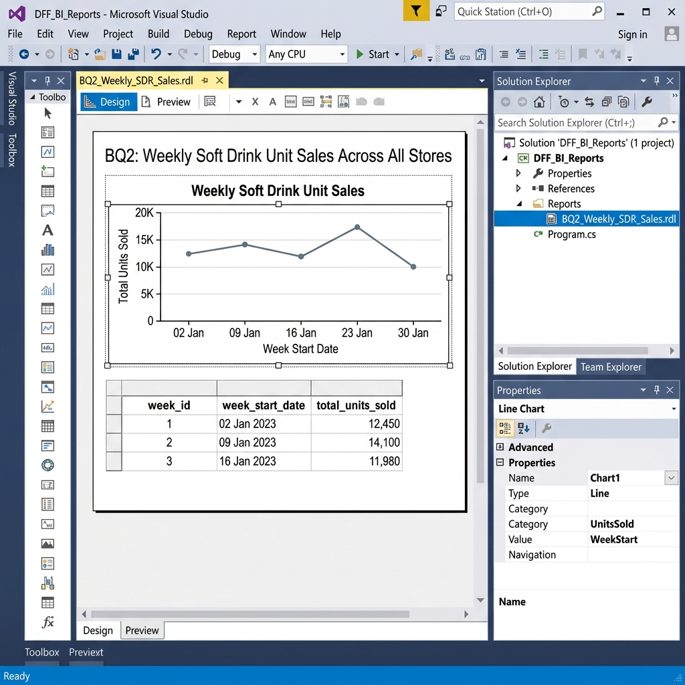

# BI Tool Implementation Guide
## Integrated Report 4 — Screenshots 30–41

> **How to use this guide:**
> Follow each section in order. Each task tells you exactly what to build, what SQL or settings to use, and
> which screenshot to take. After capturing all 12, run `python3 generate_docx.py` once more — the
> placeholders in the DOCX will be replaced with your real screenshots automatically.

---

## Prerequisites

Make sure the following are available before you start.

### Software Required (all available in TAMU ISTM Lab)
- **SQL Server 2016** with `team1_dw_area` database already populated (from Report 3 ETL)
- **Visual Studio 2015** with SQL Server Data Tools (SSDT) — includes both SSRS and SSAS project templates
- **Power BI Desktop** — free download from https://powerbi.microsoft.com/en-us/desktop/
- **AWS Academy Lab** — your course account with Redshift access

### Data Availability Check (run in SSMS first)
Before starting, verify the data mart is populated:
```sql
USE team1_dw_area;
SELECT 'FactWeeklySales'  AS tbl, COUNT(*) AS rows FROM FactWeeklySales   UNION ALL
SELECT 'DimPromotion',              COUNT(*)        FROM DimPromotion       UNION ALL
SELECT 'DimCategory',               COUNT(*)        FROM DimCategory        UNION ALL
SELECT 'DimStore',                  COUNT(*)        FROM DimStore           UNION ALL
SELECT 'DimProduct',                COUNT(*)        FROM DimProduct         UNION ALL
SELECT 'DimTime',                   COUNT(*)        FROM DimTime;
```
Expected minimums: FactWeeklySales ≥ 14,000,000 | DimStore = 107 | DimCategory = 12 | DimTime ≥ 400

---

## PART 1 — SSRS (Screenshots 30–33)

**Business Questions covered:** BQ2 (weekly SDR sales trend) and BQ9 (top 10 Crackers weekly ranking)  
**Estimated time:** 45–60 minutes

### 1.1 Create the Visual Studio Project

1. Open **Visual Studio 2015**
2. **File → New → Project**
3. In the left panel expand: `Business Intelligence` → select **`Report Server Project`**
4. Name it `DFF_BI_Reports`, click OK

### 1.2 Create the Shared Data Source

1. In **Solution Explorer** right-click **Shared Data Sources → Add New Data Source**
2. Name it `DFF_DataSource`
3. Under Type select: **Microsoft SQL Server**
4. Click **Edit** → in the connection dialog:
   - Server name: `ISTM637-PC\SQLEXPRESS` (or your lab server name)
   - Authentication: **Windows Authentication**
   - Select database: `team1_dw_area`
5. Click **Test Connection** — must say "Test connection succeeded"
6. Click OK → OK

### 1.3 Build the BQ2 Report (SSRS)

1. Right-click **Reports → Add New Item → Report** — name it `BQ2_Weekly_SDR_Sales.rdl`

2. **Add a Dataset:**  
   Right-click in the Report Data pane → **Add Dataset**  
   - Name: `DS_BQ2`
   - Data Source: select `DFF_DataSource`
   - Paste this query:
   ```sql
   SELECT
       dt.week_id,
       dt.week_start_date,
       SUM(f.units_sold) AS total_units_sold
   FROM FactWeeklySales f
   JOIN DimTime dt ON f.time_key = dt.time_key
   JOIN DimCategory dc ON f.category_key = dc.category_key
   WHERE dc.category_code = 'SDR'
   GROUP BY dt.week_id, dt.week_start_date
   ORDER BY dt.week_id;
   ```
   Click OK.

3. **Insert a Line Chart:**
   - From the menu: **Report → Insert → Chart** → choose **Line** → click OK
   - Drag the chart to fill the top half of the report body
   - In the Chart Data dialog:
     - **Values (Y-axis):** drag `total_units_sold` → set aggregation to `Sum`
     - **Category Groups (X-axis):** drag `week_start_date`
   - Right-click the Y-axis → Axis Properties → set title to `Total Units Sold`
   - Right-click the X-axis → Axis Properties → set title to `Week Start Date`
   - Click the chart title and type: `BQ2: Weekly Soft Drink Unit Sales Across All Stores`

4. **Insert a Table below the chart:**
   - **Report → Insert → Table** — place it under the chart
   - Map columns: `week_id`, `week_start_date`, `total_units_sold`
   - Bold the header row

5. **Take Screenshot 30:**
   - Stay on the **Design tab** (not Preview)
   - Make sure Solution Explorer is visible on the right (View → Solution Explorer if hidden)
   - Press **Windows + Shift + S** (or use Snipping Tool) to capture the full Visual Studio window
   - Save as: `report_4/screenshots/screenshot_30.png`

6. **Take Screenshot 31:**
   - Click the **Preview tab** at the top of the report designer
   - Wait for the report to render (may take 10–30 seconds)
   - Capture the fully rendered page showing the line chart with data and the table below
   - Save as: `report_4/screenshots/screenshot_31.png`

### 1.4 Build the BQ9 Report (SSRS Parameterized)

1. Right-click **Reports → Add New Item → Report** — name it `BQ9_Top10_Crackers.rdl`

2. **Add a Dataset for the Parameter (week list):**
   - Name: `DS_WeekList`
   - Query:
   ```sql
   SELECT DISTINCT week_id
   FROM DimTime
   ORDER BY week_id;
   ```

3. **Add the Report Parameter:**
   - Right-click Parameters in the Report Data pane → **Add Parameter**
   - Name: `WeekID`, Prompt: `Select Week Number`, Data type: Integer
   - Under **Available Values:** select "Get values from a query"
     - Dataset: `DS_WeekList`, Value field: `week_id`, Label field: `week_id`

4. **Add the Main Dataset:**
   - Name: `DS_BQ9`
   - Query:
   ```sql
   WITH ranked AS (
       SELECT
           dp.upc,
           dp.description,
           dt.week_id,
           SUM(f.units_sold) AS units_sold,
           RANK() OVER (
               PARTITION BY dt.week_id
               ORDER BY SUM(f.units_sold) DESC
           ) AS sales_rank
       FROM FactWeeklySales f
       JOIN DimProduct dp   ON f.product_key  = dp.product_key
       JOIN DimTime dt      ON f.time_key     = dt.time_key
       JOIN DimCategory dc  ON f.category_key = dc.category_key
       WHERE dc.category_code = 'CRA'
       GROUP BY dp.upc, dp.description, dt.week_id
   ),
   with_lag AS (
       SELECT *,
              LAG(units_sold) OVER (
                  PARTITION BY upc ORDER BY week_id
              ) AS prev_week_units,
              units_sold - LAG(units_sold) OVER (
                  PARTITION BY upc ORDER BY week_id
              ) AS wow_change
       FROM ranked
       WHERE sales_rank <= 10
   )
   SELECT * FROM with_lag
   WHERE week_id = @WeekID
   ORDER BY sales_rank;
   ```
   - Under **Parameters**, map `@WeekID` to the `WeekID` report parameter

5. **Insert a Table:**
   - Columns: `sales_rank`, `upc`, `description`, `units_sold`, `prev_week_units`, `wow_change`
   - Rename headers to: Rank, UPC, Product Description, Units Sold, Prev Week, WoW Change

6. **Add Conditional Color to WoW Change column:**
   - Right-click the WoW Change data cell → Text Box Properties → Font → Color → Expression:
   ```
   =IIF(Fields!wow_change.Value > 0, "Green",
     IIF(Fields!wow_change.Value < 0, "Red", "Black"))
   ```

7. **Take Screenshot 32:**
   - Stay on the **Design tab**
   - Make sure both the parameter field and the table layout with all 6 columns are fully visible
   - Solution Explorer visible on right
   - Save as: `report_4/screenshots/screenshot_32.png`

8. **Take Screenshot 33:**
   - Click the **Preview tab**
   - In the `Select Week Number` dropdown, choose week **100** (or any week with data)
   - Click **View Report**
   - Wait for the table to render — verify 10 rows appear with colored WoW values
   - Save as: `report_4/screenshots/screenshot_33.png`

---

## PART 2 — SSAS (Screenshots 34–36)

**Business Question covered:** BQ3 (promotion vs non-promotion sales comparison)  
**Estimated time:** 30–45 minutes

### 2.1 Create the SSAS Project

1. In **Visual Studio 2015**: **File → New → Project**
2. Expand `Business Intelligence` → select **Analysis Services Multidimensional and Data Mining Project**
3. Name it `DFF_Sales_Cube`, click OK

### 2.2 Create Data Source

1. Right-click **Data Sources → New Data Source**
2. Click **New** → configure connection:
   - Provider: Native OLE DB\SQL Server Native Client 11.0
   - Server: `ISTM637-PC\SQLEXPRESS`
   - Database: `team1_dw_area`
   - Authentication: Windows
3. Click **Test Connection** → must succeed
4. Click Next → leave name as `team1_dw_area.ds` → Finish

### 2.3 Create Data Source View

1. Right-click **Data Source Views → New Data Source View**
2. Select the data source then click Next
3. In the table list, add all of these tables:
   - `FactWeeklySales`
   - `DimPromotion`
   - `DimCategory`
   - `DimTime`
   - `DimStore`
   - `DimProduct`
4. Click Next → name it `DFF_DSV` → Finish
5. Verify all relationship lines are auto-detected (they should be — FK constraints are defined)

### 2.4 Create and Configure the Cube

1. Right-click **Cubes → New Cube**
2. Select **Use existing tables**, click Next
3. Select measure group table: **FactWeeklySales**, click Next
4. Under Select Measures, check: **units_sold** and **revenue**, click Next
5. Under Select Existing Dimensions, check all dimensions, click Next
6. Name the cube: `DFF_Sales_Cube` → Finish

7. **Add one calculated measure** (optional but helpful):
   - In the Cube designer, right-click in the Calculations tab → New Calculated Member
   - Name: `[Avg Units Sold]` | Expression: `[Measures].[units_sold] / [Measures].[Record Count]`

### 2.5 Deploy the Cube

1. Make sure your local SSAS instance is running (check Services on Windows)
2. From the menu: **Build → Deploy DFF_Sales_Cube**
3. Look for "Deploy: 1 succeeded" in the Output window

### 2.6 Browse the Cube

1. Double-click `DFF_Sales_Cube.cube` → click the **Browser** tab at the top
2. Click **Reconnect** if needed

**Set up the BQ3 pivot:**
- In the **Filter/Slicer** area (top left box) → drag `DimCategory` → expand → drag `category_code` into the filter row → set operator to `=` → value to `SDR`
- In the **Rows** drop zone → drag `[DimPromotion].[deal_type]`
- In the **Values/Data** area → drag `[Measures].[units_sold]`
- You should see 4 rows: `No Promotion`, `Bonus Buy (B)`, `Coupon (C)`, `Sale/Discount (S)` with their average units sold

3. **Take Screenshot 34:**
   - Switch to the **Cube Structure tab** (first tab)
   - Expand the Solution Explorer to show: Data Sources, Data Source Views, Cubes, Dimensions
   - Show the Measures pane (units_sold, revenue) and Dimensions pane
   - Save as: `report_4/screenshots/screenshot_34.png`

4. **Take Screenshot 35:**
   - Switch back to the **Browser tab**
   - With the filter `SDR` and deal_type in rows, units_sold in values — this is the BQ3 pivot
   - Save as: `report_4/screenshots/screenshot_35.png`

5. **Take Screenshot 36 (Drill-down):**
   - In the **Columns** drop zone → drag `[DimTime].[FiscalYear].[year]` (or `[DimTime].[year]`)
   - You should now see a matrix: deal_type rows × year columns × avg units_sold values
   - Save as: `report_4/screenshots/screenshot_36.png`

---

## PART 3 — Amazon Redshift Query v.2 (Screenshots 37–38)

**Business Question covered:** BQ4 (promotion lift by deal type in Canned Soup)  
**Estimated time:** 20–30 minutes

### 3.1 Export Data from SQL Server

Run this query in SSMS and **save results as CSV**:
1. Run the query → right-click results grid → **Save Results As** → name it `bq4_cso_export.csv`

```sql
USE team1_dw_area;
SELECT
    f.units_sold,
    f.revenue,
    dp.deal_type,
    dp.is_promoted,
    dc.category_code
FROM FactWeeklySales f
JOIN DimPromotion dp ON f.promotion_key = dp.promotion_key
JOIN DimCategory  dc ON f.category_key  = dc.category_key
WHERE dc.category_code = 'CSO';
```

### 3.2 Load Data into Redshift

1. Log into **AWS Academy** → Start Lab → open **AWS Console**
2. Search for **Redshift** → click **Amazon Redshift**
3. Click **Query Editor v.2** in the left sidebar
4. Connect to your cluster using your credentials

5. **Create the table:**
```sql
CREATE TABLE IF NOT EXISTS bq4_cso_sales (
    units_sold     INTEGER,
    revenue        DECIMAL(12,2),
    deal_type      VARCHAR(25),
    is_promoted    INTEGER,
    category_code  CHAR(3)
);
```

6. **Load the CSV:**
   - In the Query Editor v.2 sidebar, click **Load data** (or use the upload icon)
   - Select the `bq4_cso_export.csv` file
   - Target table: `bq4_cso_sales`
   - Map columns and click Load

   Alternative (if S3 is available):
   ```sql
   COPY bq4_cso_sales
   FROM 's3://your-bucket/bq4_cso_export.csv'
   IAM_ROLE 'arn:aws:iam::...'
   CSV IGNOREHEADER 1;
   ```

### 3.3 Run the BQ4 Query

Paste this **complete query** into the Redshift Query Editor v.2 editor:

```sql
-- BQ4: Promotion Lift by Deal Type — Canned Soup (Redshift Query v.2)
WITH baseline AS (
    SELECT AVG(CAST(units_sold AS FLOAT)) AS avg_baseline
    FROM   bq4_cso_sales
    WHERE  is_promoted = 0
),
promo_stats AS (
    SELECT deal_type,
           COUNT(*)                           AS num_promoted_records,
           AVG(CAST(units_sold AS FLOAT))     AS avg_units_promoted
    FROM   bq4_cso_sales
    WHERE  is_promoted = 1
    GROUP BY deal_type
)
SELECT
    p.deal_type,
    p.num_promoted_records,
    ROUND(CAST(p.avg_units_promoted AS DECIMAL(10,2)), 2) AS avg_units_promoted,
    ROUND(CAST(b.avg_baseline       AS DECIMAL(10,2)), 2) AS avg_baseline,
    ROUND(CAST(p.avg_units_promoted - b.avg_baseline AS DECIMAL(10,2)), 2) AS incremental_lift,
    ROUND(CAST(p.avg_units_promoted AS DECIMAL(10,4))
        / NULLIF(b.avg_baseline, 0), 2)                   AS lift_multiplier
FROM   promo_stats p
CROSS JOIN baseline b
ORDER BY incremental_lift DESC;
```

**Expected result shape:** 3 rows (Bonus Buy, Sale/Discount, Coupon), with lift_multiplier > 1.0 for all.

### 3.4 Take the Screenshots

**Take Screenshot 37:**
- Paste the SQL but **do NOT click Run yet**
- Capture the editor with the full query visible and the Run button highlighted
- Save as: `report_4/screenshots/screenshot_37.png`

**Take Screenshot 38:**
- Click **Run**
- Wait for results (should complete in seconds)
- Capture the **Results tab** showing the full output table with all 6 columns and 3 rows
- Make sure "Execution complete" is visible
- Save as: `report_4/screenshots/screenshot_38.png`

---

## PART 4 — Power BI Desktop (Screenshots 39–41)

**Business Question covered:** BQ8 (store quartile tiers by Toothpaste revenue with demographics)  
**Estimated time:** 30–45 minutes

### 4.1 Connect Power BI to SQL Server

1. Open **Power BI Desktop**
2. **Get Data → SQL Server**
3. Server: `ISTM637-PC\SQLEXPRESS`  |  Database: `team1_dw_area`
4. Select **Import** mode → click OK
5. In the Navigator, check these tables:
   - `FactWeeklySales`
   - `DimStore`
   - `DimCategory`
   - `DimTime`
   - `DimProduct`
   - `DimPromotion`
6. Click **Load** and wait for import

### 4.2 Verify Relationships

1. Click the **Model** icon (third icon in the left sidebar, looks like branching nodes)
2. Verify relationship lines exist between FactWeeklySales and each dimension table
3. If any are missing, drag the key field from the dimension to the fact table to create it:
   - `DimStore.store_key` → `FactWeeklySales.store_key` (Many-to-one)
   - `DimCategory.category_key` → `FactWeeklySales.category_key`
   - `DimPromotion.promotion_key` → `FactWeeklySales.promotion_key`
   - `DimTime.time_key` → `FactWeeklySales.time_key`
   - `DimProduct.product_key` → `FactWeeklySales.product_key`

### 4.3 Create the BQ8 Measures

Click the **Data** icon → select the `FactWeeklySales` table → click **New Measure** from the toolbar:

**Measure 1 — Total TPA Revenue:**
```dax
Total TPA Revenue =
CALCULATE(
    SUM(FactWeeklySales[revenue]),
    DimCategory[category_code] = "TPA"
)
```

**Measure 2 — Store Revenue Rank (used to compute quartile):**
```dax
Store Revenue Rank =
RANKX(
    ALL(DimStore[store_key]),
    [Total TPA Revenue],
    ,
    DESC,
    DENSE
)
```

**Note on Quartile:** Rather than a complex DAX measure, you can create a Calculated Column in DimStore:
1. Click the **Data** icon → select `DimStore`
2. Click **New Column** from the toolbar:
```dax
Revenue Quartile =
VAR StoreRev = CALCULATE(SUM(FactWeeklySales[revenue]),
                          DimCategory[category_code] = "TPA")
VAR TotalStores = COUNTROWS(ALL(DimStore))
VAR Rank = RANKX(ALL(DimStore), StoreRev, , DESC, DENSE)
RETURN
SWITCH(TRUE(),
    Rank <= TotalStores * 0.25, "Q1 (Top 25%)",
    Rank <= TotalStores * 0.50, "Q2 (25-50%)",
    Rank <= TotalStores * 0.75, "Q3 (50-75%)",
    "Q4 (Bottom 25%)"
)
```

### 4.4 Build the Report Pages

**Page 1 — Store Quartile Dashboard:**

1. In the Report view, rename "Page 1" to `BQ8 Dashboard` (double-click tab)
2. Add a **title text box** at the top: `BQ8: Store Quartile Analysis by Toothpaste Revenue`
3. **Insert Bar Chart (Clustered Bar):**
   - Y-axis: `DimStore[Revenue Quartile]`
   - X-axis: `[Total TPA Revenue]`
   - Title: `Total TPA Revenue by Store Quartile`
4. **Insert Table visual:**
   - Fields: `DimStore[store_name]`, `DimStore[city]`, `[Total TPA Revenue]`, `DimStore[avg_income]`, `DimStore[price_tier]`, `DimStore[is_urban]`, `DimStore[Revenue Quartile]`
   - Sort by Total TPA Revenue descending
5. **Add a page-level filter:**
   - In the Filters pane, drag `DimCategory[category_code]` to "Filters on this page"
   - Set it to `TPA`

**Page 2 — Map View:**

1. Right-click the report tab at the bottom → **Add page** → rename to `BQ8 Map`
2. **Insert Map visual:**
   - Location: `DimStore[city]` (or `DimStore[zip_code]` if available)
   - Bubble size: `[Total TPA Revenue]`
   - Legend: `DimStore[Revenue Quartile]`
3. **Add two Card visuals:**
   - Card 1: `DISTINCTCOUNT(DimStore[store_id])` — label it `Total Stores`
   - Card 2: `[Total TPA Revenue]` — label it `Total TPA Revenue`
4. Add the same `category_code = TPA` page filter

### 4.5 Take the Screenshots

**Take Screenshot 39:**
- Click the **Model view** icon (third in left sidebar) — NOT Report view
- The canvas should show the star schema with all 6 tables connected
- Make sure FactWeeklySales is visible in the center with all relationship lines
- Save as: `report_4/screenshots/screenshot_39.png`

**Take Screenshot 40:**
- Go back to **Report view** → click the `BQ8 Dashboard` page tab
- Both visuals (bar chart + table) should be visible with data
- The Filters pane should show `category_code is TPA` applied
- Save as: `report_4/screenshots/screenshot_40.png`

**Take Screenshot 41:**
- Click the `BQ8 Map` page tab
- The map of Chicago metro area should show store bubbles
- The two Card visuals (Total Stores, Total Revenue) should be visible below
- Save as: `report_4/screenshots/screenshot_41.png`

---

## PART 5 — Embed Screenshots and Regenerate Final DOCX

### 5.1 Verify All 12 Screenshots Are in Place

```bash
ls report_4/screenshots/screenshot_3*.png report_4/screenshots/screenshot_4*.png
```

Expected output — all 12 files:
```
screenshot_30.png  screenshot_33.png  screenshot_36.png  screenshot_39.png
screenshot_31.png  screenshot_34.png  screenshot_37.png  screenshot_40.png
screenshot_32.png  screenshot_35.png  screenshot_38.png  screenshot_41.png
```

### 5.2 Replace Placeholders in the Markdown

The `generate_docx.py` script auto-detects the `> **[Screenshot N Placeholder]**` lines and renders them as clean bordered placeholder boxes.

Once you save the screenshots to the `screenshots/` folder, edit `Integrated_Report_4.md` to replace each placeholder line with an image embed using this exact format:

```

```

You can do all 12 at once with this script (run from the `report_4/` directory):

```bash
cd "/Users/bhavikdalal/Documents/data warehouse/project/report_4"
python3 - <<'EOF'
import re

replacements = {
    30: "SSRS Report Designer — BQ2 Weekly SDR Sales trend report",
    31: "SSRS Report Preview — BQ2 chart showing weekly Soft Drink unit sales",
    32: "SSRS Report Designer — BQ9 parameterized Cracker ranking report",
    33: "SSRS Report Preview — BQ9 showing top 10 products for selected week",
    34: "Visual Studio — SSAS Cube structure in Solution Explorer",
    35: "SSAS Cube Browser — BQ3 pivot showing deal_type vs AVG units sold",
    36: "SSAS Cube Browser — drill-down by year and deal type",
    37: "Redshift Query v.2 — BQ4 query in editor",
    38: "Redshift Query v.2 — BQ4 results showing lift by deal type",
    39: "Power BI — Data model view showing star schema connections",
    40: "Power BI — BQ8 dashboard: store quartile bar chart and demographic table",
    41: "Power BI — BQ8 map view of stores by revenue tier",
}

with open("Integrated_Report_4.md", "r") as f:
    content = f.read()

for n, caption in replacements.items():
    placeholder = rf'> \*\*\[Screenshot {n} Placeholder\]\*\*.*'
    embed = f''
    content = re.sub(placeholder, embed, content)

with open("Integrated_Report_4.md", "w") as f:
    f.write(content)

print("✅ All 12 screenshot placeholders replaced with image embeds")
EOF
```

### 5.3 Regenerate the DOCX

```bash
cd "/Users/bhavikdalal/Documents/data warehouse/project/report_4"
python3 generate_docx.py
```

Expected output:
```
✅ DOCX saved to: .../Integrated_Report_4.docx
   File size: ~17,000 KB     ← should grow from current size
```

### 5.4 Quick Verification Checklist (2 minutes in Word)

Open `Integrated_Report_4.docx` and confirm:

- [ ] **Section 5.2.1** — Two real SSRS screenshots visible (not placeholder boxes)
- [ ] **Section 5.2.2** — Three real SSAS screenshots visible
- [ ] **Section 5.2.3** — Two real Redshift screenshots visible
- [ ] **Section 5.2.4** — Three real Power BI screenshots visible
- [ ] No placeholder boxes remain in Section 5
- [ ] Appendix C lists all 41 screenshots (1–29 ETL + 30–41 BI)

### 5.5 Commit and Push

```bash
cd "/Users/bhavikdalal/Documents/data warehouse/project"
git add report_4/screenshots/ report_4/Integrated_Report_4.md report_4/Integrated_Report_4.docx
git commit -m "Add real BI screenshots 30-41 and regenerate final DOCX"
git push
```

---

## Quick Reference Summary

| # | Tool | BQ | What to capture |
|:--|:--|:--|:--|
| 30 | SSRS | BQ2 | Report Designer — line chart + table layout in Design tab |
| 31 | SSRS | BQ2 | Report Preview — rendered chart with 1989–1997 data |
| 32 | SSRS | BQ9 | Report Designer — `@WeekID` parameter + table columns |
| 33 | SSRS | BQ9 | Report Preview — 10-row Cracker table for a selected week |
| 34 | SSAS | BQ3 | Cube Structure tab — Measures + Dimensions + Solution Explorer |
| 35 | SSAS | BQ3 | Cube Browser — deal_type pivot, filtered to SDR |
| 36 | SSAS | BQ3 | Cube Browser — drill-down adding Year to columns |
| 37 | Redshift | BQ4 | Query editor with full BQ4 SQL visible, before running |
| 38 | Redshift | BQ4 | Results tab — 3 rows with lift_multiplier column |
| 39 | Power BI | BQ8 | Model view — star schema with all 6 tables + relationships |
| 40 | Power BI | BQ8 | Report Page 1 — bar chart + demographic table, TPA filter |
| 41 | Power BI | BQ8 | Report Page 2 — Chicago store map with quartile bubble colors |
