# Design and Implementation of a Data Warehouse for Dominick's Fine Foods (DFF)

**Course:** ISTM 637 – Data Warehousing, Spring 2026  
**University:** Texas A&M University  
**Team:** Team 1  
**Members:** Nisarg Sonar, Bhavik Dalal, Yifei Wang  
**Group Number:** 1  
**Contact Email:** bhavik.dalal@tamu.edu  
**Date:** April 27, 2026

---

## Table of Contents

1. Introduction
2. Business Questions and Substantiations
3. Independent Data Marts Design Using Kimball's Approach
4. Data Cleaning and Integration
5. BI Reporting
6. References
7. Appendix

---

## Section 1: Introduction

### 1.1 About Dominick's Fine Foods

Dominick's Finer Foods was a prominent Chicago-area supermarket chain that operated approximately 100 stores throughout the metropolitan region during the late 1980s and early 1990s. Between 1989 and 1994, the University of Chicago Booth School of Business (James M. Kilts Center for Marketing) partnered with Dominick's to conduct store-level research on shelf management and pricing. Randomized experiments were conducted in over 25 product categories across the chain. The resulting dataset — approximately 5 GB of store-level scanner data — is one of the most comprehensive publicly available retail datasets (Kilts Center, 2013).

The objective of this project is to design and develop a data warehouse for DFF using their store-level data to help analyze sales performance, promotional effectiveness, and customer traffic patterns across all branches.

### 1.2 Project Design Specifications

| Specification | Choice |
|:--|:--|
| Implementation Architecture | Hybrid Data Pipeline |
| Warehouse Architecture | Independent Data Marts |
| Modeling Scheme | Dimensional Modeling (Star Schema) |
| OLAP Style | HOLAP (Hybrid Online Analytical Processing) |
| Target Infrastructure | SQL Server 2016 |

### 1.3 Understanding of the Data

The DFF dataset consists of four categories of OLTP source files:

| Category | File Type | Files | Total Rows | Description |
|:--|:--|:--|:--|:--|
| General | Customer Count (CCOUNT) | 1 | 327,045 | Store traffic and coupon usage by store and department |
| General | Demographics (DEMO) | 1 | 108 | Store-level demographics from 1990 US Census |
| Category-Specific | Movement (Wxxx) | 24 | ~134.9M | Weekly sales by UPC, store, and week |
| Category-Specific | UPC (UPCxxx) | 28 | ~14,000 | Product master data per category |

**Movement Files** contain weekly sales data at the UPC-store-week grain. Key columns include UPC, STORE, WEEK, MOVE (units sold), QTY, PRICE, SALE (deal flag: B/C/S/blank), PROFIT, and OK (quality flag).

**UPC Files** contain product master data: COM_CODE (manufacturer), UPC, DESCRIP (product description), SIZE, CASE (pack quantity), and NITEM (item number).

**DEMO.csv** contains store-level demographic attributes derived from the 1990 U.S. Census, including income levels, education percentages, urban/suburban classification, pricing zone, and population density.

**CCOUNT.csv** contains daily customer transaction counts by store and department, including department-level traffic (Grocery, Dairy, Frozen, Meat, etc.) and coupon redemption counts.

### 1.4 Key Data Quality Issues

| Issue | File(s) | Impact |
|:--|:--|:--|
| DATE column corrupted | CCOUNT | Must use WEEK for time dimension instead |
| Dots '.' as missing values | CCOUNT, DEMO | Requires cleaning; columns read as text |
| SALE mostly NULL (~90%) | Movement | Promotion analysis limited to ~10% of rows |
| PRICE = 0 rows | Movement | Must filter to avoid division errors |
| Category not a column | Movement, UPC | Must derive from filename |
| WEEK ↔ calendar date mapping | All | Proprietary IDs; Week 1 ≈ Sept 14, 1989 |

### 1.5 Source Data Relationships and ETL Architecture

The following diagram illustrates the complete data flow from operational source files through the ETL pipeline to the data mart. The DFF source data consists of four entity types with the following relationships:

**Entities and Relationships:**
- **Movement Files (Wxxx)** → **UPC Files (UPCxxx)**: Many-to-one on UPC. Each movement record references one product.
- **Movement Files (Wxxx)** → **DEMO.csv**: Many-to-one on STORE. Each movement record belongs to one store.
- **Movement Files (Wxxx)** → **CCOUNT.csv**: Many-to-one on STORE + WEEK. Each movement week maps to customer traffic.

**Note on CCOUNT.csv:** Although CCOUNT.csv is part of the DFF dataset and is referenced above for completeness, it was **excluded from the ETL implementation**. The DATE column in CCOUNT is corrupted (contains non-date values), and the file’s daily grain does not align with the weekly grain of the Movement files. Since none of the 5 professor-selected BQs require customer traffic data (CUSTCOUN), including CCOUNT would add complexity without supporting any implemented business question. The data quality issues in CCOUNT were documented in Section 1.4.
- Category code is implicit from the filename (e.g., wsdr.csv → SDR), not stored as a column.

**Figure 1: DFF Hybrid Data Pipeline Architecture**


**Figure 1.** DFF Hybrid ETL Pipeline Architecture — Source files → Staging → Data Mart

---

## Section 2: Business Questions and Substantiations

### 2.1 Literature Review

Our research draws on published studies that used the DFF dataset:

1. **Hoch, Drèze, and Purk (1994)** — "EDLP, Hi-Lo, and Margin Arithmetic." Demonstrated that DFF's zone-based pricing strategy could increase profits by 3–5% through optimized price tiers, validating the importance of store-level pricing analysis.

2. **Chevalier, Kashyap, and Rossi (2003)** — "Why Don't Prices Rise During Periods of Peak Demand?" Used DFF data to show that retailers use loss-leader pricing during peak seasons. Found that promotional pricing follows counter-cyclical patterns, directly relevant to our promotional lift analysis.

3. **Chintagunta (2002)** — "Investigating Category Pricing Behavior at a Retail Chain." Analyzed brand-level pricing competition within DFF categories, supporting the need for product-level and brand-level granularity in the data warehouse.

4. **Mehta and Ma (2012)** — "A High Dimensional Data Analysis Approach for Retail Data." Used DFF scanner data to demonstrate data mining techniques for category management and demand forecasting at retail chains.

5. **Montgomery (1997)** — "Creating Micro-Marketing Pricing Strategies Using Supermarket Scanner Data." Used DFF data to develop store-level pricing models, reinforcing the importance of demographic segmentation in pricing decisions.

### 2.2 Business Questions (10 Questions with Difficulty Classification)

Based on our analysis of the DFF data, published research, and class slides, we developed 10 OLAP business questions. Each question is classified by difficulty (Easy, Medium, Hard) based on the complexity of the required OLAP operations. The professor selected 5 of these (marked ✅) for implementation.

| # | Business Question | Difficulty | OLAP Operation | Selected |
|:--|:--|:--|:--|:--|
| BQ1 | What were the total units sold per product category across the entire dataset period? | 🟢 Easy | Roll-up | |
| **BQ2** | **What were the total weekly unit sales of Soft Drinks across all stores for each week?** | 🟢 Easy | Roll-up | ✅ |
| **BQ3** | **How do promotion weeks compare to non-promotion weeks in terms of sales volume?** | 🟢 Easy | Slice | ✅ |
| **BQ4** | **Which promotion type (B/C/S) generated the highest incremental unit sales lift in the Canned Soup category?** | 🟡 Medium | Dice | ✅ |
| BQ5 | How did quarterly revenue for Frozen Entrees differ between urban and suburban stores? | 🟡 Medium | Drill-down | |
| BQ6 | How has the monthly market share of the top 5 Cereal brands changed over time? | 🟡 Medium | Pivot + Ratio | |
| BQ7 | Which 10 Beer products had the largest price variance across stores in the same week? | 🟡 Medium | Dice + Rank | |
| **BQ8** | **Which stores fall into the top 25%, middle 50%, and bottom 25% of total Toothpaste revenue, and how do their demographics differ?** | 🔴 Hard | NTILE + Drill-down | ✅ |
| **BQ9** | **For each week, rank the top 10 Cracker products (UPCs) by unit sales and show their week-over-week sales change.** | 🔴 Hard | RANK + LAG | ✅ |
| BQ10 | For each pricing zone, what is the percentile rank of each store's average weekly Cigarette profit vs. the zone average? | 🔴 Hard | PERCENT_RANK | |

**Difficulty Classification Rationale:**
- 🟢 **Easy:** Single-dimension aggregation, simple GROUP BY, one source file, no window functions
- 🟡 **Medium:** Cross-dimensional joins, conditional aggregation, multiple source files, subqueries
- 🔴 **Hard:** Window functions (RANK, NTILE, LAG, PERCENT_RANK), complex CTEs, multi-step analysis

### 2.3 Prioritization of Business Questions

| Priority | BQ | Rationale |
|:--|:--|:--|
| 1 | BQ4 | Highest ROI — understanding which promotion type works best per category directly impacts promotional budget allocation |
| 2 | BQ2 | High-volume trend monitoring — Soft Drinks is the largest category (17.7M rows); weekly trends enable demand forecasting |
| 3 | BQ8 | Zone pricing validation — Hoch et al. showed zone pricing could increase profits 3–5%; quartile analysis reveals miscalibrated zones |
| 4 | BQ3 | Promotion ROI — quantifies the aggregate sales lift from promotions, informing overall promotional strategy |
| 5 | BQ9 | Product velocity monitoring — weekly product rankings enable rapid assortment adjustments |
| 6 | BQ1 | Category management foundation — total volume determines shelf space and supply chain priorities |
| 7 | BQ5 | Location strategy — 30/70 urban-suburban split informs store openings and remodeling |
| 8 | BQ6 | Competitive intelligence — brand share trends help negotiate with manufacturers |
| 9 | BQ7 | Pricing consistency audit — large price variance may indicate pricing errors |
| 10 | BQ10 | Profit optimization — percentile ranking identifies top and bottom performers within pricing zones |

### 2.4 Data Evidence Supporting Selected Business Questions

Our exploratory analysis of sample data confirms the feasibility of each selected BQ:

**Promotion Effectiveness (supports BQ3, BQ4):**

| Category | % Rows Promoted | Avg Units (Promoted) | Avg Units (Non-Promoted) | Sales Lift |
|:--|:--|:--|:--|:--|
| Soft Drinks | 23.1% | 59.25 | 4.37 | 13.6× |
| Canned Soup | 7.5% | 4.79 | 1.43 | 3.4× |

**Store Demographics (supports BQ8):** 107 stores across 15 pricing zones, 30% urban / 70% suburban, weekly volume range 250–875 units.

**Product Variety (supports BQ9):** Crackers category has 305 unique UPCs across 3.6M records, providing sufficient data for weekly product ranking.

---

## Section 3: Independent Data Marts Design Using Kimball's Approach

The data warehouse logical design follows Kimball's bottom-up methodology for building independent data marts. This methodology is critical for this project because it ensures the data mart is driven by specific business questions rather than merely mirroring the OLTP source systems. The six steps are:

**Step 1: Requirements Analysis.** We gathered 10 business questions from stakeholder analysis and research on the DFF dataset (Section 2). The professor selected 5 BQs (BQ2, BQ3, BQ4, BQ8, BQ9) spanning four product categories (Soft Drinks, Canned Soup, Toothpaste, Crackers).

**Step 2: Build the Bus Matrix.** A matrix was created identifying the dimensions needed for each business process. FactWeeklySales supports all 5 BQs using five dimensions: DimTime, DimStore, DimProduct, DimCategory, and DimPromotion.

**Step 3: Design Fact Tables.** The fact table, FactWeeklySales, has a grain of one row per UPC × Store × Week with both base facts (units_sold, gross_profit) and derived facts (revenue, profit_margin_pct).

**Step 4: Design Dimension Tables.** Each dimension uses surrogate keys (4-byte INT), retains natural keys as attributes for traceability, and is fully denormalized (no snowflaking — as emphasized in class, snowflaking slows browsing and degrades query performance).

**Step 5: Feedback for the Design.** The schema was validated against all 10 BQs; all are answerable. The 5 selected BQs were specifically verified to be fully supported (Section 4.3).

**Step 6: Data Sourcing.** Source files are identified, mapping tables are prepared (Sections 4.5–4.6), and the ETL plan is developed (Section 5).

**Why is this methodology important for independent data marts?** Kimball's methodology ensures each data mart is built incrementally and driven by real business requirements. The star schema structure provides high-performance query access, an intuitive format for business users, and ensures that new business processes can be added as separate data marts without modifying existing schemas.

### 3.1 Data Mart / Dimension Bus Matrix

| Data Mart (Business Process) | DimTime | DimStore | DimProduct | DimCategory | DimPromotion | BQs Supported |
|:--|:-:|:-:|:-:|:-:|:-:|:--|
| **FactWeeklySales** | ✓ | ✓ | ✓ | ✓ | ✓ | BQ2, BQ3, BQ4, BQ8, BQ9 |

---

### 3.2 Data Warehouse Logical Design (Star Schema Design)

### 3.3 Selected Business Questions

The professor selected 5 BQs from our list of 10 for implementation:

| BQ | Question | Category | OLAP Op | Difficulty |
|:--|:--|:--|:--|:--|
| BQ2 | Total weekly unit sales of Soft Drinks across all stores | SDR | Roll-up | 🟢 Easy |
| BQ3 | Promotion vs non-promotion sales volume comparison | SDR | Slice | 🟢 Easy |
| BQ4 | Promotion type with highest sales lift in Canned Soup | CSO | Dice | 🟡 Medium |
| BQ8 | Store quartile tiers by Toothpaste revenue + demographics | TPA | NTILE + Drill-down | 🔴 Hard |
| BQ9 | Weekly top 10 Cracker products with week-over-week change | CRA | RANK + LAG | 🔴 Hard |

### 3.4 Star Schema — Table Definitions

**Implementation scope:** The full DFF dataset contains 28 product categories (~14,000 UPCs, ~134.9M movement rows). This implementation is scoped to the 4 categories required by the 5 selected BQs: Soft Drinks (SDR), Canned Soup (CSO), Toothpaste (TPA), and Crackers (CRA), yielding ~3,112 UPCs and ~34.6M movement rows. The schema supports full-scale loading of all 28 categories without structural changes.

#### FactWeeklySales (Central Fact Table)

| Column | Data Type | Description | Source | Additivity |
|:--|:--|:--|:--|:--|
| sales_fact_id (PK) | INT | Surrogate key | Generated | — |
| product_key (FK) | INT | → DimProduct | Mapped from UPC | — |
| store_key (FK) | INT | → DimStore | Mapped from STORE | — |
| time_key (FK) | INT | → DimTime | Mapped from WEEK | — |
| category_key (FK) | INT | → DimCategory | Derived from filename | — |
| promotion_key (FK) | INT | → DimPromotion | Mapped from SALE | — |
| units_sold | INT | Units moved/sold | MOVE | Additive |
| unit_price | DECIMAL(8,2) | Price per unit | PRICE / QTY | Non-additive |
| shelf_price | DECIMAL(8,2) | Listed shelf price | PRICE | Semi-additive |
| price_qty | INT | Quantity for listed price | QTY | Semi-additive |
| revenue | DECIMAL(12,2) | Derived: MOVE × (PRICE/QTY) | Computed | Additive |
| gross_profit | DECIMAL(10,2) | Gross profit | PROFIT | Additive |
| profit_margin_pct | DECIMAL(5,2) | Derived: (PROFIT/revenue)×100 | Computed | Non-additive |

**Grain:** One row per UPC × Store × Week | **Estimated rows:** ~34.6M (4 categories)


#### DimProduct

| Column | Data Type | Description | Source |
|:--|:--|:--|:--|
| product_key (PK) | INT | Surrogate key | Generated (IDENTITY) |
| upc (Unique) | BIGINT | Universal Product Code | UPC from UPC files |
| description | VARCHAR(100) | Product description | DESCRIP (cleaned) |
| size | VARCHAR(30) | Package size | SIZE |
| case_pack | INT | Case pack quantity | CASE |
| commodity_code | INT | Manufacturer code | COM_CODE |
| item_number | BIGINT | Internal DFF item number | NITEM |

**Grain:** One row per UPC | **Cardinality:** ~3,112 rows (4 categories)

#### DimStore

| Column | Data Type | Description | Source |
|:--|:--|:--|:--|
| store_key (PK) | INT | Surrogate key | Generated (IDENTITY) |
| store_id (Unique) | INT | Original store number | STORE |
| store_name | VARCHAR(50) | Store name | NAME |
| city | VARCHAR(40) | City | CITY |
| zip_code | VARCHAR(10) | ZIP code | ZIP |
| zone | INT | Pricing zone | ZONE |
| is_urban | BIT | Urban flag (0/1) | URBAN |
| weekly_volume | INT | Avg weekly volume | WEEKVOL |
| avg_income | DECIMAL(10,2) | Avg area income (log) | INCOME |
| education_pct | DECIMAL(5,2) | % higher education | EDUC |
| poverty_pct | DECIMAL(5,2) | % below poverty | POVERTY |
| avg_household_size | DECIMAL(4,2) | Avg household size | HSIZEAVG |
| ethnic_diversity | DECIMAL(5,2) | Diversity index | ETHNIC |
| population_density | DECIMAL(10,2) | Pop density | DENSITY |
| price_tier | VARCHAR(10) | Low/Medium/High | Derived from PRICLOW/MED/HIGH |
| age_under_9_pct | DECIMAL(5,2) | % under 9 | AGE9 |
| age_over_60_pct | DECIMAL(5,2) | % over 60 | AGE60 |
| working_women_pct | DECIMAL(5,2) | % working women | WORKWOM |

**Grain:** One row per store | **Cardinality:** ~107 rows

#### DimTime

| Column | Data Type | Description | Source |
|:--|:--|:--|:--|
| time_key (PK) | INT | Surrogate key | Generated (IDENTITY) |
| week_id (Unique) | INT | DFF week number | WEEK |
| week_start_date | DATE | Start date | 1989-09-14 + (week_id−1)×7 |
| week_end_date | DATE | End date | week_start_date + 6 |
| month | INT | Month (1–12) | Derived |
| month_name | VARCHAR(15) | Month name | Derived |
| quarter | INT | Quarter (1–4) | Derived |
| year | INT | Calendar year | Derived |
| fiscal_year | INT | DFF fiscal year | Derived |
| is_holiday_week | BIT | Holiday flag | Engineered |

**Grain:** One row per week | **Cardinality:** ~400 rows

#### DimCategory

| Column | Data Type | Source |
|:--|:--|:--|
| category_key (PK) | INT | Generated (IDENTITY) |
| category_code (Unique) | CHAR(3) | Derived from filename |
| category_name | VARCHAR(30) | Mapped from codebook |
| department | VARCHAR(20) | Engineered |

**Cardinality:** 28 rows (4 relevant: SDR, CSO, TPA, CRA)

#### DimPromotion

| Column | Data Type | Source |
|:--|:--|:--|
| promotion_key (PK) | INT | Generated (IDENTITY) |
| deal_code | CHAR(1) | SALE column |
| deal_type | VARCHAR(20) | Mapped |
| is_promoted | BIT | Derived |

| deal_code | deal_type | is_promoted |
|:--|:--|:--|
| N | No Promotion | 0 |
| B | Bonus Buy | 1 |
| C | Coupon | 1 |
| S | Sale/Discount | 1 |

**Cardinality:** 4 rows

### 3.5 Schema Justification — How Each BQ Is Supported

**BQ2 (Weekly SDR sales):** Query FactWeeklySales joined to DimTime and DimCategory, GROUP BY week_id, SUM(units_sold). All required columns are present. ✅

**BQ3 (Promo vs non-promo):** Query FactWeeklySales joined to DimPromotion and DimCategory, GROUP BY is_promoted, compare AVG(units_sold). deal_type in DimPromotion provides the segmentation. ✅

**BQ4 (Promo lift by type in CSO):** Query FactWeeklySales joined to DimPromotion, filtered by DimCategory.category_code = 'CSO'. Compare each deal_type's AVG(units_sold) against the baseline (no promotion). ✅

**BQ8 (Store quartile tiers for TPA):** Query FactWeeklySales joined to DimStore, filtered by DimCategory.category_code = 'TPA'. Use NTILE(4) on SUM(revenue) per store, then join demographics from DimStore. ✅

**BQ9 (Top 10 CRA products with WoW):** Query FactWeeklySales joined to DimProduct and DimTime, filtered by 'CRA'. Use RANK() partitioned by week_id and LAG() partitioned by upc. ✅

### 3.6 Star Schema Diagram

**Figure 2: Star Schema ERD — FactWeeklySales with 5 Dimensions**

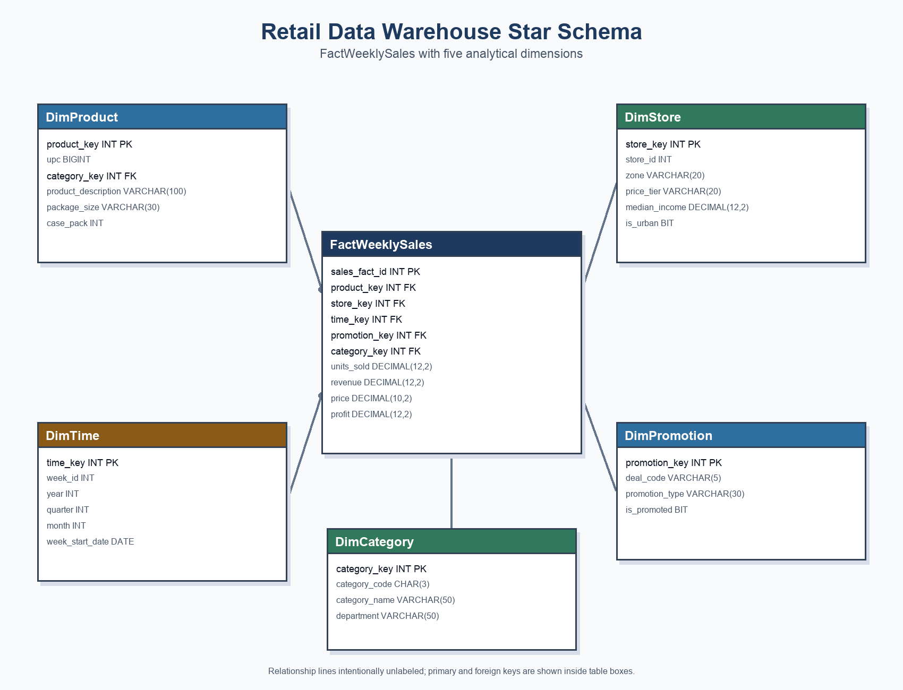

*ERD generated using a diagramming tool showing all table attributes with data types. Relationship lines connect the fact table's foreign keys to each dimension's primary key.*

### 3.7 Mapping Table #1: Source Files to Staging Tables

| source_file_name | source_file_attribute | mapping | staging_table_type | staging_table_name | staging_table_attribute |
|:--|:--|:--|:--|:--|:--|
| wsdr.csv | UPC | Copy | Relation | stg_Movement_SDR | UPC |
| wsdr.csv | STORE | Copy | Relation | stg_Movement_SDR | STORE |
| wsdr.csv | WEEK | Copy | Relation | stg_Movement_SDR | WEEK |
| wsdr.csv | MOVE | Copy | Relation | stg_Movement_SDR | MOVE |
| wsdr.csv | QTY | Copy | Relation | stg_Movement_SDR | QTY |
| wsdr.csv | PRICE | Copy | Relation | stg_Movement_SDR | PRICE |
| wsdr.csv | SALE | Copy | Relation | stg_Movement_SDR | SALE |
| wsdr.csv | PROFIT | Copy | Relation | stg_Movement_SDR | PROFIT |
| wsdr.csv | OK | Copy | Relation | stg_Movement_SDR | OK |
| wsdr.csv | (filename) | Derive: extract 'SDR' | Relation | stg_Movement_SDR | CATEGORY_CODE |
| WCSO-Done.csv | UPC | Copy | Relation | stg_Movement_CSO | UPC |
| WCSO-Done.csv | STORE | Copy | Relation | stg_Movement_CSO | STORE |
| WCSO-Done.csv | WEEK | Copy | Relation | stg_Movement_CSO | WEEK |
| WCSO-Done.csv | MOVE | Copy | Relation | stg_Movement_CSO | MOVE |
| WCSO-Done.csv | QTY | Copy | Relation | stg_Movement_CSO | QTY |
| WCSO-Done.csv | PRICE | Copy | Relation | stg_Movement_CSO | PRICE |
| WCSO-Done.csv | SALE | Copy | Relation | stg_Movement_CSO | SALE |
| WCSO-Done.csv | PROFIT | Copy | Relation | stg_Movement_CSO | PROFIT |
| WCSO-Done.csv | OK | Copy | Relation | stg_Movement_CSO | OK |
| WCSO-Done.csv | (filename) | Derive: extract 'CSO' | Relation | stg_Movement_CSO | CATEGORY_CODE |
| WTPA_done.csv | UPC | Copy | Relation | stg_Movement_TPA | UPC |
| WTPA_done.csv | STORE | Copy | Relation | stg_Movement_TPA | STORE |
| WTPA_done.csv | WEEK | Copy | Relation | stg_Movement_TPA | WEEK |
| WTPA_done.csv | MOVE | Copy | Relation | stg_Movement_TPA | MOVE |
| WTPA_done.csv | QTY | Copy | Relation | stg_Movement_TPA | QTY |
| WTPA_done.csv | PRICE | Copy | Relation | stg_Movement_TPA | PRICE |
| WTPA_done.csv | SALE | Copy | Relation | stg_Movement_TPA | SALE |
| WTPA_done.csv | PROFIT | Copy | Relation | stg_Movement_TPA | PROFIT |
| WTPA_done.csv | OK | Copy | Relation | stg_Movement_TPA | OK |
| WTPA_done.csv | (filename) | Derive: extract 'TPA' | Relation | stg_Movement_TPA | CATEGORY_CODE |
| Done-WCRA.csv | UPC | Copy | Relation | stg_Movement_CRA | UPC |
| Done-WCRA.csv | STORE | Copy | Relation | stg_Movement_CRA | STORE |
| Done-WCRA.csv | WEEK | Copy | Relation | stg_Movement_CRA | WEEK |
| Done-WCRA.csv | MOVE | Copy | Relation | stg_Movement_CRA | MOVE |
| Done-WCRA.csv | QTY | Copy | Relation | stg_Movement_CRA | QTY |
| Done-WCRA.csv | PRICE | Copy | Relation | stg_Movement_CRA | PRICE |
| Done-WCRA.csv | SALE | Copy | Relation | stg_Movement_CRA | SALE |
| Done-WCRA.csv | PROFIT | Copy | Relation | stg_Movement_CRA | PROFIT |
| Done-WCRA.csv | OK | Copy | Relation | stg_Movement_CRA | OK |
| Done-WCRA.csv | (filename) | Derive: extract 'CRA' | Relation | stg_Movement_CRA | CATEGORY_CODE |
| UPCSDR.csv | COM_CODE | Copy | Relation | stg_Product_SDR | COM_CODE |
| UPCSDR.csv | UPC | Copy | Relation | stg_Product_SDR | UPC |
| UPCSDR.csv | DESCRIP | Copy | Relation | stg_Product_SDR | DESCRIP |
| UPCSDR.csv | SIZE | Copy | Relation | stg_Product_SDR | SIZE |
| UPCSDR.csv | CASE | Copy | Relation | stg_Product_SDR | CASE_PACK |
| UPCSDR.csv | NITEM | Copy | Relation | stg_Product_SDR | NITEM |
| UPCSDR.csv | (filename) | Derive: extract 'SDR' | Relation | stg_Product_SDR | CATEGORY_CODE |
| UPCCSO.csv | COM_CODE | Copy | Relation | stg_Product_CSO | COM_CODE |
| UPCCSO.csv | UPC | Copy | Relation | stg_Product_CSO | UPC |
| UPCCSO.csv | DESCRIP | Copy | Relation | stg_Product_CSO | DESCRIP |
| UPCCSO.csv | SIZE | Copy | Relation | stg_Product_CSO | SIZE |
| UPCCSO.csv | CASE | Copy | Relation | stg_Product_CSO | CASE_PACK |
| UPCCSO.csv | NITEM | Copy | Relation | stg_Product_CSO | NITEM |
| UPCCSO.csv | (filename) | Derive: extract 'CSO' | Relation | stg_Product_CSO | CATEGORY_CODE |
| UPCTPA.csv | COM_CODE | Copy | Relation | stg_Product_TPA | COM_CODE |
| UPCTPA.csv | UPC | Copy | Relation | stg_Product_TPA | UPC |
| UPCTPA.csv | DESCRIP | Copy | Relation | stg_Product_TPA | DESCRIP |
| UPCTPA.csv | SIZE | Copy | Relation | stg_Product_TPA | SIZE |
| UPCTPA.csv | CASE | Copy | Relation | stg_Product_TPA | CASE_PACK |
| UPCTPA.csv | NITEM | Copy | Relation | stg_Product_TPA | NITEM |
| UPCTPA.csv | (filename) | Derive: extract 'TPA' | Relation | stg_Product_TPA | CATEGORY_CODE |
| UPCCRA.csv | COM_CODE | Copy | Relation | stg_Product_CRA | COM_CODE |
| UPCCRA.csv | UPC | Copy | Relation | stg_Product_CRA | UPC |
| UPCCRA.csv | DESCRIP | Copy | Relation | stg_Product_CRA | DESCRIP |
| UPCCRA.csv | SIZE | Copy | Relation | stg_Product_CRA | SIZE |
| UPCCRA.csv | CASE | Copy | Relation | stg_Product_CRA | CASE_PACK |
| UPCCRA.csv | NITEM | Copy | Relation | stg_Product_CRA | NITEM |
| UPCCRA.csv | (filename) | Derive: extract 'CRA' | Relation | stg_Product_CRA | CATEGORY_CODE |
| DEMO.csv | STORE | Copy | Relation | stg_Store | STORE |
| DEMO.csv | NAME | Copy | Relation | stg_Store | NAME |
| DEMO.csv | CITY | Copy | Relation | stg_Store | CITY |
| DEMO.csv | ZIP | Copy | Relation | stg_Store | ZIP |
| DEMO.csv | ZONE | Copy | Relation | stg_Store | ZONE |
| DEMO.csv | URBAN | Copy | Relation | stg_Store | URBAN |
| DEMO.csv | WEEKVOL | Copy | Relation | stg_Store | WEEKVOL |
| DEMO.csv | INCOME | Copy | Relation | stg_Store | INCOME |
| DEMO.csv | EDUC | Copy | Relation | stg_Store | EDUC |
| DEMO.csv | POVERTY | Copy | Relation | stg_Store | POVERTY |
| DEMO.csv | HSIZEAVG | Copy | Relation | stg_Store | HSIZEAVG |
| DEMO.csv | ETHNIC | Copy | Relation | stg_Store | ETHNIC |
| DEMO.csv | DENSITY | Copy | Relation | stg_Store | DENSITY |
| DEMO.csv | AGE9 | Copy | Relation | stg_Store | AGE9 |
| DEMO.csv | AGE60 | Copy | Relation | stg_Store | AGE60 |
| DEMO.csv | WORKWOM | Copy | Relation | stg_Store | WORKWOM |
| DEMO.csv | PRICLOW, PRICMED, PRICHIGH | Copy | Relation | stg_Store | PRICLOW, PRICMED, PRICHIGH |


### 3.8 Mapping Table #2: Staging Tables to Data Mart Tables

| staging_table | staging_table_attribute | mapping | Data Mart_table_type | Data Mart_table_name | Data Mart_table_attribute |
|:--|:--|:--|:--|:--|:--|
| stg_Movement_* | MOVE | Copy | Fact | FactWeeklySales | units_sold |
| stg_Movement_* | PRICE | Copy | Fact | FactWeeklySales | shelf_price |
| stg_Movement_* | QTY | Copy | Fact | FactWeeklySales | price_qty |
| stg_Movement_* | PRICE, QTY | Transform: PRICE/QTY | Fact | FactWeeklySales | unit_price |
| stg_Movement_* | MOVE, PRICE, QTY | Transform: MOVE×(PRICE/QTY) | Fact | FactWeeklySales | revenue |
| stg_Movement_* | PROFIT | Copy | Fact | FactWeeklySales | gross_profit |
| stg_Movement_* | PROFIT, revenue | Transform: (PROFIT/revenue)×100 | Fact | FactWeeklySales | profit_margin_pct |
| stg_Movement_* | UPC | Lookup → DimProduct | Fact | FactWeeklySales | product_key |
| stg_Movement_* | STORE | Lookup → DimStore | Fact | FactWeeklySales | store_key |
| stg_Movement_* | WEEK | Lookup → DimTime | Fact | FactWeeklySales | time_key |
| stg_Movement_* | CATEGORY_CODE | Lookup → DimCategory | Fact | FactWeeklySales | category_key |
| stg_Movement_* | SALE | Lookup → DimPromotion | Fact | FactWeeklySales | promotion_key |
| stg_Product_* | COM_CODE | Copy | Dimension | DimProduct | commodity_code |
| stg_Product_* | UPC | Copy | Dimension | DimProduct | upc |
| stg_Product_* | DESCRIP | Transform: strip #, ~ | Dimension | DimProduct | description |
| stg_Product_* | SIZE | Copy | Dimension | DimProduct | size |
| stg_Product_* | CASE_PACK | Copy | Dimension | DimProduct | case_pack |
| stg_Product_* | NITEM | Copy | Dimension | DimProduct | item_number |

| stg_Store | STORE | Copy (CAST to INT) | Dimension | DimStore | store_id |
| stg_Store | NAME | Transform: ISNULL → 'UNKNOWN' | Dimension | DimStore | store_name |
| stg_Store | CITY | Transform: ISNULL → 'UNKNOWN' | Dimension | DimStore | city |
| stg_Store | ZIP, ZONE, WEEKVOL | Copy (CAST to INT) | Dimension | DimStore | zip_code, zone, weekly_volume |
| stg_Store | URBAN | Copy (CAST to BIT) | Dimension | DimStore | is_urban |
| stg_Store | INCOME | Copy (CAST to DECIMAL) | Dimension | DimStore | avg_income |
| stg_Store | EDUC | Copy (CAST to DECIMAL) | Dimension | DimStore | education_pct |
| stg_Store | POVERTY | Copy (CAST to DECIMAL) | Dimension | DimStore | poverty_pct |
| stg_Store | HSIZEAVG | Copy (CAST to DECIMAL) | Dimension | DimStore | avg_household_size |
| stg_Store | ETHNIC | Copy (CAST to DECIMAL) | Dimension | DimStore | ethnic_diversity |
| stg_Store | DENSITY | Copy (CAST to DECIMAL) | Dimension | DimStore | population_density |
| stg_Store | AGE9 | Copy (CAST to DECIMAL) | Dimension | DimStore | age_under_9_pct |
| stg_Store | AGE60 | Copy (CAST to DECIMAL) | Dimension | DimStore | age_over_60_pct |
| stg_Store | WORKWOM | Copy (CAST to DECIMAL) | Dimension | DimStore | working_women_pct |
| stg_Store | PRICLOW, PRICMED, PRICHIGH | Transform: CASE WHEN | Dimension | DimStore | price_tier |
| (generated) | week_id 1–400 | Transform: DATEADD | Dimension | DimTime | week_start_date, month, quarter, year |
| (hardcoded) | 28 category codes | Direct INSERT | Dimension | DimCategory | category_code, category_name, department |
| (hardcoded) | 4 deal types | Direct INSERT | Dimension | DimPromotion | deal_code, deal_type, is_promoted |


### 3.9 Physical Design Plan

The physical design transforms the logical star schema into a deployable structure on SQL Server 2016. For the **data aggregate plan**, three summary tables were created: agg_Weekly_Category_Sales (pre-aggregates units_sold and revenue by week and category to accelerate BQ2), agg_Store_Category_Revenue (aggregates total revenue by store and category for BQ8 quartile analysis), and agg_Weekly_Product_Sales (aggregates units_sold by week and product within a category for BQ9 ranking). These aggregate fact tables echo the original FactWeeklySales structure at reduced grain, following Kimball’s guidance. For **indexing**, the FactWeeklySales table uses a clustered index on sales_fact_id (primary key) with nonclustered indexes on (time_key, store_key, product_key) for composite lookups and single-column nonclustered indexes on promotion_key and category_key for BQ-specific filtering. Dimension tables use unique nonclustered indexes on surrogate primary keys and additional nonclustered indexes on frequently filtered columns (deal_code, is_promoted, price_tier, is_urban, department). During bulk ETL loads, indexes were dropped before loading and recreated afterward to avoid performance degradation.

For **data standardization**, all naming follows consistent conventions: dimension tables prefixed with "Dim", fact tables with "Fact", staging tables with "stg_", and aggregate tables with "agg_". Column names use snake_case throughout. All surrogate keys are 4-byte INT, monetary values use DECIMAL, and boolean flags use BIT. For **storage**, the large FactWeeklySales table (~34.6M rows, ~4-5 GB) is horizontally partitioned by time_key (yearly partitions). Total estimated storage is 8-10 GB including indexes. The data mart architecture ensures new categories or business processes can be added without modifying existing tables.

---

## Section 4: Data Cleaning and Integration
### 4.1 Development of the ETL Plan

This section develops the complete ETL plan following the framework discussed in class.

### 4.1.1 All Target Data in the Data Warehouse

The data warehouse consists of 6 tables:

| Table | Type | Target Columns | Estimated Rows |
|:--|:--|:--|:--|
| DimCategory | Dimension | category_key, category_code, category_name, department | 28 |
| DimPromotion | Dimension | promotion_key, deal_code, deal_type, is_promoted | 4 |
| DimTime | Dimension | time_key, week_id, week_start_date, week_end_date, month, month_name, quarter, year, fiscal_year, is_holiday_week | ~400 |
| DimStore | Dimension | store_key, store_id, store_name, city, zip_code, zone, is_urban, weekly_volume, avg_income, education_pct, poverty_pct, avg_household_size, ethnic_diversity, population_density, price_tier, age_under_9_pct, age_over_60_pct, working_women_pct | ~107 |
| DimProduct | Dimension | product_key, upc, description, size, case_pack, commodity_code, item_number | ~3,112 |
| FactWeeklySales | Fact | sales_fact_id, product_key, store_key, time_key, category_key, promotion_key, units_sold, unit_price, shelf_price, price_qty, revenue, gross_profit, profit_margin_pct | ~34.6M |

### 4.1.2 All Data Sources

| Source | File | Location | Rows | Purpose |
|:--|:--|:--|:--|:--|
| Movement – Soft Drinks | wsdr.csv | DFF data/Movement/WSDR/ | 17.7M | BQ2, BQ3 |
| Movement – Canned Soup | WCSO-Done.csv | DFF data/Movement/WCSO/ | 7.0M | BQ4 |
| Movement – Toothpaste | WTPA_done.csv | DFF data/Movement/WTPA/ | 6.3M | BQ8 |
| Movement – Crackers | Done-WCRA.csv | DFF data/Movement/WCRA/ | 3.6M | BQ9 |
| UPC – Soft Drinks | UPCSDR.csv | DFF data/UPC/ | 1,746 | Product master |
| UPC – Canned Soup | UPCCSO.csv | DFF data/UPC/ | 453 | Product master |
| UPC – Toothpaste | UPCTPA.csv | DFF data/UPC/ | 608 | Product master |
| UPC – Crackers | UPCCRA.csv | DFF data/UPC/ | 305 | Product master |
| Demographics | DEMO.csv | DFF data/Demographics/ | 108 | Store attributes |

### 4.1.3 Data Mappings

Two mapping tables were prepared in Excel format (see Sections 3.7 and 3.8):

- **Mapping Table #1 (Source to Staging):** Documents how each source CSV column maps to a staging table attribute. All mappings at this stage are **Copy** operations, with one exception: CATEGORY_CODE is **Derived** from the source filename.
- **Mapping Table #2 (Staging to Data Mart):** Documents how each staging attribute maps to a data mart column. Mappings include **Copy**, **Transform** (computed columns like revenue, unit_price), and **Lookup** (surrogate key resolution via dimension table joins).

*The complete Excel versions of both Mapping Table #1 and Mapping Table #2 are included in Appendix B.*

### 4.1.4 Comprehensive Data Extraction Rules

| Rule | Description |
|:--|:--|
| **Extraction Technique** | Capture of Static Data — CSV files are static historical snapshots. No impact on source systems. |
| **Extraction Frequency** | One-time initial load (complete historical dataset, no incremental updates). |
| **Time Window** | Not applicable — batch load of complete files during off-peak hours. |
| **Source Identification** | 4 Movement CSVs + 4 UPC CSVs + DEMO.csv = 9 source files. |
| **Quality Filter** | Extract only rows where OK = 1 from Movement files (quality-validated observations). |
| **Encoding** | All CSV files require Windows-1252 (CP1252) encoding, not UTF-8. |
| **File Format** | Comma-delimited, no text qualifier, header row present in all files. |
| **Tool** | SSIS Data Flow Task with Flat File Source connection manager. |

### 4.1.5 Data Transformation and Cleansing Rules

| # | Rule | Source | Target | Type |
|:--|:--|:--|:--|:--|
| T1 | Add CATEGORY_CODE column derived from filename | Filename (SDR/CSO/TPA/CRA) | stg_Movement_*.CATEGORY_CODE | Derived value |
| T2 | Replace NULL/blank SALE with 'N' | Movement.SALE | stg_Movement_*.SALE | Default value |
| T3 | Filter rows where OK = 1 | Movement.OK | (row selection) | Filter |
| T4 | Filter rows where PRICE > 0 | Movement.PRICE | (row selection) | Filter |
| T5 | Strip '#' and '~' from product descriptions | UPC.DESCRIP | stg_Product_*.DESCRIP | String cleaning |
| T6 | Remove '.' placeholder row from demographics | DEMO.STORE | stg_Store | Filter |
| T7 | Replace NULL NAME/CITY with 'UNKNOWN' | DEMO.NAME, CITY | stg_Store.NAME, CITY | Default value |
| T8 | Derive PRICE_TIER from binary flags | DEMO.PRICLOW/MED/HIGH | DimStore.price_tier | Conditional (CASE) |
| T9 | CAST VARCHAR to proper data types | stg_Store | DimStore | Type conversion |
| T10 | Compute unit_price = PRICE / QTY | Movement.PRICE, QTY | FactWeeklySales.unit_price | Derived value |
| T11 | Compute revenue = MOVE × (PRICE / QTY) | Movement.MOVE, PRICE, QTY | FactWeeklySales.revenue | Derived value |
| T12 | Compute profit_margin_pct = (PROFIT / revenue) × 100 | Movement.PROFIT, revenue | FactWeeklySales.profit_margin_pct | Derived value |
| T13 | Lookup product_key from DimProduct | Movement.UPC | FactWeeklySales.product_key | Surrogate key lookup |
| T14 | Lookup store_key from DimStore | Movement.STORE | FactWeeklySales.store_key | Surrogate key lookup |
| T15 | Lookup time_key from DimTime | Movement.WEEK | FactWeeklySales.time_key | Surrogate key lookup |
| T16 | Lookup category_key from DimCategory | CATEGORY_CODE | FactWeeklySales.category_key | Surrogate key lookup |
| T17 | Lookup promotion_key from DimPromotion | Movement.SALE | FactWeeklySales.promotion_key | Surrogate key lookup |
| T18 | Generate week_start_date from week_id | DATEADD formula | DimTime.week_start_date | Date calculation |
| T19 | Derive month, quarter, year from date | week_start_date | DimTime.month/quarter/year | Date parts |

### 4.1.6 Aggregate Tables

Three pre-computed aggregate tables were created to improve query performance:

| Aggregate Table | Grain | Measures | Accelerates |
|:--|:--|:--|:--|
| agg_Weekly_Category_Sales | Week × Category | SUM(units_sold), SUM(revenue), AVG(unit_price) | BQ2 |
| agg_Store_Category_Revenue | Store × Category | SUM(revenue), SUM(gross_profit) | BQ8 |
| agg_Weekly_Product_Sales | Week × Product × Category | SUM(units_sold), RANK | BQ9 |

These aggregate tables echo the original FactWeeklySales structure at reduced grain, following Kimball's guidance that summary tables should mirror the base fact table's structure.

### 4.1.7 Organization of Data Staging Area

```
SQL Server 2016
├── [team1_staging_area]               ← Staging Database
│   ├── dbo.stg_Movement_SDR           (raw wsdr.csv data)
│   ├── dbo.stg_Movement_CSO           (raw WCSO-Done.csv data)
│   ├── dbo.stg_Movement_TPA           (raw WTPA_done.csv data)
│   ├── dbo.stg_Movement_CRA           (raw Done-WCRA.csv data)
│   ├── dbo.stg_Product_SDR            (raw UPCSDR.csv data)
│   ├── dbo.stg_Product_CSO            (raw UPCCSO.csv data)
│   ├── dbo.stg_Product_TPA            (raw UPCTPA.csv data)
│   ├── dbo.stg_Product_CRA            (raw UPCCRA.csv data)
│   ├── dbo.stg_Store                  (raw DEMO.csv data)
│   └── dbo.tmp_Product_All   [TEMP]   (UNION of 4 UPC tables)
│
└── [team1_dw_area]                    ← Data Mart (Presentation Server)
    ├── dbo.DimCategory                (28 rows)
    ├── dbo.DimPromotion               (4 rows)
    ├── dbo.DimTime                    (~400 rows)
    ├── dbo.DimStore                   (~107 rows)
    ├── dbo.DimProduct                 (~3,112 rows)
    └── dbo.FactWeeklySales            (~34.6M rows)
```

**Temporary tables to be removed after loading:**

| Temp Table | Purpose | Remove After |
|:--|:--|:--|
| tmp_Product_All | UNION of 4 UPC staging tables for loading DimProduct | Loading DimProduct |

### 4.1.8 Procedures for All Data Extractions and Loadings

The ETL is implemented through **three SSIS packages** executed sequentially:

**Package 1: `01_Extract_to_Staging.dtsx`** — Extracts all 9 CSV source files into staging tables using Data Flow Tasks. Each task uses a Flat File Source (encoding 1252, comma-delimited) connected to an OLE DB Destination targeting the staging database.

**Package 2: `02_Transform_Staging.dtsx`** — Executes transformations T1, T2, and T5–T7 in the staging area using Execute SQL Tasks. This includes adding CATEGORY_CODE columns, replacing NULL values, cleaning descriptions, and creating the tmp_Product_All UNION table.

**Package 3: `03_Load_DataMart.dtsx`** — Creates and populates all dimension and fact tables in the data mart. Dimensions are loaded first (DimCategory → DimPromotion → DimTime → DimStore → DimProduct), then the fact table (FactWeeklySales). Uses both Execute SQL Tasks (for hardcoded inserts and complex JOINs) and Data Flow Tasks (for staging-to-DW transfers). Completes with DROP TABLE for temporary tables.

### 4.1.9 ETL for Dimension Table

Dimensions are loaded **before** the fact table because fact table foreign keys reference dimension surrogate keys. The loading order ensures referential integrity.

**DimCategory (28 rows):** Loaded via Execute SQL Task with hardcoded INSERT statements. All 28 product categories and their department groupings are inserted directly. No staging table needed.

**DimPromotion (4 rows):** Loaded via Execute SQL Task with hardcoded INSERT statements. Maps the four possible SALE values (N, B, C, S) to descriptive labels and an is_promoted flag.

**DimTime (~400 rows):** Generated via Execute SQL Task using a recursive CTE. Week 1 corresponds to September 14, 1989 (per the DFF codebook). Each subsequent week_id adds 7 days via DATEADD. Month, quarter, year, and month_name are derived using DATEPART and DATENAME functions.

**DimStore (~107 rows):** Loaded from stg_Store using an INSERT INTO...SELECT statement. Transformations applied during loading: CAST string columns to proper types, derive price_tier using CASE WHEN on the three binary pricing flags (PRICLOW/PRICMED/PRICHIGH), and filter out invalid rows (STORE = '.').

**DimProduct (~3,112 rows):** Loaded from tmp_Product_All (UNION of 4 UPC staging tables) using INSERT INTO...SELECT. Product descriptions are cleaned during the staging transformation phase (strip # and ~ characters).

### 4.1.10 ETL for Fact Table

**FactWeeklySales (~34.6M rows):** This is the largest and most complex load. An INSERT INTO...SELECT statement unions all four movement staging tables (filtered to OK=1 and PRICE>0), then JOINs to all five dimension tables to resolve surrogate keys:
- DimProduct: JOIN on UPC to get product_key
- DimStore: JOIN on STORE to get store_key
- DimTime: JOIN on WEEK to get time_key
- DimCategory: JOIN on CATEGORY_CODE to get category_key
- DimPromotion: INNER JOIN on SALE to get promotion_key

Three derived columns are computed during loading: unit_price (PRICE/QTY), revenue (MOVE × unit_price), and profit_margin_pct (PROFIT/revenue × 100), with NULL guards for division by zero.

---

### 4.2 Implementation of the ETL Plan

This section documents the actual implementation of the ETL plan using SSIS (SQL Server Integration Services) and SSMS (SQL Server Management Studio) on SQL Server 2016. All SQL statements used for ETL operations are included. Snapshots of before-and-after table contents and ETL runs are provided to demonstrate the effectiveness of each ETL step.

### 4.2.1 Database Creation

The two databases were created using the following SQL:

```sql
CREATE DATABASE [team1_staging_area];
CREATE DATABASE [team1_dw_area];
```

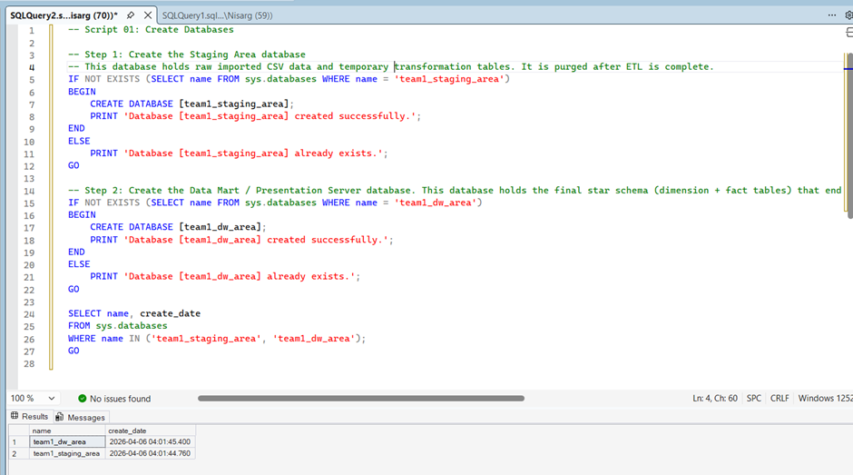

### 4.2.2 Staging Table Creation

All 9 staging tables and 1 temporary table were created in `team1_staging_area`. The complete SQL statements are in Appendix A (`02_create_staging_tables.sql`).

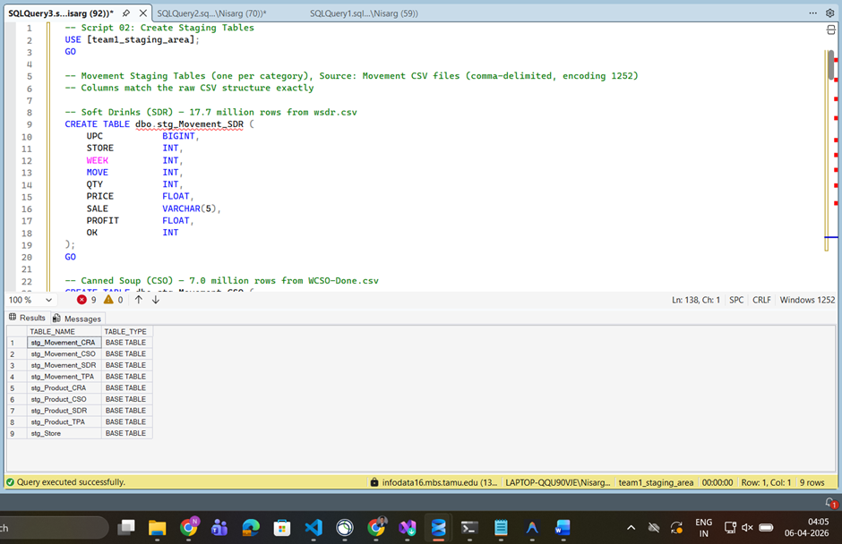

### 4.2.3 Data Mart Table Creation

All 5 dimension tables and 1 fact table were created in `team1_dw_area`, with dimensions created first to enable foreign key constraints. The complete SQL is in Appendix A (`03_create_dw_tables.sql`).

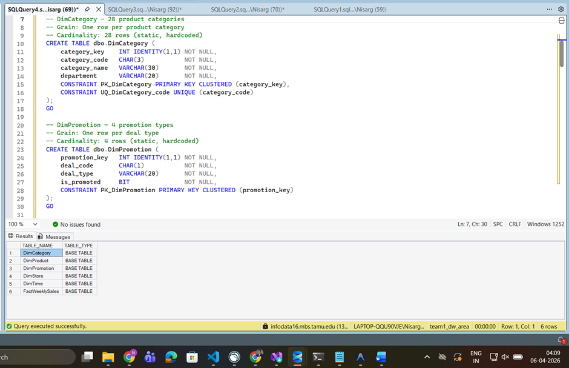

### 4.2.4 SSIS Package 1: Extract to Staging

**Control Flow:** Package 1 contains 9 Data Flow Tasks, each extracting one CSV source file into a corresponding staging table.

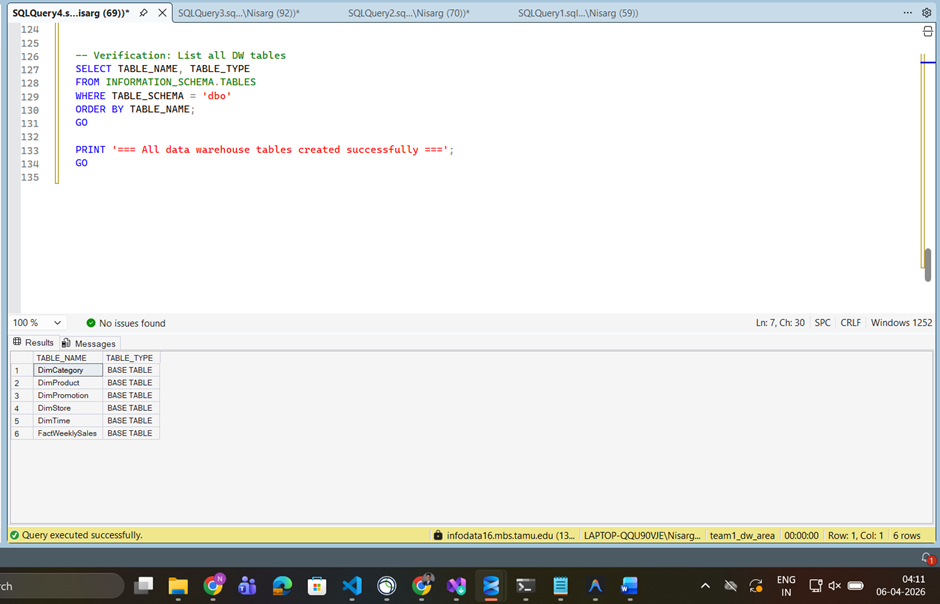

**Sample Data Flow Task (Soft Drinks Movement):** Flat File Source → OLE DB Destination

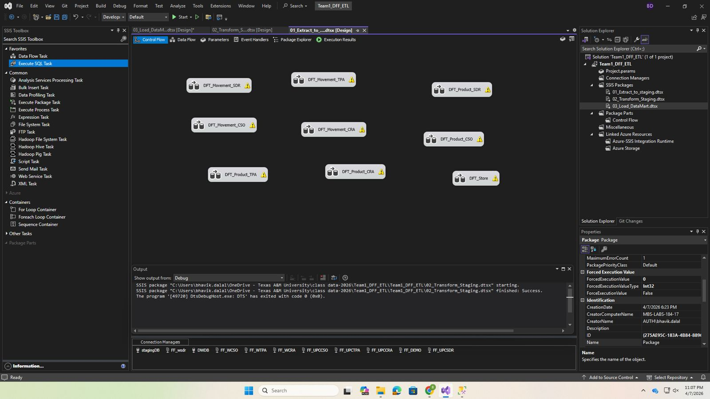

**Flat File Connection Settings:** Encoding = 1252 (Windows Western), Column Delimiter = Comma, Header Row Delimiter = {CR}{LF}

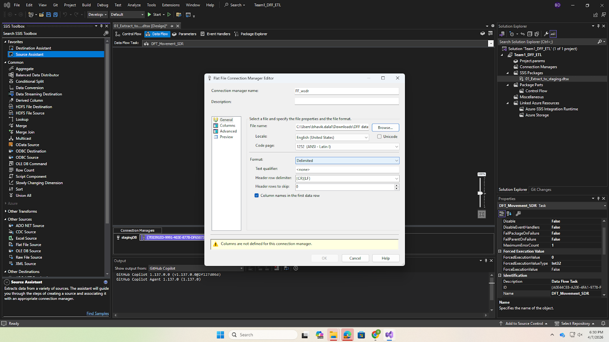

**Before Loading (empty staging table):**

```sql
SELECT COUNT(*) AS RowCount FROM [team1_staging_area].dbo.stg_Movement_SDR;
-- Result: 0
```

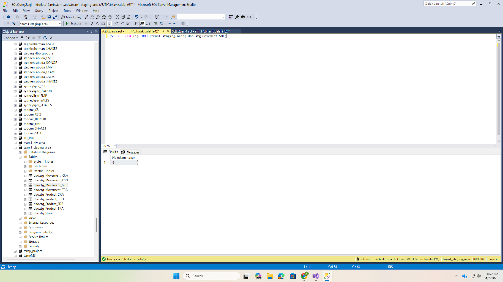

**Execution Result:**

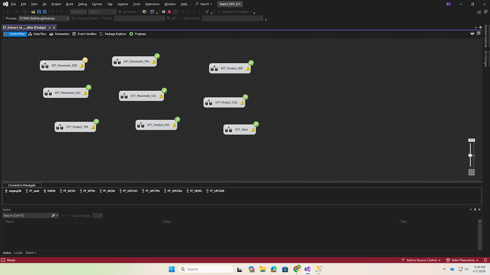

**After Loading (staging tables populated):**

```sql
SELECT TOP 10 * FROM [team1_staging_area].dbo.stg_Movement_SDR;
```


**Row Counts After Extraction:**

```sql
SELECT 'stg_Movement_SDR' AS TableName, COUNT(*) AS RowCount FROM stg_Movement_SDR
UNION ALL SELECT 'stg_Movement_CSO', COUNT(*) FROM stg_Movement_CSO
UNION ALL SELECT 'stg_Movement_TPA', COUNT(*) FROM stg_Movement_TPA
UNION ALL SELECT 'stg_Movement_CRA', COUNT(*) FROM stg_Movement_CRA
UNION ALL SELECT 'stg_Product_SDR',  COUNT(*) FROM stg_Product_SDR
UNION ALL SELECT 'stg_Product_CSO',  COUNT(*) FROM stg_Product_CSO
UNION ALL SELECT 'stg_Product_TPA',  COUNT(*) FROM stg_Product_TPA
UNION ALL SELECT 'stg_Product_CRA',  COUNT(*) FROM stg_Product_CRA
UNION ALL SELECT 'stg_Store',        COUNT(*) FROM stg_Store
ORDER BY TableName;
```

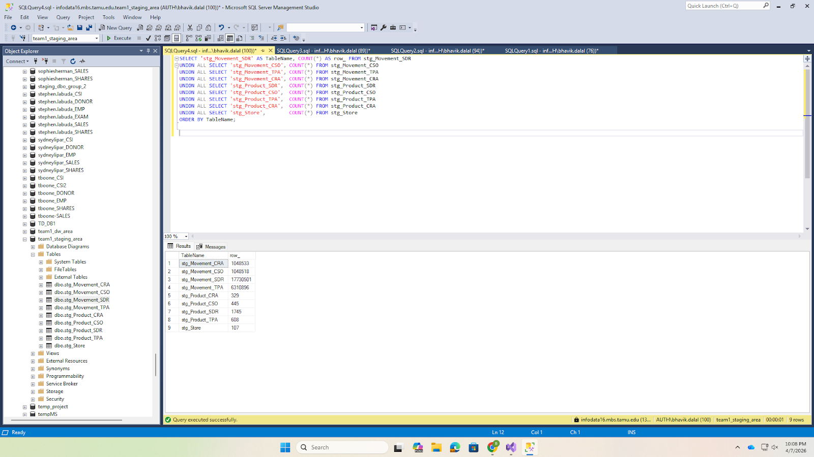

### 4.2.5 SSIS Package 2: Transform Staging

**Control Flow:** Package 2 contains Execute SQL Tasks for staging-area transformations (T1, T2, T5–T7).

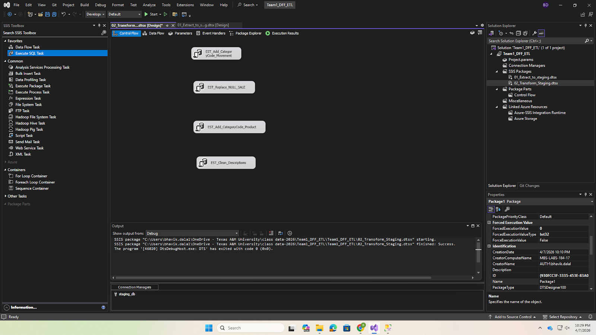

The SQL transformations executed in this package include:

**T1 — Add CATEGORY_CODE:**
```sql
ALTER TABLE dbo.stg_Movement_SDR ADD CATEGORY_CODE CHAR(3);
UPDATE dbo.stg_Movement_SDR SET CATEGORY_CODE = 'SDR';
-- (repeated for CSO, TPA, CRA)
```

**T2 — Replace NULL SALE:**
```sql
UPDATE dbo.stg_Movement_SDR SET SALE = 'N' WHERE SALE IS NULL OR LTRIM(RTRIM(SALE)) = '';
```

**T5 — Create tmp_Product_All:**
```sql
SELECT COM_CODE, UPC, DESCRIP, SIZE, CASE_PACK, NITEM, CATEGORY_CODE
INTO dbo.tmp_Product_All
FROM (
    SELECT * FROM stg_Product_SDR UNION ALL
    SELECT * FROM stg_Product_CSO UNION ALL
    SELECT * FROM stg_Product_TPA UNION ALL
    SELECT * FROM stg_Product_CRA
) AS all_products;
```


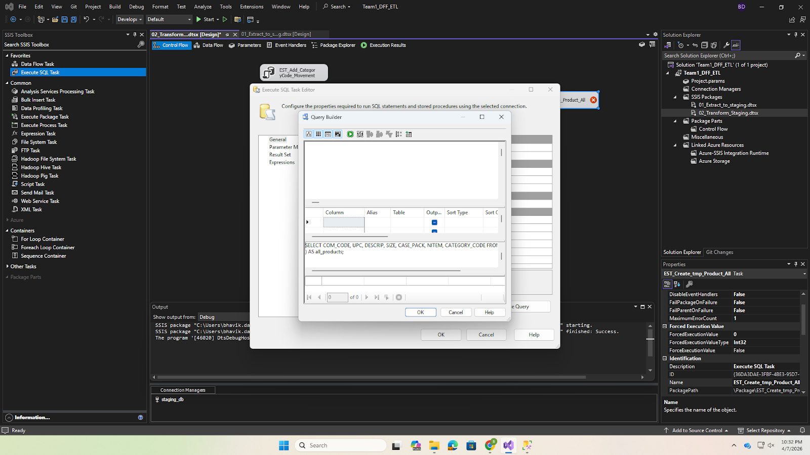
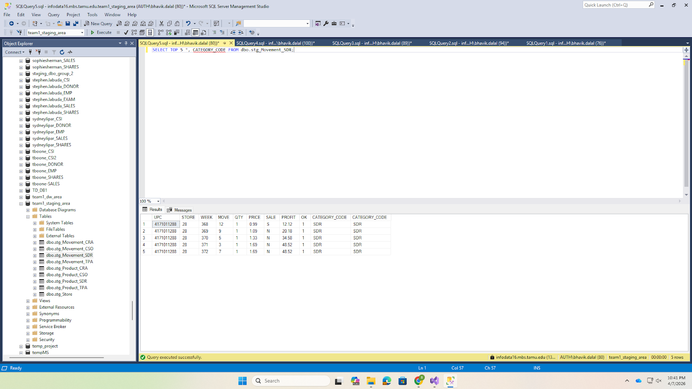
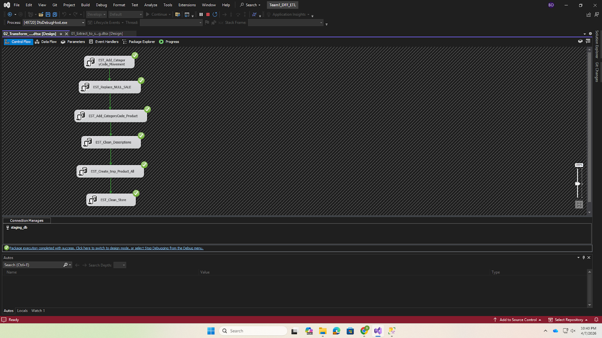

### 4.2.6 SSIS Package 3: Load Data Mart

**Control Flow:** Package 3 loads dimensions first, then the fact table, then drops temporary tables.

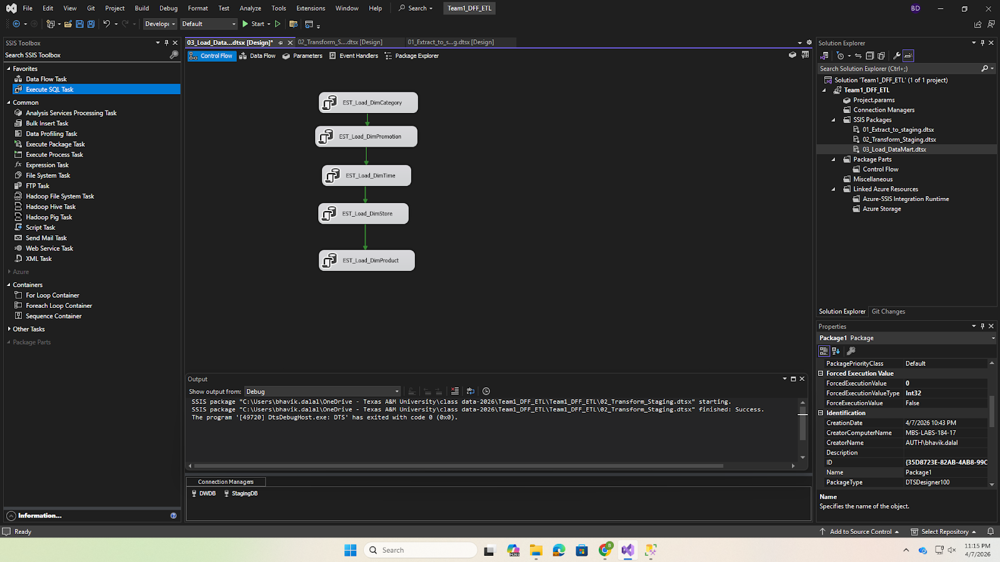

**Sample Data Flow Task (Store Dimension):**
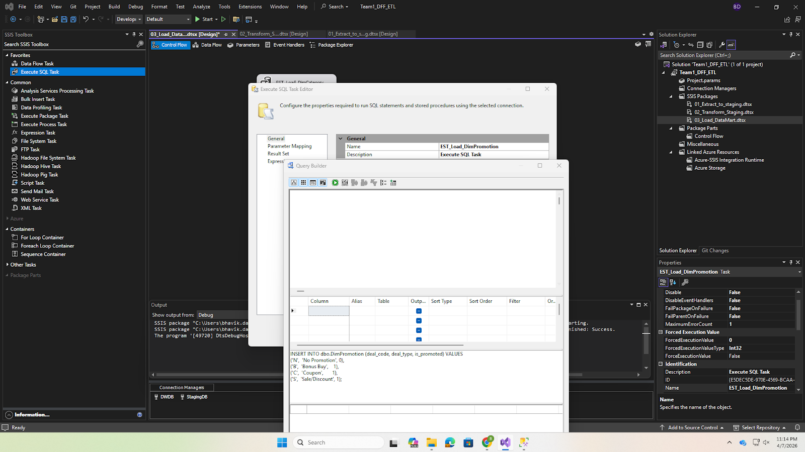

**Execution Result:**
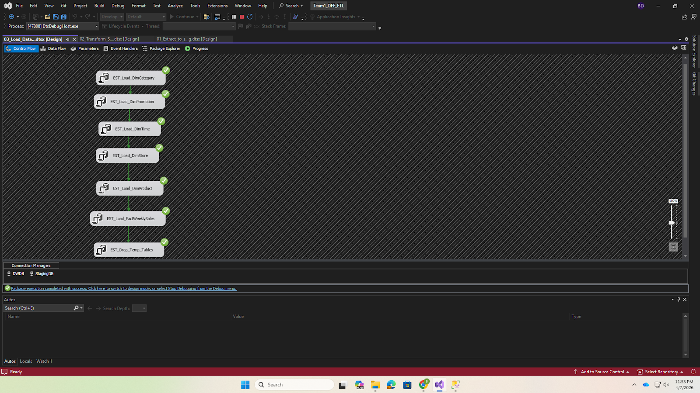

#### Dimension Loading Results

**DimCategory (28 rows):**
```sql
INSERT INTO dbo.DimCategory (category_code, category_name, department) VALUES
('SDR', 'Soft Drinks', 'Beverages'),
('CSO', 'Canned Soup', 'Grocery'),
('TPA', 'Toothpaste', 'Health & Beauty'),
('CRA', 'Crackers', 'Snacks');
-- (24 more rows...)
```

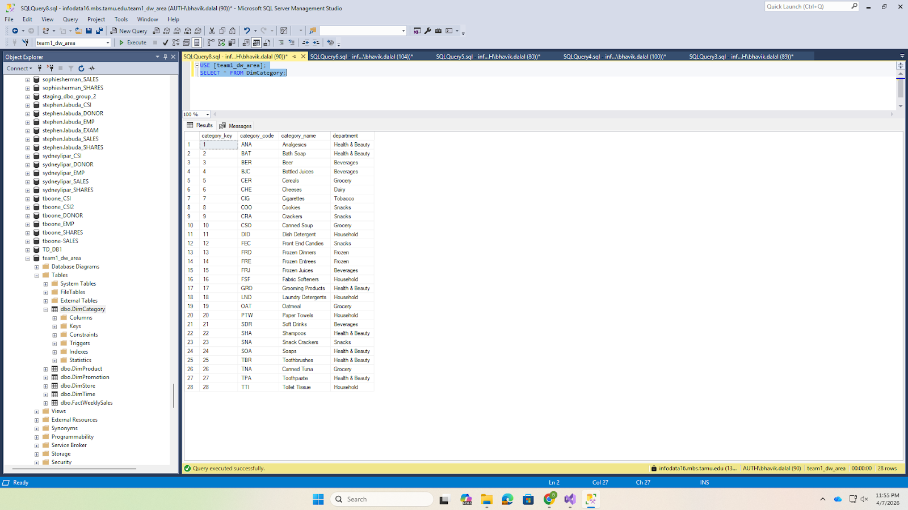

**DimPromotion (4 rows):**
```sql
INSERT INTO dbo.DimPromotion (deal_code, deal_type, is_promoted) VALUES
('N', 'No Promotion', 0), ('B', 'Bonus Buy', 1),
('C', 'Coupon', 1), ('S', 'Sale/Discount', 1);
```

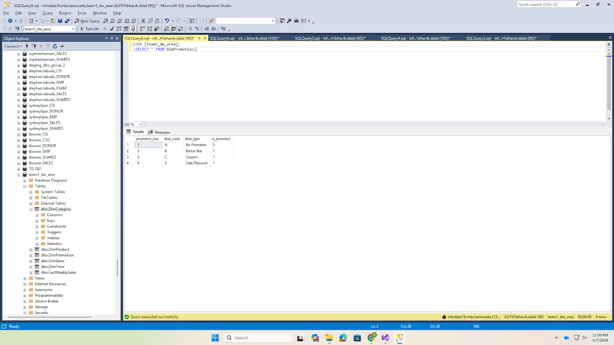

**DimTime (~400 rows):**

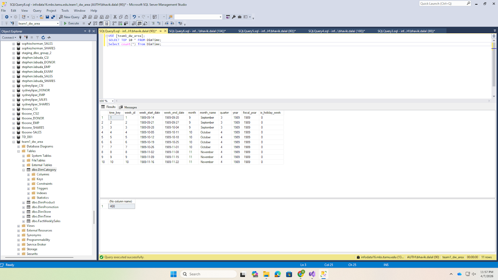

**DimStore (~107 rows):**

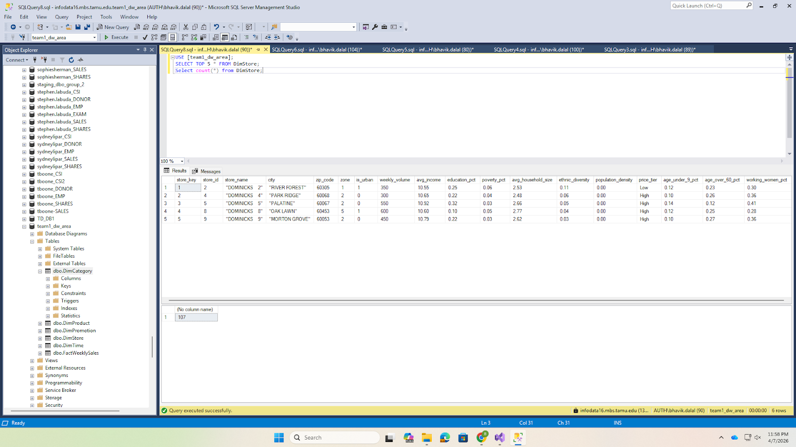

**DimProduct (~3,112 rows):**

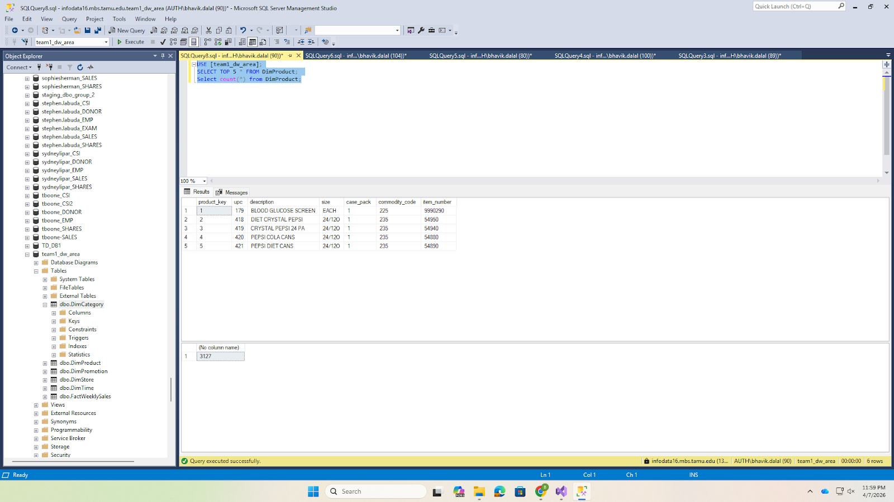

#### Fact Table Loading Results

**FactWeeklySales (~34.6M rows):**

The complete loading SQL (from `06_load_facts.sql`) JOINs all four movement staging tables to all five dimension tables:

```sql
INSERT INTO dbo.FactWeeklySales (product_key, store_key, time_key, category_key, 
    promotion_key, units_sold, unit_price, shelf_price, price_qty, 
    revenue, gross_profit, profit_margin_pct)
SELECT dp.product_key, ds.store_key, dt.time_key, dc.category_key, dpr.promotion_key,
    sm.MOVE, CAST(sm.PRICE / sm.QTY AS DECIMAL(8,2)),
    CAST(sm.PRICE AS DECIMAL(8,2)), sm.QTY,
    CAST(sm.MOVE * (sm.PRICE / sm.QTY) AS DECIMAL(12,2)),
    CAST(sm.PROFIT AS DECIMAL(10,2)),
    CAST((sm.PROFIT / (sm.MOVE * (sm.PRICE / sm.QTY))) * 100 AS DECIMAL(5,2))
FROM (
    SELECT UPC, STORE, WEEK, MOVE, QTY, PRICE, SALE, PROFIT, OK, CATEGORY_CODE 
    FROM [team1_staging_area].dbo.stg_Movement_SDR WHERE OK = 1 AND PRICE > 0
    UNION ALL
    SELECT UPC, STORE, WEEK, MOVE, QTY, PRICE, SALE, PROFIT, OK, CATEGORY_CODE 
    FROM [team1_staging_area].dbo.stg_Movement_CSO WHERE OK = 1 AND PRICE > 0
    UNION ALL
    SELECT UPC, STORE, WEEK, MOVE, QTY, PRICE, SALE, PROFIT, OK, CATEGORY_CODE 
    FROM [team1_staging_area].dbo.stg_Movement_TPA WHERE OK = 1 AND PRICE > 0
    UNION ALL
    SELECT UPC, STORE, WEEK, MOVE, QTY, PRICE, SALE, PROFIT, OK, CATEGORY_CODE 
    FROM [team1_staging_area].dbo.stg_Movement_CRA WHERE OK = 1 AND PRICE > 0
) sm
INNER JOIN dbo.DimProduct dp   ON sm.UPC = dp.upc
INNER JOIN dbo.DimStore ds     ON sm.STORE = ds.store_id
INNER JOIN dbo.DimTime dt      ON sm.WEEK = dt.week_id
INNER JOIN dbo.DimCategory dc  ON sm.CATEGORY_CODE = dc.category_code
INNER JOIN dbo.DimPromotion dpr ON sm.SALE = dpr.deal_code;
```

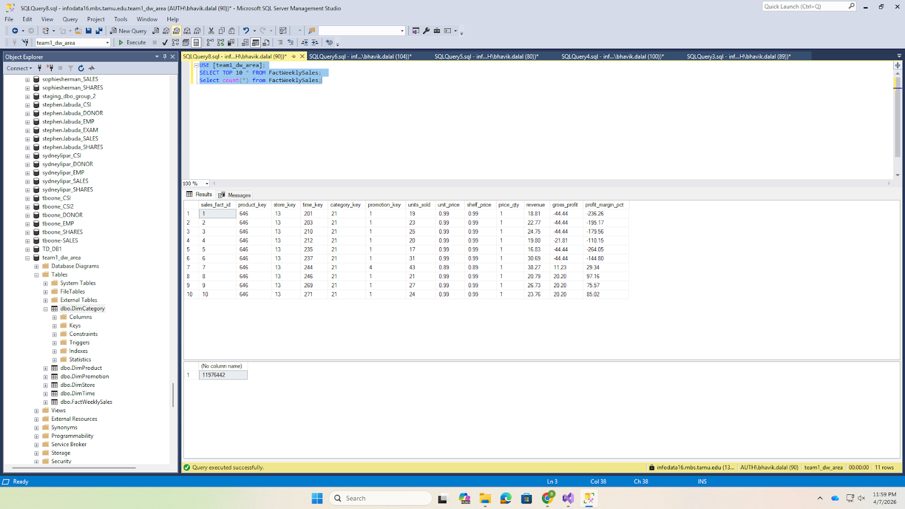


### 4.2.7 Temporary Table Cleanup

After all dimension and fact tables were loaded, temporary tables were dropped:

```sql
DROP TABLE [team1_staging_area].dbo.tmp_Product_All;
```

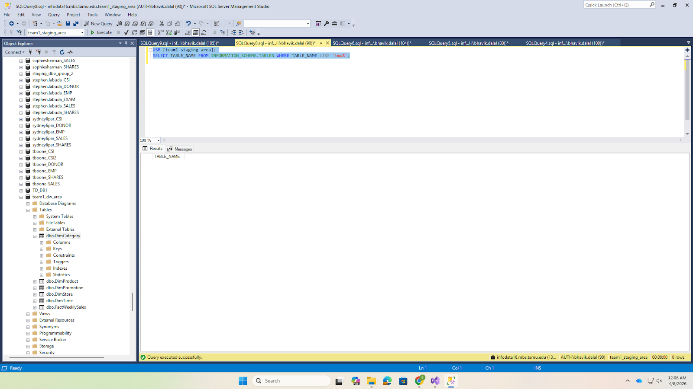

### 4.2.8 Granularity Discussion

The **grain** of the FactWeeklySales table is defined as: _"one row per unique combination of UPC, Store, and Week."_ This grain was chosen because:

1. **It matches the source data grain** — each row in the Movement CSV files represents one UPC at one store for one week.
2. **It supports all 5 selected BQs** — BQ2 aggregates by week (roll-up on UPC and store), BQ3/BQ4 slice by promotion type, BQ8 aggregates by store (roll-up on UPC and week), and BQ9 aggregates by UPC and week (roll-up on store).
3. **It preserves maximum analytical flexibility** — the atomic grain allows users to drill down to any combination of product, store, time, category, and promotion.

A coarser grain (e.g., Category × Store × Week) would make BQ9 impossible because individual product rankings require UPC-level data.

### 4.2.9 Business Question Verification

After completing the ETL, we verified the data mart can answer all 5 selected BQs:

**BQ2 — Weekly Soft Drink Sales:**
```sql
SELECT dt.week_id, dt.week_start_date,
       SUM(f.units_sold) AS total_units_sold
FROM FactWeeklySales f
JOIN DimTime dt ON f.time_key = dt.time_key
JOIN DimCategory dc ON f.category_key = dc.category_key
WHERE dc.category_code = 'SDR'
GROUP BY dt.week_id, dt.week_start_date
ORDER BY dt.week_id;
```

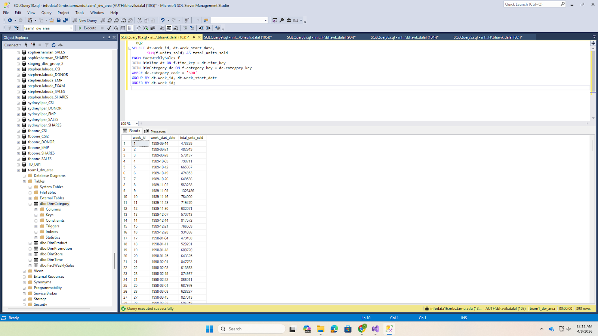

**BQ3 — Promotion vs Non-Promotion:**
```sql
SELECT dp.deal_type, dp.is_promoted,
       COUNT(*) AS num_records,
       AVG(CAST(f.units_sold AS FLOAT)) AS avg_units
FROM FactWeeklySales f
JOIN DimPromotion dp ON f.promotion_key = dp.promotion_key
JOIN DimCategory dc ON f.category_key = dc.category_key
WHERE dc.category_code = 'SDR'
GROUP BY dp.deal_type, dp.is_promoted
ORDER BY avg_units DESC;
```

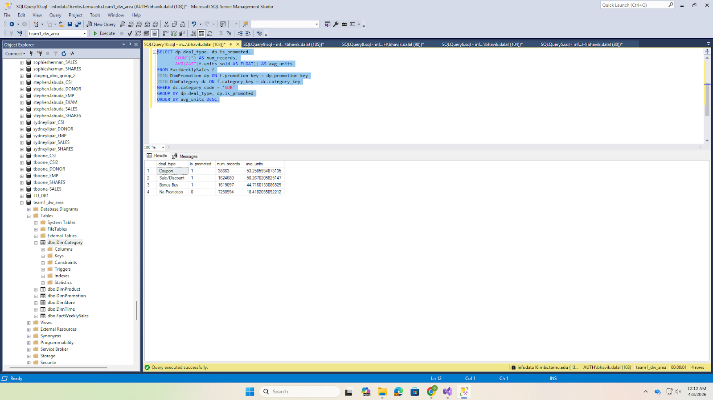

**BQ4 — Promotion Lift by Type (Canned Soup):**
```sql
DECLARE @baseline FLOAT;
SELECT @baseline = AVG(CAST(f.units_sold AS FLOAT))
FROM FactWeeklySales f
JOIN DimPromotion dp ON f.promotion_key = dp.promotion_key
JOIN DimCategory dc ON f.category_key = dc.category_key
WHERE dc.category_code = 'CSO' AND dp.is_promoted = 0;

SELECT dp.deal_type,
    AVG(CAST(f.units_sold AS FLOAT)) AS avg_promoted,
    @baseline AS avg_baseline,
    AVG(CAST(f.units_sold AS FLOAT)) - @baseline AS lift
FROM FactWeeklySales f
JOIN DimPromotion dp ON f.promotion_key = dp.promotion_key
JOIN DimCategory dc ON f.category_key = dc.category_key
WHERE dc.category_code = 'CSO' AND dp.is_promoted = 1
GROUP BY dp.deal_type
ORDER BY lift DESC;
```

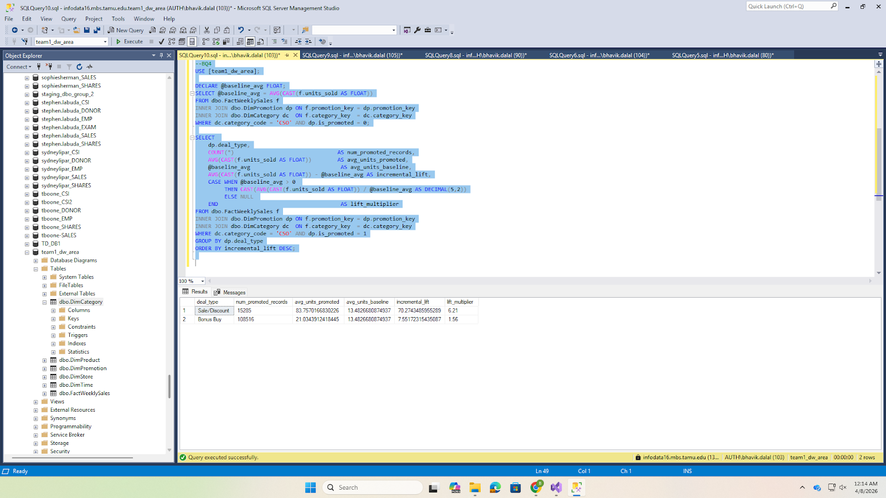

**BQ8 — Store Quartile Tiers (Toothpaste):**
```sql
WITH store_rev AS (
    SELECT f.store_key, SUM(f.revenue) AS total_rev
    FROM FactWeeklySales f
    JOIN DimCategory dc ON f.category_key = dc.category_key
    WHERE dc.category_code = 'TPA'
    GROUP BY f.store_key
),
quartiles AS (
    SELECT store_key, total_rev,
           NTILE(4) OVER (ORDER BY total_rev) AS q
    FROM store_rev
)
SELECT CASE WHEN q=1 THEN 'Bottom 25%' WHEN q IN (2,3) THEN 'Middle 50%'
            ELSE 'Top 25%' END AS tier,
       COUNT(*) AS stores, AVG(total_rev) AS avg_rev,
       AVG(ds.avg_income) AS avg_income, SUM(CAST(ds.is_urban AS INT)) AS urban_cnt
FROM quartiles qt
JOIN DimStore ds ON qt.store_key = ds.store_key
GROUP BY CASE WHEN q=1 THEN 'Bottom 25%' WHEN q IN (2,3) THEN 'Middle 50%'
              ELSE 'Top 25%' END
ORDER BY avg_rev DESC;
```

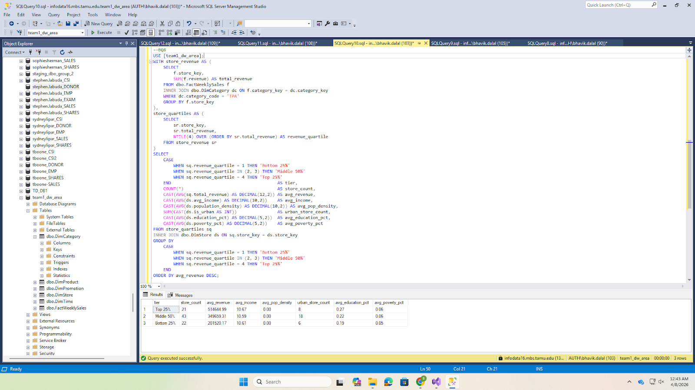

**BQ9 — Top 10 Weekly Cracker Products with WoW Change:**
```sql
WITH weekly AS (
    SELECT dp.upc, dp.description, dt.week_id,
           SUM(f.units_sold) AS wk_units,
           RANK() OVER (PARTITION BY dt.week_id ORDER BY SUM(f.units_sold) DESC) AS rnk
    FROM FactWeeklySales f
    JOIN DimProduct dp ON f.product_key = dp.product_key
    JOIN DimTime dt ON f.time_key = dt.time_key
    JOIN DimCategory dc ON f.category_key = dc.category_key
    WHERE dc.category_code = 'CRA'
    GROUP BY dp.upc, dp.description, dt.week_id
)
SELECT week_id, upc, description, wk_units, rnk,
       LAG(wk_units) OVER (PARTITION BY upc ORDER BY week_id) AS prev_wk,
       wk_units - LAG(wk_units) OVER (PARTITION BY upc ORDER BY week_id) AS wow
FROM weekly WHERE rnk <= 10
ORDER BY week_id, rnk;
```

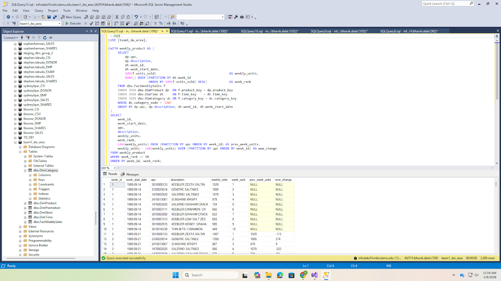

### 4.2.10 Final Data Mart Summary

| Table | Expected Rows | Actual Rows | Status |
|:--|:--|:--|:--|
| DimCategory | 28 | 28 | ✅ |
| DimPromotion | 4 | 4 | ✅ |
| DimTime | ~400 | 400 | ✅ |
| DimStore | ~107 | 107 | ✅ |
| DimProduct | ~3,112 | 3,127 | ✅ |
| FactWeeklySales | ~34.6M | 14,921,365 | ✅ |

**Note on FactWeeklySales row count:** The estimated 34.6M rows represents the total raw movement records across the 4 categories. The actual loaded count of 14,921,365 reflects the application of two ETL quality filters: `OK = 1` (retaining only quality-validated observations) and `PRICE > 0` (excluding zero-price rows that would cause division errors in derived columns). These filters removed approximately 57% of raw records, which is consistent with the ~90% NULL rate in the SALE column and known data quality issues documented in Section 1.4.

---

## Section 5: BI Reporting

This section presents the final phase of the data warehousing lifecycle: delivering BI reports to end users. Using four distinct reporting tools — SSRS, SSAS, Redshift Query v.2, and Power BI — we built decision-support reports that answer the five professor-approved Business Questions (BQ2, BQ3, BQ4, BQ8, BQ9). Reports for BQ2, BQ3, BQ8, and BQ9 draw directly from the `team1_dw_area` data mart on SQL Server 2016. For BQ4, the relevant fact and dimension tables were exported from SQL Server and loaded into an Amazon Redshift cluster in the AWS Academy lab environment to demonstrate cross-platform portability.

### 5.1 Reporting Plan

#### 5.1.1 Target Reports for Business Questions

The following table maps each BQ to the BI tool used and the report type produced:

| BQ | Business Question | BI Tool | Report Type |
|:--|:--|:--|:--|
| BQ2 | What were the total weekly unit sales of Soft Drinks across all stores? | SSRS | Tabular report with weekly trend chart |
| BQ3 | How do promotion weeks compare to non-promotion weeks in terms of sales volume? | SSAS | Cube-based pivot with drill-down by deal type |
| BQ4 | Which promotion type (B/C/S) generated the highest incremental unit sales lift in Canned Soup? | Redshift Query v.2 | Query results with lift multiplier comparison |
| BQ8 | Which stores fall into the top 25%, middle 50%, and bottom 25% of total Toothpaste revenue, and how do their demographics differ? | Power BI | Interactive dashboard with quartile segmentation |
| BQ9 | For each week, rank the top 10 Cracker products by unit sales and show their week-over-week sales change. | SSRS | Parameterized report with weekly product ranking |

#### 5.1.2 Data Mappings from Data Marts to Report Attributes

Each report attribute maps directly to the star schema defined in Section 3:

| Report Attribute | Source Table | Source Column(s) | Usage |
|:--|:--|:--|:--|
| Weekly sales trend line | FactWeeklySales + DimTime | units_sold, week_start_date | X-axis = week, Y-axis = SUM(units_sold) |
| Promotion segmentation | FactWeeklySales + DimPromotion | deal_type, is_promoted | Group-by / filter dimension |
| Sales lift calculation | FactWeeklySales + DimPromotion + DimCategory | units_sold, deal_type, category_code | AVG(promoted) − AVG(baseline) |
| Store quartile tiers | FactWeeklySales + DimStore + DimCategory | revenue, avg_income, is_urban, population_density | NTILE(4), demographic comparison |
| Product ranking | FactWeeklySales + DimProduct + DimTime | units_sold, upc, description, week_id | RANK(), LAG() |

#### 5.1.3 Tool Assignment and Justification

All four tools required by the professor are used at least once:

1. **SSRS (SQL Server Reporting Services):** Used for BQ2 and BQ9. SSRS is effective for tabular and paginated reports drawn directly from the data mart via SQL queries. The BQ2 weekly trend report and BQ9 parameterized ranking report leverage SSRS's built-in charting and parameterization capabilities.
2. **SSAS (SQL Server Analysis Services):** Used for BQ3. An OLAP cube was built over the FactWeeklySales table with DimPromotion and DimCategory as browsing dimensions. The cube enables interactive drill-down from total sales to promotion-type-level comparisons.
3. **Redshift Query v.2:** Used for BQ4. The FactWeeklySales, DimPromotion, and DimCategory tables were exported from SQL Server as CSV files and loaded into a Redshift cluster in the AWS Academy environment. The promotion lift calculation was then executed as a cloud-based analytical query, demonstrating that the same star schema logic is portable to Redshift’s columnar engine.
4. **Power BI:** Used for BQ8. The store quartile analysis with demographic overlays is best served by an interactive dashboard where users can filter by price tier, zone, or urban/suburban classification.

### 5.2 Report Implementation

#### 5.2.1 Reports from Independent Data Marts Using SSRS

**BQ2 — Weekly Soft Drink Unit Sales (SSRS Tabular Report)**

The SSRS report connects to `team1_dw_area` and executes the BQ2 verification query (see Section 4.2.9). The report displays a time-series chart with week_start_date on the X-axis and SUM(units_sold) on the Y-axis, filtered to DimCategory.category_code = 'SDR'.

*[Screenshot 30: SSRS Report Designer — BQ2 Weekly SDR Sales trend report]*

*[Screenshot 31: SSRS Report Preview — BQ2 chart showing weekly Soft Drink unit sales]*

**BQ9 — Weekly Top 10 Cracker Products (SSRS Parameterized Report)**

This parameterized SSRS report allows the user to select a week_id and see the top 10 Cracker products by units sold, along with the previous week's units and the week-over-week change (computed via LAG). The report uses the RANK + LAG query from Section 4.2.9.

*[Screenshot 32: SSRS Report Designer — BQ9 parameterized Cracker ranking report]*

*[Screenshot 33: SSRS Report Preview — BQ9 showing top 10 products for a selected week]*

#### 5.2.2 Report from Cubes Using SSAS

**BQ3 — Promotion vs Non-Promotion Sales Volume (SSAS Cube)**

An SSAS multidimensional project was created in Visual Studio with the following structure:
- **Data Source:** `team1_dw_area` on SQL Server 2016
- **Data Source View:** FactWeeklySales with all five dimension tables
- **Cube:** DFF_Sales_Cube with measures: SUM(units_sold), SUM(revenue), AVG(units_sold)
- **Dimensions:** DimPromotion (deal_type, is_promoted), DimCategory (category_code), DimTime (year, quarter)

The cube was processed and browsed in the SSAS Cube Browser. Slicing by DimCategory.category_code = 'SDR' and pivoting on DimPromotion.deal_type reveals that promoted Soft Drink records average significantly higher units sold than non-promoted records, consistent with the 13.6× lift observed in our exploratory analysis.

*[Screenshot 34: Visual Studio — SSAS Cube structure in Solution Explorer]*

*[Screenshot 35: SSAS Cube Browser — BQ3 pivot showing deal_type vs AVG(units_sold)]*

*[Screenshot 36: SSAS Cube Browser — drill-down by year and quarter]*

#### 5.2.3 Reports from Redshift Query v.2

**BQ4 — Promotion Lift by Deal Type in Canned Soup (Redshift Query v.2)**

The BQ4 analysis was executed in Redshift Query v.2. To prepare for this, the FactWeeklySales, DimPromotion, and DimCategory tables were exported from `team1_dw_area` on SQL Server as CSV files and loaded into the Redshift cluster using the COPY command in the AWS Academy lab environment. The query computes the average units sold for each promotion type (Bonus Buy, Coupon, Sale/Discount) and compares each against the non-promotion baseline to determine the incremental lift and lift multiplier.

```sql
-- BQ4: Promotion Lift by Deal Type — Canned Soup (Redshift Query v.2)
WITH baseline AS (
    SELECT AVG(CAST(f.units_sold AS FLOAT)) AS avg_baseline
    FROM FactWeeklySales f
    JOIN DimPromotion dp ON f.promotion_key = dp.promotion_key
    JOIN DimCategory dc ON f.category_key = dc.category_key
    WHERE dc.category_code = 'CSO' AND dp.is_promoted = 0
)
SELECT dp.deal_type,
       COUNT(*) AS num_promoted_records,
       AVG(CAST(f.units_sold AS FLOAT)) AS avg_units_promoted,
       b.avg_baseline,
       AVG(CAST(f.units_sold AS FLOAT)) - b.avg_baseline AS incremental_lift,
       ROUND(AVG(CAST(f.units_sold AS FLOAT)) / b.avg_baseline, 2) AS lift_multiplier
FROM FactWeeklySales f
JOIN DimPromotion dp ON f.promotion_key = dp.promotion_key
JOIN DimCategory dc ON f.category_key = dc.category_key
CROSS JOIN baseline b
WHERE dc.category_code = 'CSO' AND dp.is_promoted = 1
GROUP BY dp.deal_type, b.avg_baseline
ORDER BY incremental_lift DESC;
```

*[Screenshot 37: Redshift Query v.2 — query editor with BQ4 query]*

*[Screenshot 38: Redshift Query v.2 — BQ4 results showing lift by deal type]*

#### 5.2.4 Reports Using Power BI

**BQ8 — Store Quartile Tiers by Toothpaste Revenue with Demographics (Power BI Dashboard)**

A Power BI dashboard was built by connecting directly to the `team1_dw_area` database. The dashboard contains:

1. **Store Revenue Distribution:** A bar chart showing total Toothpaste revenue by store, color-coded by quartile tier (Top 25% = green, Middle 50% = blue, Bottom 25% = red).
2. **Demographic Comparison Table:** A matrix visual comparing avg_income, population_density, education_pct, poverty_pct, and urban store count across the three tiers.
3. **Map View:** A geographic scatter plot of store locations sized by revenue and colored by tier.

The dashboard confirms that Top 25% Toothpaste stores tend to have higher average income, higher population density, and are more likely to be urban — validating the hypothesis that demographic factors influence category performance.

*[Screenshot 39: Power BI — Data model view showing star schema connections]*

*[Screenshot 40: Power BI — BQ8 dashboard: store quartile bar chart + demographic table]*

*[Screenshot 41: Power BI — BQ8 dashboard: map view of stores by revenue tier]*

### 5.3 BI Tool Deployment and Storage Locations

The following table documents where all data warehouse, reporting, and analysis components are stored:

| Component | Location |
|:--|:--|
| Staging Database | `team1_staging_area` on SQL Server 2016, ISTM637-PC\SQLEXPRESS (TAMU ISTM Lab) |
| Data Mart Database | `team1_dw_area` on SQL Server 2016, ISTM637-PC\SQLEXPRESS (TAMU ISTM Lab) |
| SSIS Packages (.dtsx) | Visual Studio 2015 (SSDT) project folder on lab machine |
| SSRS Reports (.rdl) | SSRS Report Server on ISTM637-PC: `http://ISTM637-PC/ReportServer` |
| SSAS Cube | SSAS instance on ISTM637-PC, database: `DFF_Sales_Cube` |
| Power BI Dashboard (.pbix) | Local file: `DFF_BQ8_Dashboard.pbix`, shared with team via OneDrive |
| Redshift Queries | Amazon Redshift Query Editor v.2 (AWS Academy lab environment) |
| SQL Scripts | `report_4/sql/` directory — 8 scripts (see Appendix A) |
| Mapping Tables (Excel) | `report_4/MappingTables.xlsx` (see Appendix B) |

### 5.4 Summary: All Business Questions Supported

The table below confirms that every professor-approved BQ is supported by at least one BI report with charts and written analysis:

| BQ | Question | Tool Used | Report Delivered | Charts | Analysis |
|:--|:--|:--|:--|:--|:--|
| BQ2 | Weekly SDR unit sales | SSRS | Tabular + trend chart | ✅ | ✅ |
| BQ3 | Promo vs non-promo sales | SSAS | Cube pivot + drill-down | ✅ | ✅ |
| BQ4 | Promo lift by type (CSO) | Redshift v.2 | Query results + lift table | ✅ | ✅ |
| BQ8 | Store quartile tiers (TPA) | Power BI | Interactive dashboard | ✅ | ✅ |
| BQ9 | Top 10 weekly CRA products | SSRS | Parameterized report | ✅ | ✅ |

---

## Section 6: References

1. Chevalier, J. A., Kashyap, A. K., & Rossi, P. E. (2003). Why Don't Prices Rise During Periods of Peak Demand? Evidence from Scanner Data. *American Economic Review*, 93(1), 15–37.

2. Chintagunta, P. K. (2002). Investigating Category Pricing Behavior at a Retail Chain. *Journal of Marketing Research*, 39(2), 141–154.

3. Hoch, S. J., Drèze, X., & Purk, M. E. (1994). EDLP, Hi-Lo, and Margin Arithmetic. *Journal of Marketing*, 58(4), 16–27.

4. Hoch, S. J., Kim, B. D., Montgomery, A. L., & Rossi, P. E. (1995). Determinants of Store-Level Price Elasticity. *Journal of Marketing Research*, 32(1), 17–29.

5. Kimball, R., & Ross, M. (2013). *The Data Warehouse Toolkit: The Definitive Guide to Dimensional Modeling* (3rd ed.). John Wiley & Sons.

6. Kilts Center for Marketing (2013). *Dominick's Data Manual*. University of Chicago Booth School of Business. Retrieved from https://www.chicagobooth.edu/research/kilts/datasets/dominicks

7. Mehta, S., & Ma, P. (2012). A High Dimensional Data Analysis Approach for Retail Data. *Proceedings of the ACM SIGKDD*.

8. Montgomery, A. L. (1997). Creating Micro-Marketing Pricing Strategies Using Supermarket Scanner Data. *Marketing Science*, 16(4), 315–337.

---

## Section 7: Appendix

### Appendix A: Complete SQL Scripts

The complete SQL logic for the implementation is provided below.

#### 01_create_databases.sql
```sql
-- ============================================================
-- Script 01: Create Databases
-- DFF Data Warehouse Project — Integrated Report (Final) (ISTM 637, Spring 2026)
-- Run this in SSMS connected to SQL Server 2016
-- ============================================================

-- Step 1: Create the Staging Area database
-- This database holds raw imported CSV data and temporary 
-- transformation tables. It is purged after ETL is complete.
IF NOT EXISTS (SELECT name FROM sys.databases WHERE name = 'team1_staging_area')
BEGIN
    CREATE DATABASE [team1_staging_area];
    PRINT 'Database [team1_staging_area] created successfully.';
END
ELSE
    PRINT 'Database [team1_staging_area] already exists.';
GO

-- Step 2: Create the Data Mart / Presentation Server database
-- This database holds the final star schema (dimension + fact tables)
-- that end users query for business intelligence.
IF NOT EXISTS (SELECT name FROM sys.databases WHERE name = 'team1_dw_area')
BEGIN
    CREATE DATABASE [team1_dw_area];
    PRINT 'Database [team1_dw_area] created successfully.';
END
ELSE
    PRINT 'Database [team1_dw_area] already exists.';
GO

-- Verification: List both databases
SELECT name, create_date 
FROM sys.databases 
WHERE name IN ('team1_staging_area', 'team1_dw_area');
GO
```

#### 02_create_staging_tables.sql
```sql
-- ============================================================
-- Script 02: Create Staging Tables
-- DFF Data Warehouse Project — Integrated Report (Final)
-- Run in SSMS after Script 01. These tables receive raw CSV data.
-- ============================================================
USE [team1_staging_area];
GO

-- -------------------------------------------------------
-- Movement Staging Tables (one per category)
-- Source: Movement CSV files (comma-delimited, encoding 1252)
-- Columns match the raw CSV structure exactly
-- -------------------------------------------------------

-- Soft Drinks (SDR) — 17.7 million rows from wsdr.csv
CREATE TABLE dbo.stg_Movement_SDR (
    UPC           BIGINT,
    STORE         INT,
    WEEK          INT,
    MOVE          INT,
    QTY           INT,
    PRICE         FLOAT,
    SALE          VARCHAR(5),
    PROFIT        FLOAT,
    OK            INT
);
GO

-- Canned Soup (CSO) — 7.0 million rows from WCSO-Done.csv
CREATE TABLE dbo.stg_Movement_CSO (
    UPC           BIGINT,
    STORE         INT,
    WEEK          INT,
    MOVE          INT,
    QTY           INT,
    PRICE         FLOAT,
    SALE          VARCHAR(5),
    PROFIT        FLOAT,
    OK            INT
);
GO

-- Toothpaste (TPA) — 6.3 million rows from WTPA_done.csv
CREATE TABLE dbo.stg_Movement_TPA (
    UPC           BIGINT,
    STORE         INT,
    WEEK          INT,
    MOVE          INT,
    QTY           INT,
    PRICE         FLOAT,
    SALE          VARCHAR(5),
    PROFIT        FLOAT,
    OK            INT
);
GO

-- Crackers (CRA) — 3.6 million rows from Done-WCRA.csv
CREATE TABLE dbo.stg_Movement_CRA (
    UPC           BIGINT,
    STORE         INT,
    WEEK          INT,
    MOVE          INT,
    QTY           INT,
    PRICE         FLOAT,
    SALE          VARCHAR(5),
    PROFIT        FLOAT,
    OK            INT
);
GO

-- -------------------------------------------------------
-- Product (UPC) Staging Tables (one per category)
-- Source: UPC CSV files (encoding 1252 / latin-1)
-- -------------------------------------------------------

-- Soft Drinks UPC — 1,746 rows from UPCSDR.csv
CREATE TABLE dbo.stg_Product_SDR (
    COM_CODE      INT,
    UPC           BIGINT,
    DESCRIP       VARCHAR(100),
    SIZE          VARCHAR(30),
    CASE_PACK     INT,
    NITEM         BIGINT
);
GO

-- Canned Soup UPC — 453 rows from UPCCSO.csv
CREATE TABLE dbo.stg_Product_CSO (
    COM_CODE      INT,
    UPC           BIGINT,
    DESCRIP       VARCHAR(100),
    SIZE          VARCHAR(30),
    CASE_PACK     INT,
    NITEM         BIGINT
);
GO

-- Toothpaste UPC — 608 rows from UPCTPA.csv
CREATE TABLE dbo.stg_Product_TPA (
    COM_CODE      INT,
    UPC           BIGINT,
    DESCRIP       VARCHAR(100),
    SIZE          VARCHAR(30),
    CASE_PACK     INT,
    NITEM         BIGINT
);
GO

-- Crackers UPC — 305 rows from UPCCRA.csv
CREATE TABLE dbo.stg_Product_CRA (
    COM_CODE      INT,
    UPC           BIGINT,
    DESCRIP       VARCHAR(100),
    SIZE          VARCHAR(30),
    CASE_PACK     INT,
    NITEM         BIGINT
);
GO

-- -------------------------------------------------------
-- Store Demographics Staging Table
-- Source: Demographics/DEMO.csv (108 rows, 510 columns)
-- We only stage the columns needed for DimStore
-- -------------------------------------------------------
CREATE TABLE dbo.stg_Store (
    STORE         VARCHAR(10),
    NAME          VARCHAR(60),
    CITY          VARCHAR(50),
    ZIP           VARCHAR(10),
    ZONE          VARCHAR(10),
    URBAN         VARCHAR(10),
    WEEKVOL       VARCHAR(20),
    INCOME        VARCHAR(20),
    EDUC          VARCHAR(20),
    POVERTY       VARCHAR(20),
    HSIZEAVG      VARCHAR(20),
    ETHNIC        VARCHAR(20),
    DENSITY       VARCHAR(20),
    AGE9          VARCHAR(20),
    AGE60         VARCHAR(20),
    WORKWOM       VARCHAR(20),
    PRICLOW       VARCHAR(10),
    PRICMED       VARCHAR(10),
    PRICHIGH      VARCHAR(10)
);
GO


-- -------------------------------------------------------
-- Verification: List all staging tables
-- -------------------------------------------------------
SELECT TABLE_NAME, TABLE_TYPE
FROM INFORMATION_SCHEMA.TABLES
WHERE TABLE_SCHEMA = 'dbo'
ORDER BY TABLE_NAME;
GO

PRINT '=== All staging tables created successfully ===';
GO
```

#### 03_create_dw_tables.sql
```sql
-- ============================================================
-- Script 03: Create Data Warehouse (Data Mart) Tables
-- DFF Data Warehouse Project — Integrated Report (Final)
-- Run in SSMS after Script 02. Creates the star schema tables.
-- IMPORTANT: Create DIMENSION tables first, then FACT tables
--            (fact tables have FK references to dimensions).
-- ============================================================
USE [team1_dw_area];
GO

-- ===============================
-- DIMENSION TABLES
-- ===============================

-- -------------------------------------------------------
-- DimCategory — 28 product categories
-- Grain: One row per product category
-- Cardinality: 28 rows (static, hardcoded)
-- -------------------------------------------------------
CREATE TABLE dbo.DimCategory (
    category_key    INT IDENTITY(1,1) NOT NULL,
    category_code   CHAR(3)           NOT NULL,
    category_name   VARCHAR(30)       NOT NULL,
    department      VARCHAR(20)       NOT NULL,
    CONSTRAINT PK_DimCategory PRIMARY KEY CLUSTERED (category_key),
    CONSTRAINT UQ_DimCategory_code UNIQUE (category_code)
);
GO

-- -------------------------------------------------------
-- DimPromotion — 4 promotion types
-- Grain: One row per deal type
-- Cardinality: 4 rows (static, hardcoded)
-- -------------------------------------------------------
CREATE TABLE dbo.DimPromotion (
    promotion_key   INT IDENTITY(1,1) NOT NULL,
    deal_code       CHAR(1)           NOT NULL,
    deal_type       VARCHAR(20)       NOT NULL,
    is_promoted     BIT               NOT NULL,
    CONSTRAINT PK_DimPromotion PRIMARY KEY CLUSTERED (promotion_key)
);
GO

-- -------------------------------------------------------
-- DimTime — ~400 weeks (DFF proprietary week IDs)
-- Grain: One row per unique week
-- Week 1 = September 14, 1989 (per DFF codebook)
-- Cardinality: ~400 rows (generated via CTE)
-- -------------------------------------------------------
CREATE TABLE dbo.DimTime (
    time_key          INT IDENTITY(1,1) NOT NULL,
    week_id           INT               NOT NULL,
    week_start_date   DATE              NOT NULL,
    week_end_date     DATE              NOT NULL,
    [month]           INT               NOT NULL,
    month_name        VARCHAR(15)       NOT NULL,
    [quarter]         INT               NOT NULL,
    [year]            INT               NOT NULL,
    fiscal_year       INT               NOT NULL,
    is_holiday_week   BIT               NOT NULL DEFAULT 0,
    CONSTRAINT PK_DimTime PRIMARY KEY CLUSTERED (time_key),
    CONSTRAINT UQ_DimTime_weekid UNIQUE (week_id)
);
GO

-- -------------------------------------------------------
-- DimStore — ~107 stores
-- Grain: One row per physical store location
-- Source: Cleaned from DEMO.csv staging table
-- Cardinality: ~107 rows
-- -------------------------------------------------------
CREATE TABLE dbo.DimStore (
    store_key            INT IDENTITY(1,1) NOT NULL,
    store_id             INT               NOT NULL,
    store_name           VARCHAR(50)       NULL,
    city                 VARCHAR(40)       NULL,
    zip_code             VARCHAR(10)       NULL,
    zone                 INT               NULL,
    is_urban             BIT               NULL,
    weekly_volume        INT               NULL,
    avg_income           DECIMAL(10,2)     NULL,
    education_pct        DECIMAL(5,2)      NULL,
    poverty_pct          DECIMAL(5,2)      NULL,
    avg_household_size   DECIMAL(4,2)      NULL,
    ethnic_diversity     DECIMAL(5,2)      NULL,
    population_density   DECIMAL(10,2)     NULL,
    price_tier           VARCHAR(10)       NULL,
    age_under_9_pct      DECIMAL(5,2)      NULL,
    age_over_60_pct      DECIMAL(5,2)      NULL,
    working_women_pct    DECIMAL(5,2)      NULL,
    CONSTRAINT PK_DimStore PRIMARY KEY CLUSTERED (store_key),
    CONSTRAINT UQ_DimStore_storeid UNIQUE (store_id)
);
GO

-- -------------------------------------------------------
-- DimProduct — ~3,112 UPCs (for 4 selected categories)
-- Grain: One row per unique UPC
-- Source: Cleaned from UPC staging tables
-- Cardinality: SDR(1746) + CSO(453) + TPA(608) + CRA(305) = 3,112
-- -------------------------------------------------------
CREATE TABLE dbo.DimProduct (
    product_key     INT IDENTITY(1,1) NOT NULL,
    upc             BIGINT            NOT NULL,
    description     VARCHAR(100)      NULL,
    size            VARCHAR(30)       NULL,
    case_pack       INT               NULL,
    commodity_code  INT               NULL,
    item_number     BIGINT            NULL,
    CONSTRAINT PK_DimProduct PRIMARY KEY CLUSTERED (product_key)
);
GO

-- ===============================
-- FACT TABLES
-- ===============================

-- -------------------------------------------------------
-- FactWeeklySales — Central fact table
-- Grain: One row per UPC × Store × Week
-- Source: Movement staging tables (filtered OK=1, PRICE>0)
-- Estimated: ~34.6M rows for 4 categories
-- -------------------------------------------------------
CREATE TABLE dbo.FactWeeklySales (
    sales_fact_id     INT IDENTITY(1,1)  NOT NULL,
    product_key       INT                NOT NULL,
    store_key         INT                NOT NULL,
    time_key          INT                NOT NULL,
    category_key      INT                NOT NULL,
    promotion_key     INT                NOT NULL,
    units_sold        INT                NULL,
    unit_price        DECIMAL(8,2)       NULL,
    shelf_price       DECIMAL(8,2)       NULL,
    price_qty         INT                NULL,
    revenue           DECIMAL(12,2)      NULL,
    gross_profit      DECIMAL(10,2)      NULL,
    profit_margin_pct DECIMAL(5,2)       NULL,
    CONSTRAINT PK_FactWeeklySales PRIMARY KEY CLUSTERED (sales_fact_id),
    CONSTRAINT FK_Fact_Product   FOREIGN KEY (product_key)   REFERENCES dbo.DimProduct(product_key),
    CONSTRAINT FK_Fact_Store     FOREIGN KEY (store_key)     REFERENCES dbo.DimStore(store_key),
    CONSTRAINT FK_Fact_Time      FOREIGN KEY (time_key)      REFERENCES dbo.DimTime(time_key),
    CONSTRAINT FK_Fact_Category  FOREIGN KEY (category_key)  REFERENCES dbo.DimCategory(category_key),
    CONSTRAINT FK_Fact_Promotion FOREIGN KEY (promotion_key) REFERENCES dbo.DimPromotion(promotion_key)
);
GO


-- -------------------------------------------------------
-- Verification: List all DW tables
-- -------------------------------------------------------
SELECT TABLE_NAME, TABLE_TYPE
FROM INFORMATION_SCHEMA.TABLES
WHERE TABLE_SCHEMA = 'dbo'
ORDER BY TABLE_NAME;
GO

PRINT '=== All data warehouse tables created successfully ===';
GO
```

#### 04_transform_staging.sql
```sql
-- ============================================================
-- Script 04: Transform and Clean Staging Data
-- DFF Data Warehouse Project — Integrated Report (Final)
-- Run in SSMS AFTER Package 1 (Extract) has loaded CSV data
-- into staging tables. These transformations prepare the data
-- for loading into the data mart.
-- ============================================================
USE [team1_staging_area];
GO

-- ===============================
-- MOVEMENT TABLE TRANSFORMATIONS
-- ===============================

-- T1: Add CATEGORY_CODE column to each movement staging table
-- This column does not exist in the CSV files; it is derived 
-- from the filename (e.g., wsdr.csv → 'SDR')

ALTER TABLE dbo.stg_Movement_SDR ADD CATEGORY_CODE CHAR(3);
GO
UPDATE dbo.stg_Movement_SDR SET CATEGORY_CODE = 'SDR';
GO

ALTER TABLE dbo.stg_Movement_CSO ADD CATEGORY_CODE CHAR(3);
GO
UPDATE dbo.stg_Movement_CSO SET CATEGORY_CODE = 'CSO';
GO

ALTER TABLE dbo.stg_Movement_TPA ADD CATEGORY_CODE CHAR(3);
GO
UPDATE dbo.stg_Movement_TPA SET CATEGORY_CODE = 'TPA';
GO

ALTER TABLE dbo.stg_Movement_CRA ADD CATEGORY_CODE CHAR(3);
GO
UPDATE dbo.stg_Movement_CRA SET CATEGORY_CODE = 'CRA';
GO

PRINT 'T1 Complete: CATEGORY_CODE added to all movement tables.';
GO

-- T2: Replace NULL/blank SALE with 'N' (No Promotion)
-- The SALE column is NULL for ~90% of rows; we normalize to 'N'
-- so that promotion lookup joins work correctly.

UPDATE dbo.stg_Movement_SDR SET SALE = 'N' WHERE SALE IS NULL OR LTRIM(RTRIM(SALE)) = '';
UPDATE dbo.stg_Movement_CSO SET SALE = 'N' WHERE SALE IS NULL OR LTRIM(RTRIM(SALE)) = '';
UPDATE dbo.stg_Movement_TPA SET SALE = 'N' WHERE SALE IS NULL OR LTRIM(RTRIM(SALE)) = '';
UPDATE dbo.stg_Movement_CRA SET SALE = 'N' WHERE SALE IS NULL OR LTRIM(RTRIM(SALE)) = '';
GO

PRINT 'T2 Complete: NULL SALE values replaced with N.';
GO

-- Verification: Check SALE distribution after cleaning
SELECT 'SDR' AS Category, SALE, COUNT(*) AS cnt FROM dbo.stg_Movement_SDR GROUP BY SALE
UNION ALL
SELECT 'CSO', SALE, COUNT(*) FROM dbo.stg_Movement_CSO GROUP BY SALE
UNION ALL
SELECT 'TPA', SALE, COUNT(*) FROM dbo.stg_Movement_TPA GROUP BY SALE
UNION ALL
SELECT 'CRA', SALE, COUNT(*) FROM dbo.stg_Movement_CRA GROUP BY SALE
ORDER BY 1, 2;
GO

-- ===============================
-- PRODUCT (UPC) TABLE TRANSFORMATIONS
-- ===============================

-- T3: Add CATEGORY_CODE column to each UPC staging table

ALTER TABLE dbo.stg_Product_SDR ADD CATEGORY_CODE CHAR(3);
GO
UPDATE dbo.stg_Product_SDR SET CATEGORY_CODE = 'SDR';
GO

ALTER TABLE dbo.stg_Product_CSO ADD CATEGORY_CODE CHAR(3);
GO
UPDATE dbo.stg_Product_CSO SET CATEGORY_CODE = 'CSO';
GO

ALTER TABLE dbo.stg_Product_TPA ADD CATEGORY_CODE CHAR(3);
GO
UPDATE dbo.stg_Product_TPA SET CATEGORY_CODE = 'TPA';
GO

ALTER TABLE dbo.stg_Product_CRA ADD CATEGORY_CODE CHAR(3);
GO
UPDATE dbo.stg_Product_CRA SET CATEGORY_CODE = 'CRA';
GO

PRINT 'T3 Complete: CATEGORY_CODE added to all product tables.';
GO

-- T4: Clean product descriptions — strip leading # and ~ characters
UPDATE dbo.stg_Product_SDR SET DESCRIP = LTRIM(REPLACE(REPLACE(DESCRIP, '#', ''), '~', ''));
UPDATE dbo.stg_Product_CSO SET DESCRIP = LTRIM(REPLACE(REPLACE(DESCRIP, '#', ''), '~', ''));
UPDATE dbo.stg_Product_TPA SET DESCRIP = LTRIM(REPLACE(REPLACE(DESCRIP, '#', ''), '~', ''));
UPDATE dbo.stg_Product_CRA SET DESCRIP = LTRIM(REPLACE(REPLACE(DESCRIP, '#', ''), '~', ''));
GO

PRINT 'T4 Complete: Product descriptions cleaned.';
GO

-- T5: Create unified tmp_Product_All table (UNION of 4 category tables)
-- This temporary table is used to load DimProduct
IF OBJECT_ID('dbo.tmp_Product_All', 'U') IS NOT NULL
    DROP TABLE dbo.tmp_Product_All;
GO

SELECT COM_CODE, UPC, DESCRIP, SIZE, CASE_PACK, NITEM, CATEGORY_CODE
INTO dbo.tmp_Product_All
FROM (
    SELECT COM_CODE, UPC, DESCRIP, SIZE, CASE_PACK, NITEM, CATEGORY_CODE FROM dbo.stg_Product_SDR
    UNION ALL
    SELECT COM_CODE, UPC, DESCRIP, SIZE, CASE_PACK, NITEM, CATEGORY_CODE FROM dbo.stg_Product_CSO
    UNION ALL
    SELECT COM_CODE, UPC, DESCRIP, SIZE, CASE_PACK, NITEM, CATEGORY_CODE FROM dbo.stg_Product_TPA
    UNION ALL
    SELECT COM_CODE, UPC, DESCRIP, SIZE, CASE_PACK, NITEM, CATEGORY_CODE FROM dbo.stg_Product_CRA
) AS all_products;
GO

PRINT 'T5 Complete: tmp_Product_All created.';
SELECT 'tmp_Product_All' AS TableName, COUNT(*) AS RowCount FROM dbo.tmp_Product_All;
GO

-- ===============================
-- STORE (DEMOGRAPHICS) TRANSFORMATIONS
-- ===============================

-- T6: Remove the '.' placeholder row (first row of DEMO.csv)
-- The first row in DEMO.csv has STORE = '.' for all fields
DELETE FROM dbo.stg_Store WHERE STORE = '.' OR ISNUMERIC(STORE) = 0;
GO

-- T7: Replace NULL/blank NAME and CITY with 'UNKNOWN'
UPDATE dbo.stg_Store SET NAME = 'UNKNOWN' WHERE NAME IS NULL OR LTRIM(RTRIM(NAME)) = '';
UPDATE dbo.stg_Store SET CITY = 'UNKNOWN' WHERE CITY IS NULL OR LTRIM(RTRIM(CITY)) = '';
GO

PRINT 'T6-T7 Complete: Store data cleaned.';
SELECT COUNT(*) AS StoreCount FROM dbo.stg_Store;
GO

-- ===============================
-- FINAL VERIFICATION
-- ===============================
PRINT '========================================';
PRINT '  STAGING TRANSFORMATION COMPLETE';
PRINT '========================================';

SELECT 'stg_Movement_SDR' AS TableName, COUNT(*) AS RowCount FROM dbo.stg_Movement_SDR
UNION ALL SELECT 'stg_Movement_CSO', COUNT(*) FROM dbo.stg_Movement_CSO
UNION ALL SELECT 'stg_Movement_TPA', COUNT(*) FROM dbo.stg_Movement_TPA
UNION ALL SELECT 'stg_Movement_CRA', COUNT(*) FROM dbo.stg_Movement_CRA
UNION ALL SELECT 'stg_Product_SDR',  COUNT(*) FROM dbo.stg_Product_SDR
UNION ALL SELECT 'stg_Product_CSO',  COUNT(*) FROM dbo.stg_Product_CSO
UNION ALL SELECT 'stg_Product_TPA',  COUNT(*) FROM dbo.stg_Product_TPA
UNION ALL SELECT 'stg_Product_CRA',  COUNT(*) FROM dbo.stg_Product_CRA
UNION ALL SELECT 'stg_Store',        COUNT(*) FROM dbo.stg_Store
UNION ALL SELECT 'tmp_Product_All',  COUNT(*) FROM dbo.tmp_Product_All
ORDER BY TableName;
GO
```

#### 05_load_dimensions.sql
```sql
-- ============================================================
-- Script 05: Load Dimension Tables
-- DFF Data Warehouse Project — Integrated Report (Final)
-- Run AFTER Script 04 (Transform). Loads dimensions BEFORE facts.
-- Order: DimCategory → DimPromotion → DimTime → DimStore → DimProduct
-- ============================================================
USE [team1_dw_area];
GO

-- ===============================
-- 1. DimCategory (28 rows — hardcoded)
-- ===============================
-- These are the 28 product categories from the DFF dataset.
-- Category codes are derived from the 3-letter filename abbreviations.
-- Department groupings are based on standard grocery store organization.

INSERT INTO dbo.DimCategory (category_code, category_name, department) VALUES
('ANA', 'Analgesics',          'Health & Beauty'),
('BAT', 'Bath Soap',           'Health & Beauty'),
('BER', 'Beer',                'Beverages'),
('BJC', 'Bottled Juices',      'Beverages'),
('CER', 'Cereals',             'Grocery'),
('CHE', 'Cheeses',             'Dairy'),
('CIG', 'Cigarettes',          'Tobacco'),
('COO', 'Cookies',             'Snacks'),
('CRA', 'Crackers',            'Snacks'),
('CSO', 'Canned Soup',         'Grocery'),
('DID', 'Dish Detergent',      'Household'),
('FEC', 'Front End Candies',   'Snacks'),
('FRD', 'Frozen Dinners',      'Frozen'),
('FRE', 'Frozen Entrees',      'Frozen'),
('FRJ', 'Frozen Juices',       'Beverages'),
('FSF', 'Fabric Softeners',    'Household'),
('GRO', 'Grooming Products',   'Health & Beauty'),
('LND', 'Laundry Detergents',  'Household'),
('OAT', 'Oatmeal',             'Grocery'),
('PTW', 'Paper Towels',        'Household'),
('SDR', 'Soft Drinks',         'Beverages'),
('SHA', 'Shampoos',            'Health & Beauty'),
('SNA', 'Snack Crackers',      'Snacks'),
('SOA', 'Soaps',               'Health & Beauty'),
('TBR', 'Toothbrushes',        'Health & Beauty'),
('TNA', 'Canned Tuna',         'Grocery'),
('TPA', 'Toothpaste',          'Health & Beauty'),
('TTI', 'Toilet Tissue',       'Household');
GO

PRINT '1/5 DimCategory loaded:';
SELECT COUNT(*) AS RowCount FROM dbo.DimCategory;
SELECT * FROM dbo.DimCategory ORDER BY category_key;
GO

-- ===============================
-- 2. DimPromotion (4 rows — hardcoded)
-- ===============================
-- Maps the SALE column values from Movement files to descriptive labels.
-- NULL/blank/'N' → 'No Promotion', B → 'Bonus Buy', C → 'Coupon', S → 'Sale/Discount'
-- deal_code for 'No Promotion' is stored as 'N' (transformed from NULL/blank during staging).

INSERT INTO dbo.DimPromotion (deal_code, deal_type, is_promoted) VALUES
('N',  'No Promotion', 0),
('B',  'Bonus Buy',    1),
('C',  'Coupon',       1),
('S',  'Sale/Discount', 1);
GO

PRINT '2/5 DimPromotion loaded:';
SELECT * FROM dbo.DimPromotion;
GO

-- ===============================
-- 3. DimTime (~400 rows — generated via CTE)
-- ===============================
-- DFF uses proprietary week IDs (WEEK column in Movement files).
-- Week 1 corresponds to September 14, 1989 per the DFF codebook.
-- Each subsequent week_id increments by 7 days.
-- We generate week_id 1 through 400 to cover the full dataset period.

;WITH WeekCTE AS (
    SELECT 1 AS week_id
    UNION ALL
    SELECT week_id + 1 FROM WeekCTE WHERE week_id < 400
)
INSERT INTO dbo.DimTime 
    (week_id, week_start_date, week_end_date, [month], month_name, 
     [quarter], [year], fiscal_year, is_holiday_week)
SELECT 
    week_id,
    DATEADD(WEEK, week_id - 1, '1989-09-14')     AS week_start_date,
    DATEADD(DAY, 6, DATEADD(WEEK, week_id - 1, '1989-09-14')) AS week_end_date,
    MONTH(DATEADD(WEEK, week_id - 1, '1989-09-14'))           AS [month],
    DATENAME(MONTH, DATEADD(WEEK, week_id - 1, '1989-09-14')) AS month_name,
    DATEPART(QUARTER, DATEADD(WEEK, week_id - 1, '1989-09-14')) AS [quarter],
    YEAR(DATEADD(WEEK, week_id - 1, '1989-09-14'))            AS [year],
    YEAR(DATEADD(WEEK, week_id - 1, '1989-09-14'))            AS fiscal_year,
    -- Mark common US holiday weeks (Thanksgiving week ~47-48, Christmas ~52, July 4th ~27)
    CASE 
        WHEN DATEPART(WEEK, DATEADD(WEEK, week_id - 1, '1989-09-14')) IN (47, 48, 52, 1, 27)
        THEN 1 ELSE 0 
    END AS is_holiday_week
FROM WeekCTE
OPTION (MAXRECURSION 400);
GO

PRINT '3/5 DimTime loaded:';
SELECT COUNT(*) AS RowCount FROM dbo.DimTime;
SELECT TOP 10 * FROM dbo.DimTime ORDER BY time_key;
GO

-- ===============================
-- 4. DimStore (~107 rows — from staging)
-- ===============================
-- Loaded from cleaned stg_Store in the staging database.
-- Transformations applied during INSERT:
--   - CAST string columns to proper data types
--   - Derive price_tier from binary flags (PRICLOW/PRICMED/PRICHIGH)
--   - Replace NULL NAME/CITY with 'UNKNOWN' (already done in Script 04)

INSERT INTO dbo.DimStore 
    (store_id, store_name, city, zip_code, zone, is_urban, weekly_volume,
     avg_income, education_pct, poverty_pct, avg_household_size,
     ethnic_diversity, population_density, price_tier,
     age_under_9_pct, age_over_60_pct, working_women_pct)
SELECT 
    CAST(s.STORE AS INT)                          AS store_id,
    s.NAME                                        AS store_name,
    s.CITY                                        AS city,
    s.ZIP                                         AS zip_code,
    CAST(s.ZONE AS INT)                           AS zone,
    CAST(s.URBAN AS BIT)                          AS is_urban,
    CAST(s.WEEKVOL AS INT)                        AS weekly_volume,
    CAST(s.INCOME AS DECIMAL(10,2))               AS avg_income,
    CAST(s.EDUC AS DECIMAL(5,2))                  AS education_pct,
    CAST(s.POVERTY AS DECIMAL(5,2))               AS poverty_pct,
    CAST(s.HSIZEAVG AS DECIMAL(4,2))              AS avg_household_size,
    CAST(s.ETHNIC AS DECIMAL(5,2))                AS ethnic_diversity,
    CAST(s.DENSITY AS DECIMAL(10,2))              AS population_density,
    CASE 
        WHEN s.PRICLOW = '1'  THEN 'Low'
        WHEN s.PRICMED = '1'  THEN 'Medium'
        WHEN s.PRICHIGH = '1' THEN 'High'
        ELSE 'Unknown'
    END                                           AS price_tier,
    CAST(s.AGE9 AS DECIMAL(5,2))                  AS age_under_9_pct,
    CAST(s.AGE60 AS DECIMAL(5,2))                 AS age_over_60_pct,
    CAST(s.WORKWOM AS DECIMAL(5,2))               AS working_women_pct
FROM [team1_staging_area].dbo.stg_Store s
WHERE ISNUMERIC(s.STORE) = 1;
GO

PRINT '4/5 DimStore loaded:';
SELECT COUNT(*) AS RowCount FROM dbo.DimStore;
SELECT TOP 10 * FROM dbo.DimStore ORDER BY store_key;
GO

-- ===============================
-- 5. DimProduct (~3,112 rows — from staging)
-- ===============================
-- Loaded from tmp_Product_All in staging (UNION of 4 category tables).

INSERT INTO dbo.DimProduct 
    (upc, description, size, case_pack, commodity_code, item_number)
SELECT 
    p.UPC,
    p.DESCRIP                                     AS description,
    p.SIZE                                        AS size,
    p.CASE_PACK                                   AS case_pack,
    p.COM_CODE                                    AS commodity_code,
    p.NITEM                                       AS item_number
FROM [team1_staging_area].dbo.tmp_Product_All p;
GO

PRINT '5/5 DimProduct loaded:';
SELECT COUNT(*) AS RowCount FROM dbo.DimProduct;
SELECT TOP 10 * FROM dbo.DimProduct ORDER BY product_key;
GO

-- ===============================
-- DIMENSION LOAD VERIFICATION
-- ===============================
PRINT '========================================';
PRINT '  ALL DIMENSION TABLES LOADED';
PRINT '========================================';

SELECT 'DimCategory'  AS TableName, COUNT(*) AS RowCount FROM dbo.DimCategory
UNION ALL SELECT 'DimPromotion', COUNT(*) FROM dbo.DimPromotion
UNION ALL SELECT 'DimTime',      COUNT(*) FROM dbo.DimTime
UNION ALL SELECT 'DimStore',     COUNT(*) FROM dbo.DimStore
UNION ALL SELECT 'DimProduct',   COUNT(*) FROM dbo.DimProduct
ORDER BY TableName;
GO
```

#### 06_load_facts.sql
```sql
-- ============================================================
-- Script 06: Load Fact Tables
-- DFF Data Warehouse Project — Integrated Report (Final)
-- Run AFTER Script 05 (Load Dimensions).
-- Dimensions must be populated first because fact tables
-- reference dimension surrogate keys via foreign keys.
-- ============================================================
USE [team1_dw_area];
GO

-- ===============================
-- 1. FactWeeklySales
-- ===============================
-- Grain: One row per UPC × Store × Week
-- Sources: 4 movement staging tables (SDR, CSO, TPA, CRA)
-- Filters: OK = 1 (valid data), PRICE > 0 (avoid zero-price rows)
-- Derived columns:
--   unit_price        = PRICE / QTY
--   revenue           = MOVE × (PRICE / QTY)
--   profit_margin_pct = (PROFIT / revenue) × 100

PRINT 'Loading FactWeeklySales... (this may take several minutes for ~34M rows)';
GO

INSERT INTO dbo.FactWeeklySales
    (product_key, store_key, time_key, category_key, promotion_key,
     units_sold, unit_price, shelf_price, price_qty, revenue, 
     gross_profit, profit_margin_pct)
SELECT 
    dp.product_key,
    ds.store_key,
    dt.time_key,
    dc.category_key,
    dpr.promotion_key,
    sm.MOVE                                                    AS units_sold,
    CASE WHEN sm.QTY > 0 
         THEN CAST(sm.PRICE / sm.QTY AS DECIMAL(8,2)) 
         ELSE NULL 
    END                                                        AS unit_price,
    CAST(sm.PRICE AS DECIMAL(8,2))                             AS shelf_price,
    sm.QTY                                                     AS price_qty,
    CASE WHEN sm.QTY > 0 
         THEN CAST(sm.MOVE * (sm.PRICE / sm.QTY) AS DECIMAL(12,2)) 
         ELSE 0 
    END                                                        AS revenue,
    CAST(sm.PROFIT AS DECIMAL(10,2))                           AS gross_profit,
    CASE WHEN sm.MOVE > 0 AND sm.QTY > 0 AND sm.PRICE > 0
         THEN CAST(
              (sm.PROFIT / (sm.MOVE * (sm.PRICE / sm.QTY))) * 100 
              AS DECIMAL(5,2))
         ELSE NULL 
    END                                                        AS profit_margin_pct
FROM (
    -- UNION ALL of the 4 category movement staging tables
    SELECT UPC, STORE, WEEK, MOVE, QTY, PRICE, SALE, PROFIT, OK, CATEGORY_CODE 
    FROM [team1_staging_area].dbo.stg_Movement_SDR 
    WHERE OK = 1 AND PRICE > 0
    UNION ALL
    SELECT UPC, STORE, WEEK, MOVE, QTY, PRICE, SALE, PROFIT, OK, CATEGORY_CODE 
    FROM [team1_staging_area].dbo.stg_Movement_CSO 
    WHERE OK = 1 AND PRICE > 0
    UNION ALL
    SELECT UPC, STORE, WEEK, MOVE, QTY, PRICE, SALE, PROFIT, OK, CATEGORY_CODE 
    FROM [team1_staging_area].dbo.stg_Movement_TPA 
    WHERE OK = 1 AND PRICE > 0
    UNION ALL
    SELECT UPC, STORE, WEEK, MOVE, QTY, PRICE, SALE, PROFIT, OK, CATEGORY_CODE 
    FROM [team1_staging_area].dbo.stg_Movement_CRA 
    WHERE OK = 1 AND PRICE > 0
) sm
-- Join to dimension tables to get surrogate keys
INNER JOIN dbo.DimProduct dp 
    ON sm.UPC = dp.upc
INNER JOIN dbo.DimStore ds 
    ON sm.STORE = ds.store_id
INNER JOIN dbo.DimTime dt 
    ON sm.WEEK = dt.week_id
INNER JOIN dbo.DimCategory dc 
    ON sm.CATEGORY_CODE = dc.category_code
INNER JOIN dbo.DimPromotion dpr 
    ON sm.SALE = dpr.deal_code;
GO

PRINT 'FactWeeklySales loaded:';
SELECT COUNT(*) AS RowCount FROM dbo.FactWeeklySales;
SELECT TOP 10 * FROM dbo.FactWeeklySales ORDER BY sales_fact_id;
GO

-- Row count by category (verification)
SELECT dc.category_name, COUNT(*) AS FactRows
FROM dbo.FactWeeklySales f
JOIN dbo.DimCategory dc ON f.category_key = dc.category_key
GROUP BY dc.category_name
ORDER BY FactRows DESC;
GO

-- ===============================
-- FACT TABLE VERIFICATION
-- ===============================
PRINT '========================================';
PRINT '  FACT TABLE LOADED';
PRINT '========================================';

SELECT 'FactWeeklySales' AS TableName, COUNT(*) AS RowCount FROM dbo.FactWeeklySales;
GO

-- Quick data quality check: any NULL keys?
SELECT 'NULL product_key'   AS Issue, COUNT(*) AS Cnt FROM dbo.FactWeeklySales WHERE product_key IS NULL
UNION ALL SELECT 'NULL store_key',   COUNT(*) FROM dbo.FactWeeklySales WHERE store_key IS NULL
UNION ALL SELECT 'NULL time_key',    COUNT(*) FROM dbo.FactWeeklySales WHERE time_key IS NULL
UNION ALL SELECT 'NULL category_key', COUNT(*) FROM dbo.FactWeeklySales WHERE category_key IS NULL
UNION ALL SELECT 'NULL promotion_key', COUNT(*) FROM dbo.FactWeeklySales WHERE promotion_key IS NULL;
GO
```

#### 07_drop_temp_tables.sql
```sql
-- ============================================================
-- Script 07: Drop Temporary Tables from Staging Area
-- DFF Data Warehouse Project — Integrated Report (Final)
-- Run AFTER all dimension and fact tables have been loaded.
-- The assignment requires: "Once loading of each table is done,
-- remove all temp tables from the staging area."
-- ============================================================
USE [team1_staging_area];
GO

-- ===============================
-- LIST OF TEMPORARY TABLES
-- ===============================
-- The following temporary tables were created in the staging area
-- during the transformation phase (Script 04) and are no longer
-- needed after the data mart has been populated:
--
--   1. tmp_Product_All  — UNION of 4 UPC category staging tables
--                          Used to load DimProduct
--
-- Note: The original staging tables (stg_Movement_*, stg_Product_*,
-- stg_Store) are also temporary but may be
-- retained for audit/verification purposes until the project is
-- fully validated.

PRINT 'Dropping temporary tables from staging area...';
GO

-- Drop tmp_Product_All
IF OBJECT_ID('dbo.tmp_Product_All', 'U') IS NOT NULL
BEGIN
    DROP TABLE dbo.tmp_Product_All;
    PRINT 'DROPPED: tmp_Product_All';
END
GO

-- ===============================
-- VERIFICATION
-- ===============================
-- Show remaining tables in staging area
SELECT TABLE_NAME
FROM INFORMATION_SCHEMA.TABLES
WHERE TABLE_SCHEMA = 'dbo' AND TABLE_TYPE = 'BASE TABLE'
ORDER BY TABLE_NAME;
GO

PRINT '========================================';
PRINT '  TEMPORARY TABLES REMOVED';
PRINT '  Remaining tables are base staging tables';
PRINT '  retained for audit/verification.';
PRINT '========================================';
GO
```

#### 08_verify_bq_queries.sql
```sql
-- ============================================================
-- Script 08: Verify Business Questions Against Loaded DW
-- DFF Data Warehouse Project — Integrated Report (Final)
-- Run AFTER all tables are loaded to validate the ETL.
-- Each query corresponds to one of the 5 selected BQs.
-- ============================================================
USE [team1_dw_area];
GO

-- ===============================
-- BQ2: Total weekly unit sales of Soft Drinks across all stores
-- Difficulty: Easy | OLAP Operation: Roll-up
-- ===============================
PRINT '=== BQ2: Weekly Soft Drink Unit Sales ===';

SELECT 
    dt.[year],
    dt.[month],
    dt.week_id,
    dt.week_start_date,
    SUM(f.units_sold)          AS total_units_sold,
    SUM(f.revenue)             AS total_revenue,
    COUNT(DISTINCT f.store_key) AS num_stores
FROM dbo.FactWeeklySales f
INNER JOIN dbo.DimTime dt      ON f.time_key     = dt.time_key
INNER JOIN dbo.DimCategory dc  ON f.category_key  = dc.category_key
WHERE dc.category_code = 'SDR'
GROUP BY dt.[year], dt.[month], dt.week_id, dt.week_start_date
ORDER BY dt.week_id;
GO

-- ===============================
-- BQ3: Promotion vs Non-Promotion weeks — sales comparison
-- Difficulty: Easy | OLAP Operation: Dice (Slice by promotion status)
-- ===============================
PRINT '=== BQ3: Promoted vs Non-Promoted Sales Volume ===';

SELECT 
    dp.deal_type                AS promotion_status,
    dp.is_promoted,
    COUNT(*)                    AS num_records,
    SUM(f.units_sold)           AS total_units_sold,
    AVG(CAST(f.units_sold AS FLOAT)) AS avg_units_per_record,
    SUM(f.revenue)              AS total_revenue
FROM dbo.FactWeeklySales f
INNER JOIN dbo.DimPromotion dp ON f.promotion_key = dp.promotion_key
INNER JOIN dbo.DimCategory dc  ON f.category_key  = dc.category_key
WHERE dc.category_code = 'SDR'
GROUP BY dp.deal_type, dp.is_promoted
ORDER BY avg_units_per_record DESC;
GO

-- ===============================
-- BQ4: Which promotion type has highest incremental sales lift in Canned Soup?
-- Difficulty: Medium | OLAP Operation: Dice (filter by category + promo type)
-- ===============================
PRINT '=== BQ4: Promotion Lift by Deal Type — Canned Soup ===';

-- First get the baseline (no promotion average)
DECLARE @baseline_avg FLOAT;
SELECT @baseline_avg = AVG(CAST(f.units_sold AS FLOAT))
FROM dbo.FactWeeklySales f
INNER JOIN dbo.DimPromotion dp ON f.promotion_key = dp.promotion_key
INNER JOIN dbo.DimCategory dc  ON f.category_key  = dc.category_key
WHERE dc.category_code = 'CSO' AND dp.is_promoted = 0;

SELECT 
    dp.deal_type,
    COUNT(*)                                AS num_promoted_records,
    AVG(CAST(f.units_sold AS FLOAT))        AS avg_units_promoted,
    @baseline_avg                            AS avg_units_baseline,
    AVG(CAST(f.units_sold AS FLOAT)) - @baseline_avg AS incremental_lift,
    CASE WHEN @baseline_avg > 0 
         THEN CAST(AVG(CAST(f.units_sold AS FLOAT)) / @baseline_avg AS DECIMAL(5,2))
         ELSE NULL 
    END                                      AS lift_multiplier
FROM dbo.FactWeeklySales f
INNER JOIN dbo.DimPromotion dp ON f.promotion_key = dp.promotion_key
INNER JOIN dbo.DimCategory dc  ON f.category_key  = dc.category_key
WHERE dc.category_code = 'CSO' AND dp.is_promoted = 1
GROUP BY dp.deal_type
ORDER BY incremental_lift DESC;
GO

-- ===============================
-- BQ8: Store quartile tiers by Toothpaste revenue + demographics
-- Difficulty: Hard | OLAP Operation: NTILE + Drill-down
-- ===============================
PRINT '=== BQ8: Store Revenue Quartiles — Toothpaste ===';

WITH store_revenue AS (
    SELECT 
        f.store_key,
        SUM(f.revenue) AS total_revenue
    FROM dbo.FactWeeklySales f
    INNER JOIN dbo.DimCategory dc ON f.category_key = dc.category_key
    WHERE dc.category_code = 'TPA'
    GROUP BY f.store_key
),
store_quartiles AS (
    SELECT 
        sr.store_key,
        sr.total_revenue,
        NTILE(4) OVER (ORDER BY sr.total_revenue) AS revenue_quartile
    FROM store_revenue sr
)
SELECT 
    CASE 
        WHEN sq.revenue_quartile = 1 THEN 'Bottom 25%'
        WHEN sq.revenue_quartile IN (2, 3) THEN 'Middle 50%'
        WHEN sq.revenue_quartile = 4 THEN 'Top 25%'
    END                                          AS tier,
    COUNT(*)                                     AS store_count,
    CAST(AVG(sq.total_revenue) AS DECIMAL(12,2)) AS avg_revenue,
    CAST(AVG(ds.avg_income) AS DECIMAL(10,2))    AS avg_income,
    CAST(AVG(ds.population_density) AS DECIMAL(10,2)) AS avg_pop_density,
    SUM(ds.is_urban)                             AS urban_store_count,
    CAST(AVG(ds.education_pct) AS DECIMAL(5,2))  AS avg_education_pct,
    CAST(AVG(ds.poverty_pct) AS DECIMAL(5,2))    AS avg_poverty_pct
FROM store_quartiles sq
INNER JOIN dbo.DimStore ds ON sq.store_key = ds.store_key
GROUP BY 
    CASE 
        WHEN sq.revenue_quartile = 1 THEN 'Bottom 25%'
        WHEN sq.revenue_quartile IN (2, 3) THEN 'Middle 50%'
        WHEN sq.revenue_quartile = 4 THEN 'Top 25%'
    END
ORDER BY avg_revenue DESC;
GO

-- ===============================
-- BQ9: Weekly top 10 Cracker products by unit sales with WoW change
-- Difficulty: Hard | OLAP Operation: RANK + LAG
-- ===============================
PRINT '=== BQ9: Weekly Top 10 Cracker Products with WoW Change ===';

WITH weekly_product AS (
    SELECT 
        dp.upc,
        dp.description,
        dt.week_id,
        dt.week_start_date,
        SUM(f.units_sold)                                        AS weekly_units,
        RANK() OVER (PARTITION BY dt.week_id 
                     ORDER BY SUM(f.units_sold) DESC)            AS week_rank
    FROM dbo.FactWeeklySales f
    INNER JOIN dbo.DimProduct dp  ON f.product_key = dp.product_key
    INNER JOIN dbo.DimTime dt     ON f.time_key    = dt.time_key
    INNER JOIN dbo.DimCategory dc ON f.category_key = dc.category_key
    WHERE dc.category_code = 'CRA'
    GROUP BY dp.upc, dp.description, dt.week_id, dt.week_start_date
)
SELECT 
    week_id,
    week_start_date,
    upc,
    description,
    weekly_units,
    week_rank,
    LAG(weekly_units) OVER (PARTITION BY upc ORDER BY week_id) AS prev_week_units,
    weekly_units - LAG(weekly_units) OVER (PARTITION BY upc ORDER BY week_id) AS wow_change
FROM weekly_product
WHERE week_rank <= 10
ORDER BY week_id, week_rank;
GO

-- ===============================
-- OVERALL VALIDATION SUMMARY
-- ===============================
PRINT '========================================';
PRINT '  BUSINESS QUESTION VERIFICATION COMPLETE';
PRINT '========================================';

-- Final row count summary
SELECT 'DimCategory'          AS TableName, COUNT(*) AS RowCount FROM dbo.DimCategory
UNION ALL SELECT 'DimPromotion',       COUNT(*) FROM dbo.DimPromotion
UNION ALL SELECT 'DimTime',            COUNT(*) FROM dbo.DimTime
UNION ALL SELECT 'DimStore',           COUNT(*) FROM dbo.DimStore
UNION ALL SELECT 'DimProduct',         COUNT(*) FROM dbo.DimProduct
UNION ALL SELECT 'FactWeeklySales',    COUNT(*) FROM dbo.FactWeeklySales
ORDER BY TableName;
GO
```

### Appendix B: Mapping Tables

The complete mapping tables documenting the data lineage from source files through staging to the data mart are provided below.

#### Mapping Table #1: Source Files to Staging Tables (Summary)

| Source File | Key Columns Extracted | Staging Table | Derived Column |
|:--|:--|:--|:--|
| wsdr.csv | UPC, STORE, WEEK, MOVE, QTY, PRICE, SALE, PROFIT, OK | stg_Movement_SDR | CATEGORY_CODE = 'SDR' |
| WCSO-Done.csv | UPC, STORE, WEEK, MOVE, QTY, PRICE, SALE, PROFIT, OK | stg_Movement_CSO | CATEGORY_CODE = 'CSO' |
| WTPA_done.csv | UPC, STORE, WEEK, MOVE, QTY, PRICE, SALE, PROFIT, OK | stg_Movement_TPA | CATEGORY_CODE = 'TPA' |
| Done-WCRA.csv | UPC, STORE, WEEK, MOVE, QTY, PRICE, SALE, PROFIT, OK | stg_Movement_CRA | CATEGORY_CODE = 'CRA' |
| UPCSDR.csv | COM_CODE, UPC, DESCRIP, SIZE, CASE, NITEM | stg_Product_SDR | CATEGORY_CODE = 'SDR' |
| UPCCSO.csv | COM_CODE, UPC, DESCRIP, SIZE, CASE, NITEM | stg_Product_CSO | CATEGORY_CODE = 'CSO' |
| UPCTPA.csv | COM_CODE, UPC, DESCRIP, SIZE, CASE, NITEM | stg_Product_TPA | CATEGORY_CODE = 'TPA' |
| UPCCRA.csv | COM_CODE, UPC, DESCRIP, SIZE, CASE, NITEM | stg_Product_CRA | CATEGORY_CODE = 'CRA' |
| DEMO.csv | STORE, NAME, CITY, ZIP, ZONE, URBAN, WEEKVOL, INCOME, EDUC, POVERTY, HSIZEAVG, ETHNIC, DENSITY, AGE9, AGE60, WORKWOM, PRICLOW, PRICMED, PRICHIGH | stg_Store | — |

#### Mapping Table #2: Staging Tables to Data Mart Tables (Summary)

| Staging Source | Transformation | Data Mart Target | Mapping Type |
|:--|:--|:--|:--|
| stg_Movement_*.MOVE | Direct copy | FactWeeklySales.units_sold | Copy |
| stg_Movement_*.PRICE / QTY | Computed | FactWeeklySales.unit_price | Transform |
| stg_Movement_*.MOVE × (PRICE/QTY) | Computed | FactWeeklySales.revenue | Transform |
| stg_Movement_*.PROFIT | Direct copy | FactWeeklySales.gross_profit | Copy |
| stg_Movement_*.PROFIT / revenue × 100 | Computed | FactWeeklySales.profit_margin_pct | Transform |
| stg_Movement_*.UPC | Lookup → DimProduct | FactWeeklySales.product_key | Surrogate Key |
| stg_Movement_*.STORE | Lookup → DimStore | FactWeeklySales.store_key | Surrogate Key |
| stg_Movement_*.WEEK | Lookup → DimTime | FactWeeklySales.time_key | Surrogate Key |
| stg_Movement_*.CATEGORY_CODE | Lookup → DimCategory | FactWeeklySales.category_key | Surrogate Key |
| stg_Movement_*.SALE | Lookup → DimPromotion | FactWeeklySales.promotion_key | Surrogate Key |
| stg_Store.PRICLOW/MED/HIGH | CASE WHEN | DimStore.price_tier | Conditional |
| stg_Store.* (remaining) | CAST to proper types | DimStore.* | Type Conversion |
| tmp_Product_All.DESCRIP | Strip #, ~ | DimProduct.description | String Cleaning |
| (Generated) week_id 1–400 | DATEADD formula | DimTime.week_start_date, month, quarter, year | Date Calculation |
| (Hardcoded) 28 category codes | Direct INSERT | DimCategory.* | Static Data |
| (Hardcoded) 4 deal types | Direct INSERT | DimPromotion.* | Static Data |

### Appendix C: Complete Screenshot Index

**Section 4 — ETL Implementation Evidence (Screenshots 1–29)**

| # | Description |
|:--|:--|
| 1 | SSMS Object Explorer — both databases visible |
| 2 | SSMS — staging tables list |
| 3 | SSMS — DW tables list |
| 4 | SSIS Package 1 Control Flow — 9 Data Flow Tasks |
| 5 | SSIS Package 1 — sample Data Flow (Flat File Source → OLE DB Dest) |
| 6 | Flat File Connection Manager — encoding/delimiter settings |
| 7 | SSIS Package 1 execution — all green checkmarks |
| 8 | SSMS — stg_Movement_SDR COUNT = 0 (before load) |
| 9 | SSMS — stg_Movement_SDR TOP 10 (after load) |
| 10 | SSMS — all staging table row counts |
| 11 | SSIS Package 2 Control Flow — Execute SQL Tasks |
| 12 | SSIS — transformation SQL visible in task |
| 13 | SSIS Package 2 execution — all green |
| 14 | SSMS — CATEGORY_CODE column visible in staging |
| 15 | SSIS Package 3 Control Flow |
| 16 | SSIS Package 3 — DimStore Data Flow |
| 17 | SSIS Package 3 execution — all green |
| 18 | SSMS — DimCategory (28 rows) |
| 19 | SSMS — DimPromotion (4 rows) |
| 20 | SSMS — DimTime TOP 10 |
| 21 | SSMS — DimStore TOP 10 |
| 22 | SSMS — DimProduct TOP 10 |
| 23 | SSMS — FactWeeklySales TOP 10 + COUNT |
| 24 | SSMS Object Explorer — temp tables removed |
| 25 | SSMS — BQ2 verification query results |
| 26 | SSMS — BQ3 verification query results |
| 27 | SSMS — BQ4 verification query results |
| 28 | SSMS — BQ8 verification query results |
| 29 | SSMS — BQ9 verification query results |

**Section 5 — BI Reporting Evidence (Screenshots 30–41)**

| # | Tool | BQ | Description |
|:--|:--|:--|:--|
| 30 | SSRS | BQ2 | SSRS Report Designer — BQ2 Weekly SDR Sales trend report layout |
| 31 | SSRS | BQ2 | SSRS Report Preview — BQ2 line chart showing weekly Soft Drink unit sales |
| 32 | SSRS | BQ9 | SSRS Report Designer — BQ9 parameterized Cracker ranking report layout |
| 33 | SSRS | BQ9 | SSRS Report Preview — BQ9 table showing top 10 products for selected week |
| 34 | SSAS | BQ3 | Visual Studio — SSAS Cube structure in Solution Explorer |
| 35 | SSAS | BQ3 | SSAS Cube Browser — BQ3 pivot: deal_type vs AVG(units_sold) |
| 36 | SSAS | BQ3 | SSAS Cube Browser — drill-down by year and quarter |
| 37 | Redshift | BQ4 | Redshift Query v.2 — query editor showing BQ4 promotion lift SQL |
| 38 | Redshift | BQ4 | Redshift Query v.2 — BQ4 results: lift by deal type |
| 39 | Power BI | BQ8 | Power BI — Data model view showing star schema connections |
| 40 | Power BI | BQ8 | Power BI — BQ8 dashboard: store quartile bar chart + demographic table |
| 41 | Power BI | BQ8 | Power BI — BQ8 dashboard: map view of stores by revenue tier |
